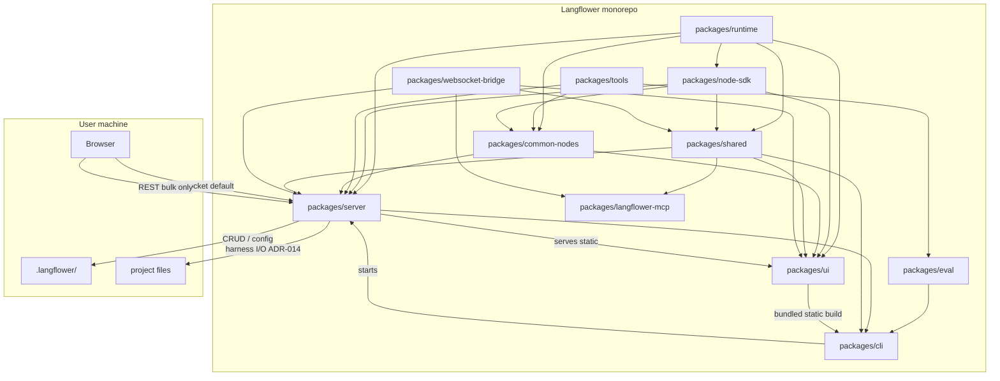
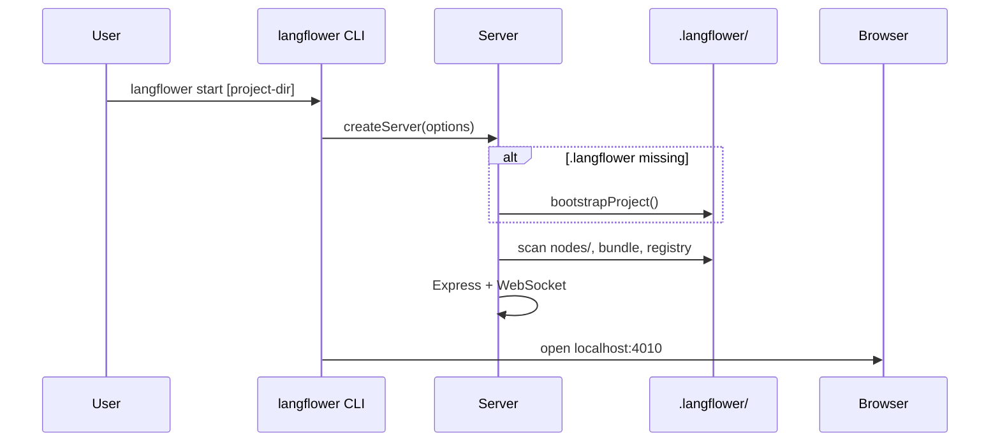
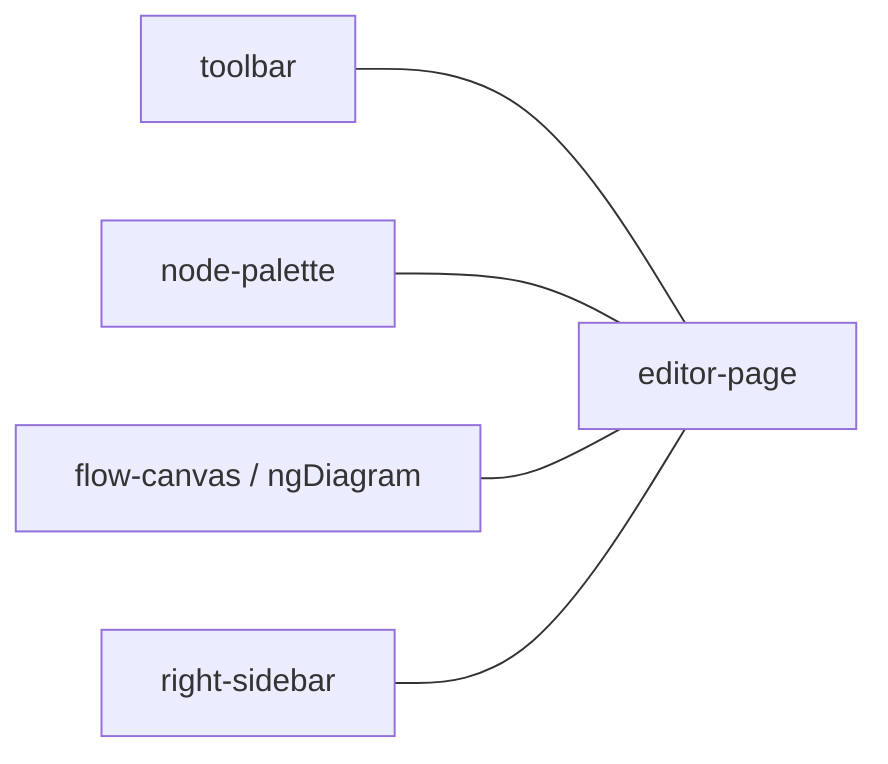
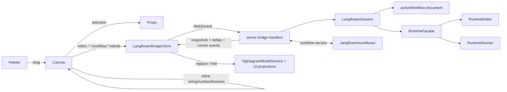

# Architecture

## System context



Package roles: [NAVIGATION.md](NAVIGATION.md). Product purpose: [PRODUCT.md](PRODUCT.md).

## Startup sequence

Current CLI/server flow; product behavior:
[bootstrap-new-project](use-cases/bootstrap-new-project.md).



## UI editor layout



## Data flow



There is no client `WorkflowStore` or graph mapper between the bridge and the
canvas. `LangflowerBridgeClient` is the UI domain source of truth:

- `workflow.current.snapshot` replaces the active document projection and
  initializes the ngDiagram model;
- `editor.*` facts mutate the live canvas projection after bootstrap;
- `runner.*` facts and `executionFeed.snapshot` feed RxJS folds for run state,
  canvas chrome, work log, HITL, and permissions;
- editor and workflow actions go back as typed `*.requested` intents.

The server session owns both the persisted-shape active workflow document and
one `RuntimeFacade`. Workflow activation materializes fresh runtime node
instances into `RuntimeEditor`; successful editor mutations synchronize the
session document from that editor. `RuntimeRunner` executes the same in-memory
graph while it is locked.

**Transport split**

| Layer                               | Mechanism     | Data                                                                |
| ----------------------------------- | ------------- | ------------------------------------------------------------------- |
| Live state, commands, notifications | **WebSocket** | editor graph, runner telemetry, palette, workflow catalog/save/load |
| Bulk escape hatch                   | **REST**      | Reserved for payloads too large for the WebSocket bus               |

**Node instance data** (`WorkflowNode.data`):

- `params` — `uiSchema` values (panel + inline placement).
- `inputs` — literal values for unconnected primitive input ports.
- At execution: wired port overrides `inputs[portName]`; progress via WS push.

Reactive node and runner execution — see
[EXECUTION_ARCHITECTURE.md](EXECUTION_ARCHITECTURE.md).

### Harness & agents

Harness / agent / KB / crawl capabilities ship via `@langflower/tools` and
`@langflower/common-nodes`, injected by the thin server. Product framing:
[PRODUCT.md](PRODUCT.md).

**Boundary (ADR-014):** harness nodes may read/write under **project root** with
path sandbox, plus optional `harness.allowedRoots` for vaults outside the
project. Generic server services (workflow CRUD, config) remain
`.langflower/`-only. Server **injects** tools/common-nodes factories — it does
**not** own KB/crawl/MCP/LLM implementations. See
[ADR.md §ADR-014](ADR.md#adr-014--project-root-harness-io) and
[PRINCIPLES.md § Thin server](PRINCIPLES.md#thin-server--do-not-grow-domain-here).

## WebSocket Protocol (Default)

Single connection per UI session. JSON messages are defined by the canonical bus
registry in
[`packages/shared/src/langflower-bus-config.ts`](../packages/shared/src/langflower-bus-config.ts).

The protocol is internal and co-versioned across Langflower UI, server, shared,
and runtime packages. Runtime APIs intentionally define many message payloads via
`Parameters<>` / `ReturnType<>`; a runtime contract change should break server/UI
compilation immediately instead of being hidden behind DTO adapters.

The shared registry also owns the default transport (`/ws`, port `4010`) so the
client and server cannot drift on connection settings.

### Message Model

No RPC envelope, no `requestId`. Clients emit `*.requested` intents; the server
executes and **broadcasts authoritative snapshots** so multiple tabs stay in sync.

**Workflow example (anti-pattern):** Tab A saves → server sends `workflow.saved`
to all tabs → Tab B does not know which workflow or whether the catalog changed.
**Correct pattern:** server sends `workflow.list.snapshot` + `workflow.current.snapshot`
(full slices); every tab replaces its projection — no need to know the source tab.

### State sync: snapshot vs event-sourcing

On **connect / reconnect** (browser refresh, new tab) the server sends
domain-specific snapshots rather than one monolithic payload. Replace-state
domains restore from their latest full slice; execution projections replay the
bounded `executionFeed.snapshot` event log. After bootstrap, domains update
differently:

| Domain                               | Model                | Reconnect source                                                                                                                      | Live updates                                                                      |
| ------------------------------------ | -------------------- | ------------------------------------------------------------------------------------------------------------------------------------- | --------------------------------------------------------------------------------- |
| Session chrome                       | snapshot only        | slim `session.state.snapshot`: `version`, effective redacted `langflowerConfig`, `dividerPositions`, `paletteVisible`, `selectedNode` | divider, palette visibility, and selection bridge facts                           |
| Langflower config layers             | snapshot only        | `langflower.config.snapshot`                                                                                                          | full slice replace                                                                |
| Settings unsaved draft               | snapshot only        | `langflower.config.draft.snapshot`                                                                                                    | full slice replace (session memory; connection statuses)                          |
| Workflow catalog                     | snapshot only        | `workflow.list.snapshot`                                                                                                              | full slice replace                                                                |
| Active workflow document + status    | snapshot only        | `workflow.current.snapshot`                                                                                                           | full replace for workflow operations; status-only snapshot after editor mutations |
| Canvas topology                      | snapshot + deltas    | graph in `workflow.current.snapshot`                                                                                                  | `editor.*` node/edge facts                                                        |
| Canvas viewport                      | snapshot + deltas    | `activeWorkflow.graph.viewport` in `workflow.current.snapshot`                                                                        | `editor.viewport.delta`                                                           |
| Runtime session status + checkpoints | snapshot only        | `runner.snapshot`, `runner.checkpoints.snapshot`                                                                                      | runner lifecycle/checkpoint facts                                                 |
| UI execution projections             | snapshot + event log | `executionFeed.snapshot`                                                                                                              | new `runner.*` facts only                                                         |
| Tool config                          | snapshot only        | `toolConfig.snapshot`                                                                                                                 | full slice replace                                                                |
| Palette (system)                     | snapshot only        | `palette.snapshot`                                                                                                                    | full slice replace                                                                |
| Custom palette                       | snapshot only        | `customPalette.snapshot`                                                                                                              | full slice replace                                                                |

**Reconnect order** (see `packages/server/src/bridge/emit-bootstrap.ts`):
`session.state.snapshot` → `runner.snapshot` → `executionFeed.snapshot` →
`runner.checkpoints.snapshot` → `toolConfig.snapshot` →
`workflow.list.snapshot` → `workflow.current.snapshot` → `session.ready` →
`langflower.config.snapshot` → `langflower.config.draft.snapshot` →
(async) `langflower.models.catalog.snapshot` → replay each in-flight
`runner.permission.ask` → `palette.snapshot` → `customPalette.snapshot`.

The first payload is intentionally slim: workflow graph and viewport, runner
status, execution history, checkpoints, tool config, and palette never belong
in `session.state.snapshot`. The UI run gate currently hydrates from
`executionFeed.snapshot`; `runner.snapshot` is a transport/session snapshot, not
that fold's input.

Because the execution feed arrives before workflow and palette catalogs, feed
and HITL folds wait for those real snapshots before classifying replayed
events. Their live event sources are hot, so facts emitted after the feed
snapshot but before catalog readiness are not currently buffered. Do not treat
this bootstrap window as a lossless event handoff.

**Runtime after reconnect:** apply `executionFeed.events`, then append live
`runner.output-emitted` / `runner.input-received` / `runner.done` — do not expect
a full execution resnapshot on every port tick.

The UI applies snapshots and delta/event facts; it does not correlate server
pushes with "my last command". Updates may come from this tab, another tab, or
the server.

| Namespace    | Direction                         | Purpose                                                                                   |
| ------------ | --------------------------------- | ----------------------------------------------------------------------------------------- |
| `editor.*`   | client → server / server → client | Session graph intents, delta graph outcomes (broadcast), divider positions                |
| `runner.*`   | client → server / server → client | Current session run control and port telemetry                                            |
| `session.*`  | server → client                   | Slim session chrome/config snapshot; ready marker                                         |
| `palette.*`  | client → server / server → client | Palette reload, changed catalog, compilation errors                                       |
| `workflow.*` | client → server / server → client | Workflow intents; **broadcast** `list.snapshot` + `current.snapshot` (no command replies) |

Each partial config owns exactly one namespace prefix before the final route merge.
Do not add a duplicate event key under another partial; object spread would otherwise
shadow routes at runtime.

### Validation

Incoming frames are decoded by `@langflower/websocket-bridge` against the
`message<>()` registry. Add method-specific validation at the service boundary when
payloads cross from transport data into filesystem, runtime, or UI state.

See [EXECUTION_ARCHITECTURE.md](EXECUTION_ARCHITECTURE.md) for execution flow.

## REST Surface

REST is an escape hatch for payloads that are too large or browser-tooling-sensitive
for the WebSocket bus. Workflow save/load currently belongs to `workflow.*` events;
do not add REST CRUD routes without updating ADR-012.

Mount: `packages/server/src/api/routes.ts` (static + any explicitly approved bulk
routes).

## Build pipeline

Compile / publish order (see `.cursor/skills/langflower-build/SKILL.md`):

```
shared → node-sdk → runtime → tools → common-nodes → eval → server → ui → cli
```

Exact graph is encoded in `build/build-all.mjs` / workspace dependencies — prefer
those over this summary when ordering changes.
