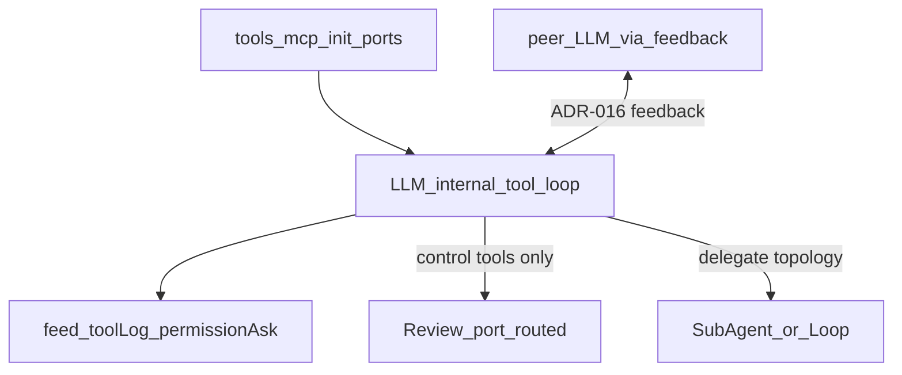

# Tool execution mechanics — internal vs external

**Status:** product lock (shared contract — not a numbered epic)  
**Index:** [README.md](README.md)

## Goal

Lock **Option 3** (combined) for how agents invoke tools, MCP, and
sub-agents: an **internal** tool loop for world-changing burst work, plus
**external** graph ports only when control, topology, or typed contracts
leave the agent node.

Epics implement slices of this contract. Do not reopen the layers without
updating this file and [README product locks](README.md#product-locks-do-not-reopen).

## UX rule

**Canvas shows topology and contracts. Feed shows in-step world changes.**

| Surface              | Shows                                                                                   |
| -------------------- | --------------------------------------------------------------------------------------- |
| Canvas edges / ports | Registration binding, peer `feedback`, Review accept/feedback, Sub-Agent / Loop fan-out |
| Feed + `toolLog`     | Builtin / MCP tool calls, results, `permission.ask` Allow/Deny                          |

## Layers



| Layer                | What                                                            | When                                                      |
| -------------------- | --------------------------------------------------------------- | --------------------------------------------------------- |
| **Authoring (1a)**   | `tools` init port + `enabledToolIds`                            | Already shipped — registration/binding, not invoke wires  |
| **Internal loop**    | Parse tool calls → execute → append results → re-complete       | Default for builtins and MCP tools mapped into inventory  |
| **External (graph)** | Port-routed control tools; `feedback` handoff; Sub-Agent / Loop | Control, topology, or typed wire contracts leave the node |

## Normative criteria (internal vs external)

Evaluate a capability (builtin tool, MCP tool, control tool, delegate act).
If **any** External criterion fires, treat it as external (or dual with
external as the graph path). If all stay Internal, keep it inside the agent
loop.

| #   | Criterion                           | Internal                                                                                                              | External                                                                  |
| --- | ----------------------------------- | --------------------------------------------------------------------------------------------------------------------- | ------------------------------------------------------------------------- |
| C1  | Who owns the next step?             | Same agent node (model continues the turn/loop)                                                                       | Another node, human stage, or peer agent on the canvas                    |
| C2  | Does the run topology change?       | No — same subgraph                                                                                                    | Yes — spawn, fan-out N, accept/reject branch, handoff                     |
| C3  | Is a graph-typed contract required? | Tool result → messages / `toolLog` is enough                                                                          | Payload must land on a **port** (wire type, Merge, Assert, feedback edge) |
| C4  | Call rate inside one agent turn     | High / burst (many `read` / `grep`)                                                                                   | Rare / 0–1 per turn (`accept`, `delegate`)                                |
| C5  | Must the author see an edge?        | No — canvas noise                                                                                                     | Yes — budget, safety path, review path, swarm role                        |
| C6  | Verifiable without the LLM?         | Sandbox / permission runtime                                                                                          | **Assert / IF / Gate / Merge** on an artifact or decision                 |
| C7  | HITL character                      | Allow/Deny on an _action_ (`permission.ask` in feed)                                                                  | Approve/revise a _stage_ or _role_ (Ask User / Review gate on graph)      |
| C8  | Executor identity                   | Same session / history ([ADR-016](../../ADR.md#adr-016--llm-session-init-vs-feedback-defaultvalue-vs-turn-startwith)) | New session, other preset/budget, nested workflow                         |
| C9  | Error / deny semantics              | Return tool error into the loop; agent may retry                                                                      | Fail-closed port / other graph branch — not silent message-only           |
| C10 | Trust boundary                      | Covered by project sandbox + allowlist                                                                                | Separate trust UX _and_ author wants a graph gate on invoke               |

**Conflict resolution:**

1. **C2, C3, or C8** → almost always External.
2. **C4 high + C5 no** → almost always Internal (even if the tool is “important”).
3. **C7** — do not confuse feed permission asks with stage gates on the canvas.

### Decision tree

```text
Capability X requested by model (or author wiring)
        │
        ▼
Does it transfer control to another graph node / human stage / new session?
        │ yes → EXTERNAL (port out → node → port in / feedback)
        │ no
        ▼
Must the payload be a typed wire for Merge/Assert/Router (not just chat tool result)?
        │ yes → EXTERNAL (or port-routed control tool)
        │ no
        ▼
Is expected call rate bursty inside one agent turn?
        │ yes → INTERNAL (+ toolLog/feed; permissions in feed if risky)
        │ no
        ▼
INTERNAL (default)
```

## Class table

| Class                                                               | Default                                                                    | Criteria                                                                                                                                                                                                        | Epic                                                                                                                     |
| ------------------------------------------------------------------- | -------------------------------------------------------------------------- | --------------------------------------------------------------------------------------------------------------------------------------------------------------------------------------------------------------- | ------------------------------------------------------------------------------------------------------------------------ |
| **Read-class** builtins (`read`, `glob`, `grep`; later search-like) | **Internal** + optional `postProcess`                                      | C1/C4; non-mutating                                                                                                                                                                                             | [01](01-tool-loop-builtins.md)                                                                                           |
| **Mutating** builtins (`edit`, `write`, `create`, `delete`)         | **Internal**                                                               | C1/C4; no `postProcess`                                                                                                                                                                                         | [01](01-tool-loop-builtins.md)                                                                                           |
| `bash`                                                              | **Internal** + feed permission                                             | C7 = feed ask; not read-class                                                                                                                                                                                   | [01](01-tool-loop-builtins.md), [02](02-runtime-permissions.md)                                                          |
| MCP tools (typical)                                                 | **Internal** (mapped inventory)                                            | Same path as builtins; C10 alone ≠ external                                                                                                                                                                     | [16](16-mcp-optional.md)                                                                                                 |
| MCP server config wire                                              | **Init / authoring**                                                       | `tools` registration port (`ToolHandle[]`), not invoke loop                                                                                                                                                     | [16](16-mcp-optional.md), [41](41-uniform-tool-shape.md)                                                                 |
| Domain packs (crawl / KB / Memory)                                  | **Internal** via `registration.handler`                                    | Handlers imported from `@langflower/tools/domain-tool-configs` and attached on the wire; **not** in `listBuiltinRegistrations` / harness toolId map — inventory only when wired from `common-*-tools`           | node-library §7 · [ADR-019](../../ADR.md#adr-019--tool-handlers-on-registration-not-harness-toolid-registry)             |
| Tool collection (`common-tool-collection`)                          | **Init / authoring**                                                       | Optional hub: combine `tools` slots → one `ToolHandle[]` (last-wins). LLM `tools` stays multi combine.                                                                                                          | [ADR-035](../../ADR.md#adr-035--uniform-inventory-wire--optional-tool-collection), [41](41-uniform-tool-shape.md)        |
| Review `accept` / `feedback`                                        | **External (port-routed)**                                                 | C1/C2/C3/C9 — **path choice on the graph**; optional wired inventory (tools/MCP/subagents) may run first — Review is a full agent, not a yes/no stub ([03](03-review-node.md), [LLM_NODES](../../LLM_NODES.md)) | [03](03-review-node.md)                                                                                                  |
| Soft↔Hard critique text                                             | **External via `feedback`**                                                | C1 other agent; **text handoff only** — not an accept/reject path decision                                                                                                                                      | [08](08-adversarial-multi-llm.md)                                                                                        |
| Sub-Agent (canvas specialist as `ToolHandle`)                       | **Internal** invoke; **external** node + `subagent-registration` → `tools` | C2+C8; see [§ Sub-Agent](#sub-agent-as-toolhandle)                                                                                                                                                              | [ADR-021](../../ADR.md#adr-021--sub-agent-registration--port-routed-spawn-nodeid-filter), [41](41-uniform-tool-shape.md) |
| Loop (map-collect N)                                                | **External**                                                               | C2+C8 — dynamic body fan-out                                                                                                                                                                                    | [07](07-swarm-primitives.md)                                                                                             |
| Palette harness node (e.g. standalone Read)                         | Outside agent loop                                                         | Ordinary graph step; dual surface with tools                                                                                                                                                                    | node-library / future harness nodes                                                                                      |
| Role presets allowlists                                             | Configure **internal** loop only                                           | Not a loop mode                                                                                                                                                                                                 | [04](04-role-tool-profiles.md)                                                                                           |

## File-ops patterns (normative for epic 01)

Industry patterns (OpenCode / Claude-style / `@agent-sh` / agentool) collapsed into
Langflower rules. Builtin tool **implementations** live in a **separate package**
`@langflower/tools` (see [epic 01](01-tool-loop-builtins.md)); the server injects
them through `ExecutionContext.harness`
([ADR-014](../../ADR.md#adr-014--project-root-harness-io)). No third-party pack
is a product lock — reuse ideas or thin engines only inside `@langflower/tools`.

### Package boundary (`@langflower/tools`)

| Package                        | Owns                                                                                                                                |
| ------------------------------ | ----------------------------------------------------------------------------------------------------------------------------------- |
| **`@langflower/tools`**        | Builtin tool ids/schemas, domain packs (crawl/KB/Memory handlers), path fence, `postProcess`, webFetch/crawl/KB/memory facades, MCP |
| **`@langflower/server`**       | Project dir, config/`permission.*`, compose harness + `ctx.crawl`/`kb`/`memory`, feed/`permission.ask` pause (epic 02)              |
| **`@langflower/common-nodes`** | LLM tool-loop / inventory; domain pack **registration** nodes; calls `ctx.harness` only — **no** direct import of tool handlers     |
| **`@langflower/runtime`**      | Graph/reactive execution only — **not** a home for file/shell tools                                                                 |

`@langflower/tools` must not depend on Express, WebSocket bridge, UI, or
`common-nodes`. Prefer depending only on Node builtins + minimal shared types
if needed.

### Read-class vs mutating

| Kind           | Tools (builtins + later)                                                        | Mutates project? | `postProcess`           |
| -------------- | ------------------------------------------------------------------------------- | ---------------- | ----------------------- |
| **Read-class** | `read`, `glob`, `grep`; future search / list / webfetch-as-tool if non-mutating | No               | **Yes** — optional      |
| **Mutating**   | `edit`, `write`, `create`, `delete`                                             | Yes              | **No**                  |
| **Shell**      | `bash`                                                                          | Maybe            | **No** (not read-class) |

Read-class = non-mutating observation. Do not conflate with the single tool id
`read` (file read is one member of the class).

### Shared harness patterns

1. **Project-root fence** — every path through `resolveProjectPath` + deny list
   before I/O (ADR-014).
2. **gitignore-aware discovery** — `glob` / `grep` respect `.gitignore` by
   default (OpenCode-compatible); opt-out only via explicit tool arg/param.
3. **Pagination / caps** — `read` supports offset/limit (or line range); large
   grep/glob results are truncated with a clear “continue from …” hint in the
   tool result string so the model retries instead of looping from zero.
4. **LLM-shaped errors** — prefer structured failure text the model can act on
   (e.g. not-found + sibling hints, invalid regex hint) over bare `ENOENT`.
5. **Mutating split** — `create` fails if target exists; `write` creates or
   overwrites; `edit` is exact replace (uniqueness / match locations on
   ambiguity); `delete` is explicit. Do not collapse all four into one “write”.
6. **Dual surface** — same harness handlers power agent tools and future
   palette nodes (`common-read-file`, …); agent path stays internal-loop.
7. **Permission stage ≠ allowlist** — author-time `enabledToolIds` binds
   inventory; runtime ask/deny is epic 02 (mutating + bash first).

### Read-class `postProcess`

After a **successful** read-class invoke, the harness serializes the result to
the **same string** that would be returned to the model, then may apply:

```ts
type ReadClassPostProcess = (res: string) => string;
```

**Who provides it:** the agent (LLM) may pass an optional tool argument whose
value is the **source text** of a pure function with that signature (or an
expression body that evaluates to such a function). Author-time defaults on
registration are allowed later; they must not replace the per-call arg.

**Pipeline:**

```text
resolve + permission → execute read-class → serialize to string
        → optional postProcess(string) → tool result / toolLog / model
```

**Constraints (normative):**

- Pure and sync only: no I/O, no `require`/`import`, no network, no mutable
  host globals; isolated eval with timeout and output size cap.
- Applied only on success; harness/permission failures skip `postProcess`.
- Thrown / timeout / non-string return → **tool error** visible to the model
  (fail closed on the transform; do not silently drop the transform and return
  raw content).
- Mutating tools and `bash` must not expose `postProcess`.
- Future MCP/search tools that are non-mutating may opt into the same arg when
  mapped into the internal loop.

**Why:** models often need slice/filter/reformat (JSON path, strip noise, keep
matching lines) without a second tool round-trip; keeping it on read-class
avoids inventing graph edges for transform (still internal — C4/C5).

## Sub-Agent as ToolHandle (L0 shipped; 3-wire superseded)

**Status:** **L0 implemented** — `common-sub-agent` stays a canvas node with
in-node chat. The registration / spawn / result **wires are gone** (epic 41
stage 2). Nested workflow/subgraph files remain far future.
Canonical decision: [ADR-021](../../ADR.md#adr-021--sub-agent-registration--port-routed-spawn-nodeid-filter).

### Why the node stays (invoke is internal)

- **C2 / C8:** invoke changes executor identity — specialist is another node /
  session, not the same LLM turn inventing agents off-canvas.
- **C5:** authors must see Sub-Agent nodes (skills, budgets, feed).
- **C9:** `ToolHandle.invoke` runs the specialist loop **inside** that node
  and returns a string into the parent tool loop. Review `accept` / `feedback`
  stay **external port-routed** (unchanged).

Do **not** hide specialists inside one LLM session without Sub-Agent nodes.

### Ports (parent LLM)

Shared `defineLlmNode` inventory: IN `tools` (combine) + `steerControl`; OUT
`toolLog` + `recovery`. Sub-Agent handles arrive on `tools` like packs/MCP.
There is no `spawn_subagent` chat tool.

### Ports (Sub-Agent node)

| Port                      | Direction | Wire type     | Role                                              |
| ------------------------- | --------- | ------------- | ------------------------------------------------- |
| `tools`                   | out       | `tool-handle` | One specialist `ToolHandle[]` → parent `tools`    |
| `tools` / `steerControl`  | in        | same as LLM   | Nested inventory for this node's loop             |
| LLM chat outs + `toolLog` | out       | same as LLM   | In-node tool loop (own provider/model/compaction) |

Inspector: **multiselect** skills from `.langflower/skills/*.md`. Those ids
are the handle `inputSchema.skillId` enum (omitted when empty).

### Invoke contract

```text
invoke({ task, skillId? }) → string
```

- **`task`:** required.
- **`skillId`:** optional when the enum exists; unknown id → `Error: …`.
- Timeout: `recovery.subagentTimeoutMs` → error string (no hang).
- Nesting = graph: child OUT `subagent-registration` → parent Sub-Agent IN `tools`.

### Graph sketch

```text
Sub-Agent.subagent-registration ──combine──► Parent.tools → ToolHandle.invoke → in-node loop
packs / MCP ──tools──► Sub-Agent.tools
```

### Loop vs Sub-Agent

| Primitive     | Use                                                           |
| ------------- | ------------------------------------------------------------- |
| **Sub-Agent** | Canvas specialist + one `tools` handle + skill multiselect    |
| **Loop**      | Dynamic N≥2 map-collect over a list (no specialist inventory) |

### Sub-Agent layers (swarm, nested, Monte Carlo)

Canonical: [ADR-022](../../ADR.md#adr-022--sub-agent-layers-swarm-nested-monte-carlo).
Same canvas node; no second spawn mythology.

| Layer              | Focus                                       | Lock                                                                       |
| ------------------ | ------------------------------------------- | -------------------------------------------------------------------------- |
| **L0**             | One `tools` handle + in-node loop + skills  | ADR-021 (**shipped**; 3-wire superseded)                                   |
| **L1 Swarm**       | N Sub-Agent nodes on one parent `tools`     | Default invoke concurrency **serial**. Opt-in `parallel-by-nodeId` later   |
| **L2 Nested**      | Specialist also takes `tools` from children | Graph-controlled recursion; depth cap later. Nested **workflow file** = L∞ |
| **L3 Monte Carlo** | Same-model repeated trials                  | **Loop** + `trialId` / `seed` envelope + reduce on graph                   |
| **Pending**        | Cross-model ensemble                        | **Not locked** — see ADR-022                                               |

Guidance order: L0 → L1 serial → L3 trial fields → L2 depth caps → L∞.

**Superseded gap:** the old 3-wire wait-for-`subagentResult` hang is gone;
unknown `skillId` and invoke timeout return error strings into the parent loop.

## Anti-criteria (do not use)

| Bad signal                         | Why                                                                                                                                                                                                                                                                                                               |
| ---------------------------------- | ----------------------------------------------------------------------------------------------------------------------------------------------------------------------------------------------------------------------------------------------------------------------------------------------------------------- |
| “Tool is important / dangerous”    | Danger → `permission.ask` / allowlist, not a canvas edge per call                                                                                                                                                                                                                                                 |
| “We want observability”            | Feed + `toolLog` suffice; an edge is not a log                                                                                                                                                                                                                                                                    |
| “It is MCP”                        | MCP is a tool source, not a loop mode                                                                                                                                                                                                                                                                             |
| “Looks like Review”                | Only if there is a **closed port↔tool contract** and ownership leaves the node                                                                                                                                                                                                                                    |
| “We could draw it on the graph”    | Possibility ≠ default — coding-agent UX dies if every `grep` is an edge                                                                                                                                                                                                                                           |
| Peer LLM `response` as accept gate | A single-output agent/`common-openai-llm` **cannot choose the next graph path**. Soft↔Hard critique text on `feedback` ≠ «agreed». For accept vs revise, use `common-review` (or HITL Review Gate): `accept`→`response`, `feedback`→`feedback`. `maxFeedbackTurns` is a storm guardrail, not an agreement signal. |

## Out of scope (deferred)

- Opt-in graph-hosted tool host (`pendingToolCall` ↔ `toolResult` edges for
  selected tool ids). Not designed in epic 01; do not invent ad hoc.
- Replacing builtins with MCP.
- Hidden manager that spawns sub-agents inside one LLM session without
  Sub-Agent nodes ([ADR-021](../../ADR.md#adr-021--sub-agent-registration--port-routed-spawn-nodeid-filter)).
- Nested workflow / subgraph runtime for Sub-Agent (far future).

## Related

- [README.md](README.md) — product locks + epic index
- [01-tool-loop-builtins.md](01-tool-loop-builtins.md) — internal builtins
- [02-runtime-permissions.md](02-runtime-permissions.md) — feed gates inside internal loop
- [03-review-node.md](03-review-node.md) — port-routed control tools
- [07-swarm-primitives.md](07-swarm-primitives.md) — Loop + interim Sub-Agent map-collect
- [ADR-021](../../ADR.md#adr-021--sub-agent-registration--port-routed-spawn-nodeid-filter) — Sub-Agent registration + spawn
- [ADR-022](../../ADR.md#adr-022--sub-agent-layers-swarm-nested-monte-carlo) — swarm / nested / Monte Carlo layers
- [08-adversarial-multi-llm.md](08-adversarial-multi-llm.md) — `feedback` handoff
- [16-mcp-optional.md](16-mcp-optional.md) — MCP into internal inventory
- [docs/LLM_NODES.md](../../LLM_NODES.md) — foundation session / allowlist semantics
