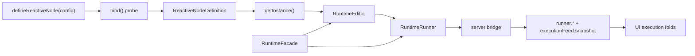

# Execution architecture

How the production path turns a reactive node definition into a running graph
and projects runtime facts into the UI.

See also: [REACTIVE_NODES.md](REACTIVE_NODES.md),
[HOW_TO_WRITE_REACTIVE_NODES.md](HOW_TO_WRITE_REACTIVE_NODES.md), and
[packages/node-sdk/AGENTS.md](../packages/node-sdk/AGENTS.md).

## Production path

| Package                | Production responsibility                                                                             |
| ---------------------- | ----------------------------------------------------------------------------------------------------- |
| `@langflower/node-sdk` | Author API, probe metadata, and fresh live instances                                                  |
| `@langflower/runtime`  | In-memory editor graph, run wiring, port state, and runtime events                                    |
| `@langflower/server`   | Session ownership, workflow materialization, execution-context seeds, bridge fan-out, and checkpoints |
| `@langflower/shared`   | Typed WebSocket registry and snapshot payloads                                                        |
| `@langflower/ui`       | Bridge projections for run gate, feed, canvas chrome, HITL, and permissions                           |

The server does not have a parallel execution engine under
`packages/server/src/runtime`. A `LangflowerSession` owns one `RuntimeFacade`;
the facade exposes the `RuntimeEditor` and `RuntimeRunner` used by both editor
intents and execution intents.

## Definition, probe, and live instances

`defineReactiveNode(config)` has a deliberate two-bind lifecycle:

1. At definition time it creates a probe context and calls `config.bind(...)`.
   Only input/output metadata is retained for the palette and validation; the
   probe connections are discarded.
2. `definition.getInstance()` creates a fresh hidden context connection and
   calls `bind(...)` again. The returned inputs and outputs are the live port
   graph for one canvas node.
3. The server combines that instance with the persisted node id and runtime
   flags (`stopsRun`, `chatEntry`, bypass metadata), then adds it directly to
   `RuntimeEditor`.

Persisted literal input values are connected to the fresh instance while the
workflow document is materialized. There is no `withNodeId`,
`ReactiveRuntimeNode`, `bindRuntimeNode`, or `WorkflowRuntime` layer.

Because `bind` runs once for the discarded probe and again per canvas node,
node authors must not perform module-level I/O or mutate shared state from
`bind`.

Sources:

- `packages/node-sdk/src/node-factory/define-reactive-node/define-reactive-node.ts`
- `packages/server/src/workflow/apply-editor-mutation.ts`
- `packages/server/src/workflow/activate-workflow-in-session.ts`

## Runtime graph ownership

`RuntimeEditor` stores runtime nodes and edges, validates ports and wire types,
materializes bypass slots, and recomputes weakly connected graph clusters after
edits. `RuntimeRunner` receives that editor in its constructor; it does not
copy the graph into another workflow model.

The editor is locked for an active run. Node and edge mutations return failure
while locked. Natural completion or interruption tears down run wiring and
unlocks the same editor graph. Node instances themselves remain in the editor:
authors may intentionally keep in-memory internal state across runs until the
workflow is rematerialized or the Langflower process exits (see
[REACTIVE_NODES](REACTIVE_NODES.md) § Instance lifetime). That is not durable
checkpoint resume.

Workflow activation follows this order:

1. resolve every persisted node definition;
2. call `getInstance()` for each node;
3. add runtime nodes and persisted edges to `RuntimeEditor`;
4. assign the active workflow document to the session;
5. mark the document dirty or pristine.

Live editor mutations take the inverse path: apply the mutation to
`RuntimeEditor`, then synchronize the active document topology from the
editor. The active document remains the persisted shape; runtime port objects
remain inside `RuntimeEditor`.

Sources:

- `packages/runtime/src/runtime.ts`
- `packages/runtime/src/runtime-editor.ts`
- `packages/server/src/workflow/activate-workflow-in-session.ts`
- `packages/server/src/workflow/apply-editor-mutation.ts`

## Starting and scoping a run

The bridge handles three entry paths:

- `runner.start.requested` calls `RuntimeRunner.start`;
- `runner.startNode.requested` calls `RuntimeRunner.startNode`;
- `runner.hitl.event` pushes into an active run, or cold-starts the target
  node's cluster before pushing the value.

Before start, the server assigns a `runId`, temporarily marks the session
running to prevent workflow-load races, builds the run-scoped
`ExecutionContext`, and merges those context seeds with client seeds.
Checkpoint tracking begins against the active workflow before the runtime is
started. On success the server stores the returned run id and broadcasts
`runner.started`, `runner.startNode.started`, or `runner.resume.started`.

`start()` wires every weakly connected cluster that does not contain a
`chatEntry` node. Chat-entry clusters wait for a composer/HITL push.
`startNode(nodeId)` wires the complete weakly connected cluster containing that
node. This is the current run-from-node behavior: it is cluster-scoped, not an
upstream-only run plan and not a `mustFresh` partial-run cache.

Only one run can be active in a session. A start request is rejected by the
runtime while its status is already `running`.

Sources:

- `packages/server/src/bridge/wire-runner-handlers.ts`
- `packages/server/src/bridge/build-execution-context.ts`
- `packages/runtime/src/runtime-helpers.ts`
- `packages/runtime/src/runtime-runner.ts`

## Wiring, demand, and seeds

`RuntimeRunner.runScope` locks the editor and materializes the selected graph:

1. collect every output slot in the selected nodes;
2. wrap outputs with telemetry taps;
3. connect each scoped source output to its target input;
4. combine multi-input groups according to `merge` or `combine`;
5. subscribe outputs with no downstream edge;
6. apply port defaults, then explicit run seeds according to slot ownership.

The ordering is significant. Unwired outputs are subscribed before defaults
and seeds are delivered, so terminal outputs and multi-value streams are
demanded in time to observe every emission. Edge-connected outputs are
demanded by their downstream input connections. This is how the lazy
`StatefulObservable` graph is activated; merely constructing a node instance
does not execute it.

An edge owns an input slot for the run. A port `defaultValue` is connected when
the input is in scope, has no edge or materialize-time value, and is still
inactive. Runtime seeds are applied afterwards: an edge or default recorded in
the run's `wiredSlotKeys` blocks a seed, while an existing materialize-time
connection does not. The first runtime seed for a slot wins; bridge seed merge
puts context seeds before client seeds. On teardown the runner disconnects
wired inputs, completes pushed-input subjects, and unsubscribes terminal-output
demand.

Output and input telemetry rides the actual dataflow through `tap`, rather
than through a second observer. That preserves the order
`output-emitted` before the corresponding downstream `input-received`.

Source: `packages/runtime/src/runtime-runner.ts`.

## Port state and multiple emissions

Runtime telemetry carries `@rx-evo/stateful-observable` `ResponseDto` on the
same port (slot 3 of `PortTelemetry`), via `serializeResponse`:

- loading → `{ pending: true }`;
- success → `{ value }`;
- error → `{ error }`;
- inactive/reset → `{ inactive: true }` when the source emits it.

Chrome folds the last `ResponseDto` per edge (`'pending' in status()`, …).
The work log drops pending/inactive frames (chrome-only).

Ports are streams. One output may emit `{ pending: true }`, many `{ value }`
frames, another pending, and later more values. Every observed frame becomes
a distinct `runner.port` tuple; downstream deliveries become input tuples.
`{ value }` therefore means “a value was observed”, not “this port is
permanently complete”.

The event log keeps chronological frames for reconnect replay. UI chrome folds
the last observed state per node/port and per edge. Live value frames also
drive transient pulses, so multi-emit ports can pulse repeatedly.

Sources:

- `packages/runtime/src/runtime-runner.ts`
- `packages/ui/src/app/services/execution-chrome-fold.ts`
- `packages/ui/src/app/services/workflow-execution.service.ts`

## Run completion and interruption

Natural completion is explicit:

- an empty graph emits `done` immediately;
- when a watched output of a node with `stopsRun: true` emits a `value`, the
  runner schedules `finishRun`;
- `finishRun` emits one `{ kind: 'done', runId }`, sets status to `idle`,
  tears down run wiring, and unlocks the editor.

Output Observable completion is not a run-completion signal. The production
server does not append hidden finish nodes when loading a workflow. A
non-empty run without a firing `stopsRun` node remains running until it is
interrupted. `RuntimeRunner.completeRun()` exists as an explicit fallback API,
but the current production server path does not call it.

`runner.interrupt.requested` calls `RuntimeRunner.interrupt('cancel')`. For an
active run, interruption tears down wiring and sets status to `stopped`; it
does not emit runtime `done`. If the runtime is already idle/stopped, the call
is a runtime no-op. The bridge currently broadcasts `runner.interrupted` for
the accepted request in either case.

Sources:

- `packages/runtime/src/runtime-runner.ts`
- `packages/runtime/src/types.ts`
- `packages/server/src/bridge/wire-runner-handlers.ts`

## Bridge telemetry and reconnect

`attachLangflowerBridge` subscribes to `RuntimeRunner.events$` once for the
whole bridge lifetime, before client bootstrap and intent handlers. This is
required because the runtime stream is hot and non-replaying: initial
`pending` frames produced during start must be captured even if no client
subscription is being installed at that moment.

Live runtime facts are broadcast as:

| Runtime event kind | WebSocket event         |
| ------------------ | ----------------------- |
| `output-emitted`   | `runner.output-emitted` |
| `input-received`   | `runner.input-received` |
| `done`             | `runner.done`           |

The same events are retained in `RuntimeRunner.eventLog` because the session
constructs the facade with `{ log: true }`. On connect/reconnect,
`executionFeed.snapshot` contains the run id, workflow id, derived progress
status, and the chronological event log. It is `null` when the session has no
run id or active workflow id, including after an allowed feed clear.

Relevant bootstrap order is:

`runner.snapshot` → `executionFeed.snapshot` →
`runner.checkpoints.snapshot` → later workflow and palette snapshots.

The UI treats the feed as replay data, then appends new `runner.*` facts. Folds
that need node definitions wait for workflow and palette snapshots before
classifying replayed events. Those live event streams are currently hot: facts
emitted after `executionFeed.snapshot` but before catalog readiness are not
buffered by the fold wiring. The current reconnect protocol therefore must not
be described as lossless across that bootstrap window.

Sources:

- `packages/server/src/bridge/attach-langflower-bridge.ts`
- `packages/server/src/bridge/forward-runner-event.ts`
- `packages/server/src/session/langflower-session.ts`
- `packages/server/src/bridge/emit-bootstrap.ts`
- `packages/shared/src/langflower-bus-config.ts`

## UI execution projections

`WorkflowExecutionService` wires run-gate, live graph, labels, and chrome.
`ComposerService` (`features/composer/`) wires HITL and permission folds.
`ExecutionFeedService` owns the nested work-log.

| Fold                                             | Projection                                                                                                       |
| ------------------------------------------------ | ---------------------------------------------------------------------------------------------------------------- |
| `execution-run-gate-fold.ts`                     | running state from feed snapshot, started events, done, and interruption                                         |
| `execution-chrome-fold.ts`                       | last output state per node/port and edge, replayed identically from the feed                                     |
| `features/feed-folding/` (see README)            | append-only `FeedProjection` → nested node → port → item work-log; **never re-fold full history on live tokens** |
| `features/composer/execution-hitl-fold.ts`       | nodes currently awaiting human input, reconstructed from input history                                           |
| `features/composer/execution-permission-fold.ts` | pending tool permission asks                                                                                     |

Hydration policy is concern-specific. Feed and chrome replay the execution-feed
history; HITL may ignore a stale hydrate after live actions have advanced its
state; permission asks are restored by replayed `runner.permission.ask` facts,
not by `executionFeed.snapshot`. A new run id resets chrome and HITL state.
Settling keeps the final chrome visible until a new run or a clearing snapshot.

Feed and HITL replay combine `executionFeed.snapshot` with real
`workflow.current.snapshot` and `palette.snapshot` values. This avoids
classifying historical node/port ids against empty catalogs during bootstrap;
it does not buffer live facts emitted before those catalogs become ready.

Sources:

- `packages/ui/src/app/services/workflow-execution.service.ts`
- `packages/ui/src/app/services/execution-run-gate-fold.ts`
- `packages/ui/src/app/services/execution-chrome-fold.ts`
- `packages/ui/src/app/features/feed-folding/execution-feed.service.ts`
- `packages/ui/src/app/features/composer/composer.service.ts`
- `packages/ui/src/app/features/composer/execution-hitl-fold.ts`
- `packages/ui/src/app/features/composer/execution-permission-fold.ts`

## HITL and permissions

Canvas HITL and tool permissions are separate paths.

For HITL, the UI sends `runner.hitl.event` with `nodeId`, `portId`, and
`payload`. During a run, `pushIntoInput` accepts only a **`single`-mode**
input in the active scope that is not occupied by an edge
([runtime spec §6.3](../packages/runtime/spec.md) — multi-input /
`merge`/`combine` targets return `false`). Repeated values use the same
run-scoped pushed-input subject. While idle/stopped, the server starts the
target node's weakly connected cluster, broadcasts `runner.started`, then
delivers the value.

The UI derives “awaiting HITL” from port metadata plus
`input-received` history: a qualifying non-HITL input opens the interaction,
and a value received on a HITL input closes it. This state can be rebuilt from
`executionFeed.snapshot`.

**Soft Pause (`steerControl`)** — [ADR-032](ADR.md#adr-032--soft-pause-via-hidden-steercontrol-hitl-port):
LLM inventory input `steerControl` is `hidden` but has `config.hitl`
(textarea + Send) and **must stay `single`** (not `multi: 'merge'`). Operator
Pause is **per-node**: one
`runner.hitl.event` → `pushIntoInput` with `{ kind: 'pause' }` for the **last
feed section**'s working agent. Other agents keep running. Fold rules for
this port are **payload-aware**: `{ kind: 'pause' }` **opens** awaiting for
that `nodeId`; `{ kind: 'steer' }` / `{ kind: 'resume' }` **closes**. Do not
treat pause as a HITL reply that closes. Multi-tab sync uses the same
`input-received` broadcast + feed hydrate as other HITL awaits. Hard Stop
remains `interrupt('cancel')` only ([ADR-031](ADR.md#adr-031--stop-hard-cancel-vs-pause-soft-interrupt-vs-steer)).

Tool permission asks are owned by `PendingPermissionAsks`, not runtime graph
ports. The server emits `runner.permission.ask`; the UI replies through
`runner.permission.reply`. After the server validates and consumes a pending
reply, it broadcasts `runner.permission.accepted`; every UI projection removes
the ask only from this authoritative fact, not an optimistic local reply.
In-flight asks are replayed during reconnect after `langflower.config.snapshot`
and before the palette result. When a run leaves `running`, the session denies
remaining asks.

Sources:

- `packages/runtime/src/runtime-runner.ts`
- `packages/server/src/bridge/wire-runner-handlers.ts`
- `packages/server/src/session/langflower-session.ts`
- `packages/server/src/bridge/emit-bootstrap.ts`
- `packages/ui/src/app/features/composer/execution-hitl-fold.ts`
- `packages/ui/src/app/features/composer/execution-permission-fold.ts`

## Durable checkpoints

Checkpoints are server-owned persistence around runtime events:

1. a run begins with the active workflow fingerprint and accumulator;
2. each `output-emitted` is checked against output metadata;
3. only an explicit `createCheckpoint: true` boundary requests a running
   checkpoint write;
4. after a boundary has been crossed, `done` persists the checkpoint as
   completed and interruption persists it as stopped;
5. checkpoint summaries and the refreshed resumable list are broadcast.

Resume validates that no run is active, an active workflow exists, the stored
checkpoint loads, its workflow fingerprint still matches, and it contains
completed stages. The server then rebuilds execution-context seeds and calls
`RuntimeRunner.resume`.

The runtime resume path wires the full current graph, skips completed target
nodes, and substitutes stored output snapshots for completed source nodes.
Missing required snapshots fail rather than silently re-running a completed
stage.

Sources:

- `packages/server/src/checkpoint/run-checkpoint-session.ts`
- `packages/server/src/checkpoint/resolve-checkpoint-boundary.ts`
- `packages/server/src/bridge/wire-runner-handlers.ts`
- `packages/runtime/src/runtime-runner.ts`
