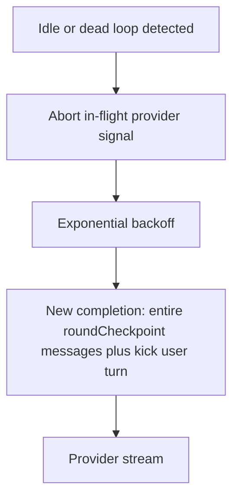
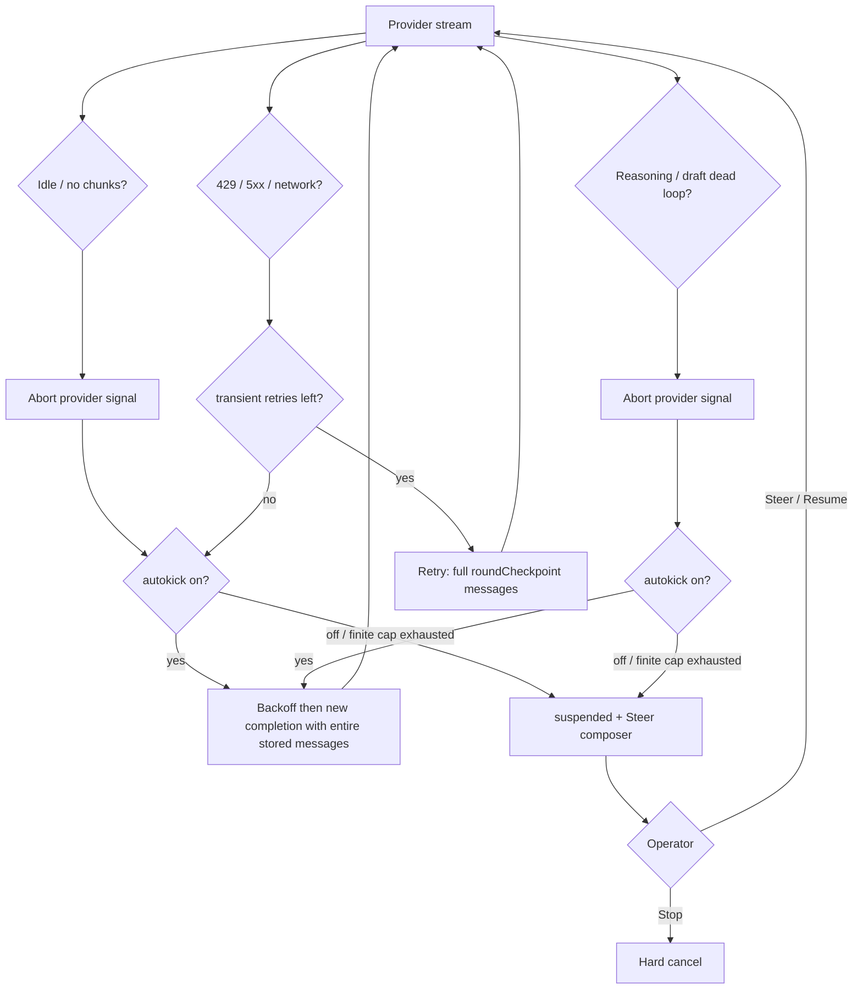

# LLM recovery — stuck streams and dead loops

Canonical **strategy** when an LLM provider stream goes silent or starts
repeating itself. Node catalog and Inspector fields live in
[LLM_NODES.md](LLM_NODES.md). Operator chrome (Stop / Pause / Steer) lives in
[run-interruption](use-cases/run-interruption.md). Graph-wide reload of an
arbitrary failed node is **not** this doc — that is
[TBD-008](TBD.md#tbd-008--node-local-reactive-recovery).

Implementation queue: landed in [epic 38](DONE/EPICS/38-llm-autokick.md). **Default
autokick** (abort, backoff, full-store replay, dead-loop detector, HTTP join
after the transient budget, pinned feed retry banner) is on for every
LLM-class node. Folder layout (`ai/nodes/` vs `ai/features/`) is
[epic 39](TODO/EPICS/39-ai-package-restructure.md) after 38 — do not mix the
rename with recovery.

## Shared LLM core

Stuck / dead-loop detection is **not** an Agent-only feature. All catalog
LLM nodes already run one machine:

```text
Agent (openai-llm / fake-llm) ─┐
Sub-Agent ─────────────────────┼─► runAgentLoop ──────────┐
                               │                          │
Critique ─┐                    │                          ▼
Review ───┴─► runPathChoiceToolLoop ──────────────► runLlmLoop
                                                    observeProviderStream
```

Policy (`LlmRecoveryPolicy` / `llmRecoveryUiSchema`) and the `recovery`
inventory port are the same contract (`defineLlmNode`). Implement the
detector **once** in `llm-loop`. A per-node copy is a bug.

---

## Honesty

| Symptom                                                                                 | Detection                                                                  | Recovery today                                                                                                                                                                                                                                                                                                                                                                                                      | Still queued |
| --------------------------------------------------------------------------------------- | -------------------------------------------------------------------------- | ------------------------------------------------------------------------------------------------------------------------------------------------------------------------------------------------------------------------------------------------------------------------------------------------------------------------------------------------------------------------------------------------------------------- | ------------ |
| Absent / stuck stream (no tokens, hang, idle gap)                                       | `streamIdleTimeoutMs` watchdog (default 90s; `0` disables)                 | **Abort** the in-flight provider `signal` immediately. Default autokick: backoff + new completion with the entire stored session messages + kick user turn. `'retry'` banner sits in the feed **after** the reasoning/draft block and ticks locally on the latest row. Autokick off / finite cap exhausted → `'suspended'` + Steer. Empty idle with autokick **off** still uses `maxTransientRetries` then suspend. | —            |
| Dead loop (repeated tokens / cyclic **reasoning or draft**, including whole paragraphs) | Shared `llm-loop` detector (default window **1000** tokens; on by default) | Same abort + autokick replay as idle, but wait is **`retryBaseDelayMs`** (default 1s), not the 60s idle exponential backoff. Inspector can turn detection off.                                                                                                                                                                                                                                                      | —            |
| HTTP 429 / 5xx / network                                                                | `classifyLlmFailure`                                                       | Short `retry.scheduled` budget first (full `roundCheckpoint` replay, no kick). After that budget, **join the autokick wait** (backoff `max` `Retry-After`, full store replay, **no** kick user turn, **no** penalty bump). Autokick off / finite cap exhausted → `'suspended'` + Steer.                                                                                                                             | —            |

Authentication and configuration failures stay on the **error** lane (not
recovery). Output truncation, compaction protocol failures, and tool /
Sub-Agent timeouts stay in [LLM_NODES.md § Failure recovery](LLM_NODES.md#failure-recovery).

## How recovery works today

Langflower, not the provider, owns conversation state.

| Store                                 | Role                                                                                                                                                                      |
| ------------------------------------- | ------------------------------------------------------------------------------------------------------------------------------------------------------------------------- |
| `committedMessages`                   | Session history on the LLM node (ADR-016). May already be compacted (`historySync`).                                                                                      |
| `roundCheckpoint`                     | Snapshot at the start of the current generation round (after a closed tool block). Idle / fail **rolls history back** here so uncommitted partial draft is not committed. |
| `partial.draft` / `partial.reasoning` | Feed telemetry only until the round completes.                                                                                                                            |

`createChatCompletionStream` is a **stateless** OpenAI-compatible POST: every
attempt already sends `messages: toOpenAiMessages(...)` plus
`signal: AbortSignal`. There is no provider-side session id to resume.

Retry (`retry.scheduled`) sets `committedMessages ← roundCheckpoint` and
runs `prepareChatCompletion` again — that **is** a full replay of the
Langflower-owned store for this node. It is **not** a Langflower disk
checkpoint and **not** Hard Stop.

Idle on an **already-streaming** attempt: RxJS `timeout` emits
`provider.idle`; `takeWhile` completes; the observer **aborts immediately**.
Pause and dead-loop abort the same way.

---

## Two reconnect assumptions (epic 38)

Autokick cannot know whether the remote process still has KV-cache / the
in-flight request. **Assume the worst for context; assume the optimistic
case still needs an explicit stop.**

### Worst — provider restarted, context gone

Treat every reconnect as a **cold completion**:

1. Discard the in-flight round (partial draft stays feed-only; do **not**
   append it as an assistant message the new process never produced).
2. **Restart the generation session** on this LLM node: `phase: 'prepare'`
   from `roundCheckpoint` (full stored history, including prior tool
   rounds; already compacted if compaction ran).
3. Send that **entire stored `messages[]`** on the new
   `createChatCompletionStream` — never a delta, never a prefix-cache
   continuation, never a disk checkpoint Continue.

The kick user message is an extra **new user turn on top of that store**,
not a continuation of a phantom partial.

### Optimistic — stuck, provider still up but overloaded

When idle or a dead loop is detected, **stop the in-flight request first**
so the overloaded worker does not keep generating:

1. `AbortController.abort()` on the stream `signal` **immediately** (same
   moment as Pause today — not only `finalize`).
2. That abort is the provider **stop** (HTTP/SSE cancel via the OpenAI
   client `signal`). It is **not** Langflower Hard Stop
   (`interrupt 'cancel'`) and must not kill the workflow.
3. Then backoff and reconnect as in the worst case (full stored messages).

If the socket is already dead, abort is a no-op; the replay still heals a
restarted provider.



## What this is not

- **Not Stop.** Hard cancel ends the run (`interrupt 'cancel'`). Provider
  abort during autokick is per-request only.
- **Not Pause.** Soft Pause is an operator intent on `steerControl`. Autokick
  must not open Steer by itself. Pause still wins over autokick.
- **Not checkpoint Continue.** No durable `.langflower/runs/` resume point.
- **Not TBD-008.** LLM recovery keeps the node's StatefulObservable alive for
  _provider_ failures. It does not reload an arbitrary failed graph node.

## Shared principles

1. **Keep the LLM cycle alive** for recoverable provider problems. Only fatal
   failures enter the StatefulObservable error lane.
2. **Partial reasoning / draft is feed telemetry.** It is not committed to
   `roundCheckpoint` and is not replayed as assistant content after abort.
3. **Notices go on the `recovery` port** (`feed.role: 'recovery'`). `'retry'`
   does not open Steer. `'suspended'` does (same HITL fold as Pause) — used
   when autokick is **off**, or when a finite attempt cap is exhausted.
4. **Sanitize diagnostics.** No raw HTML provider bodies, API keys, or full
   stacks in the feed.
5. **Operator Pause / Steer wins.** Autokick must abort if `steerControl`
   emits pause or steer during recovery setup or backoff wait. One in-flight
   provider stream per LLM node instance.
6. **Kick messages must not inject secrets.** Default copy is a fixed English
   string; a panel override is operator text, not a credential channel.
7. **Autokick is default.** Idle kick and dead-loop detection are **on**.
   Operators may disable them in Inspector. Attempt count is **unlimited**
   (`0` = unlimited). Delay between attempts grows `1 min → 2 → 4 → 8 → 16…`
   and clamps at `autokickMaxBackoffMs` (default 16 minutes).
8. **Feed makes retries transparent.** The recovery banner shows attempt
   number, time since last retry, and time until the next retry. The UI
   ticks locally from notice timestamps — the server does not emit once per
   second.
9. **Always full store replay + explicit provider stop** (sections above).
10. **Detector stays in the shared LLM loop.** Rolling hash / windows are
    not server or runtime state. Agent, Critique, Review, and Sub-Agent
    all run `runLlmLoop` — they inherit autokick without per-node copies.
    The graph and UI see only `recovery` port events
    (`feed.role: 'recovery'`) and operator `steerControl` HITL.

Default kick copy (epic 38):

> I notice you are repeating yourself. Please stop and provide a concise answer.

## Escalation ladder



Pause at any time cancels the backoff timer, aborts the provider signal, and
holds the node in Steer await. Stop short-circuits everything.

---

## Absent / stuck response

The model accepted the request but **does not make progress**: no first token
within the idle window, a mid-stream gap longer than `streamIdleTimeoutMs`,
or a stream that ends without a `done` chunk.

### Detect

`observeProviderStream` wraps the provider AsyncIterable with RxJS
`timeout({ first, each })`. Idle is **terminal for one provider attempt**,
not for the surrounding LLM loop. A missing `done` chunk is classified as a
recoverable protocol failure.

Feed liveness (`last event Ns ago` after 10s quiet) is **observation only**.
It does not open HITL and does not start recovery.

### Recover (default autokick)

1. **Stop** the in-flight provider request (`AbortSignal`) immediately.
2. Wait `min(60s × 2^(n-1), autokickMaxBackoffMs)` before reconnect _n_.
3. **Restart the round** from `roundCheckpoint` (entire stored session for
   this node). Do not attach uncommitted partial as assistant content.
4. Append `autokickUserMessage` as a new user turn; bump penalties; new
   `createChatCompletionStream`.
5. Emit `'retry'` with structured timing fields. Repeat without a default
   cap. The feed banner ticks from those fields on `livenessNowMs`.

`autokickOnIdle: false` or a finite `maxAutokickAttempts` that is exhausted
falls back to suspend: empty idle may still use `maxTransientRetries`; idle
**with** partial text or dead-loop → `'suspended'` + Steer / Resume await.

---

## Dead loop

The model **is** producing tokens, but reasoning or draft is stuck in
repetition: the same delta over and over, a short cyclic phrase, or **entire
paragraphs** looping (common on reasoning streams). Idle watchdog will not
fire while tokens keep arriving, so a loop can waste time and quota until a
human Pause / Stop.

### Detect

Inspect **`reasoning` and `draft`** `ChatCompletionStreamChunk` deltas
(separate rolling windows per channel so a reasoning paragraph-loop trips
before any draft exists). Empty streams have no detector state.

| Check                        | Default                                     | Meaning                                                                                                          |
| ---------------------------- | ------------------------------------------- | ---------------------------------------------------------------------------------------------------------------- |
| Consecutive identical deltas | `consecutiveThreshold: 5`                   | Same token/delta repeated in a row                                                                               |
| Cyclic pattern               | `minPatternTokens: 2` × `minRepetitions: 3` | Rolling hash, then **exact** slice confirm (no hash-only match). Long _L_ catches paragraph repeats              |
| Window                       | `maxWindowTokens: 1000`                     | Rolling buffer (Inspector-configurable; clamp 10–8000). Sized for multi-paragraph cycles, not only short phrases |

Internal `DeadLoopError` carries `{ partialText, lastTokens, reason, channel }`
(`channel`: `'reasoning'` \| `'draft'`). `partialText` is **not** replayed
into the next request (worst-case provider restart). It may appear in the
recovery `text` fallback.

**Complexity lock:** the scan domain is the **window W**, never the full
stream length _N_. Each `push` is **O(W)** rolling-hash lookups, not
O(W²) / O(N²). Exact slice compare runs only after a hash hit, and at most
once per detection (then abort). See epic 38 performance tests.

### Recover

**Abort** the stream, wait **`retryBaseDelayMs`** (default 1s — not the idle
60s exponential backoff), then a new completion with entire stored messages

- kick user turn. Unlimited by default. Longer idle backoff does not help a
  loop that is already emitting tokens.

Do **not** emit a fake OpenAI `loop_detected` chunk on the wire. Map
detection to an internal recovery fact, then abort.

---

## Feed contract (retry transparency)

The recovery banner is always visible (not buried under Tool `<details>`).
It stays in **port-stream order** after the reasoning or draft block where
idle/dead-loop was detected — do not lift it under the node-visit header or
footer-pin it. After reconnect, the next reasoning/draft segment belongs
**below** that banner. `NodeFeedItem.pinnedRecovery` is a live `projection$`
selector (not a frozen snapshot): the wait timer ticks only while recovery
is the **last entry in the visit**. After reconnect, later reasoning/draft
clears the timer — every recovery row is headline-only (`Retrying … · retry N`).
Hide `working…` only while that live tail is recovery. Closed visits keep
every recovery row in history.

While `'retry'` autokick is in progress it MUST show, in English:

| Fact                  | Source                               | Example                                                                                        |
| --------------------- | ------------------------------------ | ---------------------------------------------------------------------------------------------- |
| Attempt number        | `attempt` (1-based)                  | `Retry 3`                                                                                      |
| Time since last retry | `now - lastAttemptAt` (tick locally) | `last retry 1m 12s ago` — omit or `first wait` when `attempt === 1` and no prior reconnect yet |
| Time until next retry | `nextAttemptAt - now` (tick locally) | `next in 2m 48s`                                                                               |

Copy shape (live wait — recovery is the visit tail):

```text
Retrying idle stream · retry 3
Last retry 1m 12s ago · next in 2m 48s
```

Older recovery rows in the same visit omit the second line.

Reason label is `idle stream`, `dead loop`, `rate limit`, `provider error`,
or `network error` (reasoning vs draft detail stays in `text`).
Do not open Steer on this banner. Client ticks at ~1 Hz from `lastAttemptAt`
/ `nextAttemptAt`; do **not** add a WS tick channel.

Structured notice (additive on `LlmRecoveryNotice`; `code` stays `'retry'`):

| Field           | Meaning                                                                                |
| --------------- | -------------------------------------------------------------------------------------- |
| `attempt`       | 1-based autokick index                                                                 |
| `reason`        | `'idle'` \| `'dead-loop'` \| `'rate-limit'` \| `'provider-unavailable'` \| `'network'` |
| `lastAttemptAt` | Epoch ms of last reconnect, or omitted on the first wait                               |
| `nextAttemptAt` | Epoch ms when the next reconnect starts                                                |
| `backoffMs`     | Delay used for this wait                                                               |

`text` remains a fallback one-liner for logs and older fold paths.

---

## Precedence

Highest first:

1. **Hard Stop** — cancel the run.
2. **Pause / Steer** — operator owns the turn; autokick must not reconnect
   behind an open Steer composer; backoff timers cancel; provider signal
   aborts.
3. **Autokick** — abort in-flight provider request, wait, new completion
   with entire stored messages; **does not** suspend by itself.
4. **Transient HTTP / network retry** — same full `roundCheckpoint` replay,
   existing short budget; then autokick wait.
5. **Suspend** — only if autokick is off or a finite cap is exhausted.
   `'suspended'` notice opens Steer.

## Policy knobs

Authoritative types: `LlmRecoveryPolicy` in
`packages/common-nodes/src/ai/features/llm-loop/llm-loop-types.ts`. Inspector:
`llmRecoveryUiSchema`.

Shipped today: `streamIdleTimeoutMs`, `maxTransientRetries`, tool /
Sub-Agent timeouts, result caps, plus the autokick / dead-loop Inspector
fields below. HTTP 429 / 5xx / network join the autokick wait after the
transient budget (wait-only: no kick, no penalty).

Shipped (epic 38 Inspector):

| Field                           | Default                             | Notes                                                                  |
| ------------------------------- | ----------------------------------- | ---------------------------------------------------------------------- |
| `autokickOnIdle`                | **`true`**                          | Idle → backoff kick                                                    |
| `deadLoopEnabled`               | **`true`**                          | Consecutive + cyclic detection                                         |
| `maxAutokickAttempts`           | **`0` (unlimited)**                 | Finite `N` then suspend; `0` = no cap                                  |
| `autokickBackoffMs`             | `60_000`                            | Idle / HTTP join; attempt _n_ waits `base × 2^(n-1)`                   |
| `autokickMaxBackoffMs`          | `960_000` (16 min)                  | Clamp so idle/HTTP waits do not grow without bound                     |
| `retryBaseDelayMs`              | `1_000`                             | Transient HTTP budget **and** dead-loop autokick wait (no exponential) |
| `autokickUserMessage`           | default copy above                  | Inspector string                                                       |
| `autokickPenaltyDelta`          | `{ frequency: 0.3, presence: 0.3 }` | Per-attempt bump                                                       |
| `deadLoop.maxWindowTokens`      | **`1000`**                          | Rolling buffer; Inspector; clamp 10–8000                               |
| `deadLoop.consecutiveThreshold` | `5`                                 | Identical consecutive deltas                                           |
| `deadLoop.minRepetitions`       | `3`                                 | Cyclic repeats required                                                |
| `deadLoop.minPatternTokens`     | `2`                                 | Avoid 1-token false positives                                          |

No ENV vars and no new WS event types. Recovery stays on the existing
`recovery` port; the notice object grows additively.

## Code map

| Piece                                                                                   | Role                                                                                    |
| --------------------------------------------------------------------------------------- | --------------------------------------------------------------------------------------- |
| `features/llm-loop/dead-loop-detector.ts`                                               | **Private** node state; not a package export; not used by compaction                    |
| `observe-provider-stream.ts`                                                            | Idle / pause / cancel; **immediate abort** + detector on the **main** generation stream |
| `run-llm-loop.ts` / `reduceLlmLoop`                                                     | Shared core: Agent, Critique, Review, Sub-Agent all enter here                          |
| `features/llm-session/llm-session-shell.ts` + Critique / Review / Sub-Agent `recovery$` | Demux `recoveryNotice` → `recovery` port (**must forward timing fields**)               |
| `classify-llm-failure.ts`                                                               | 429 / 5xx / network / auth vs recoverable                                               |
| `create-chat-completion-stream.ts`                                                      | Full `messages[]` + `signal`. **No** detector wrap (compaction shares it)               |
| `recovery-notice.ts` (`@langflower/node-sdk/llm`)                                       | `code: 'retry' \| 'suspended'` + timing fields; port already `feed.role: 'recovery'`    |
| Work-log recovery banner                                                                | Tick attempt / last / next from **port events**; local clock                            |
| `@langflower/server` / runtime / WS                                                     | Unchanged — no autokick APIs                                                            |

## Related

- [LLM_NODES.md](LLM_NODES.md) — truncation, compaction, auth, tool timeouts
- [feed-panel](features/feed-panel.md) — recovery banner chrome
- [run-interruption](use-cases/run-interruption.md) S6 — recoverable failure
  must not kill Steer
- [ADR-032](ADR.md#adr-032--soft-pause-via-hidden-steercontrol-hitl-port) —
  Pause / Steer port
- [TBD-008](TBD.md#tbd-008--node-local-reactive-recovery) — graph node reload
- [epic 38](DONE/EPICS/38-llm-autokick.md) — autokick implementation contract
  (**landed**)
- [epic 39](TODO/EPICS/39-ai-package-restructure.md) — `ai/nodes/` +
  `ai/features/` layout (after 38)
