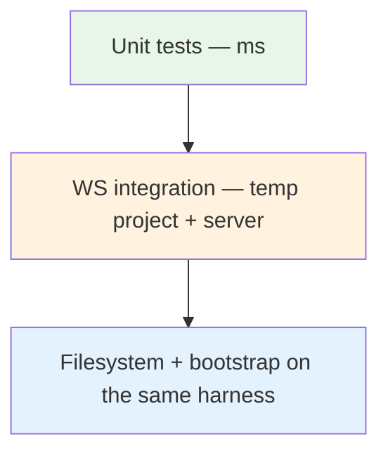
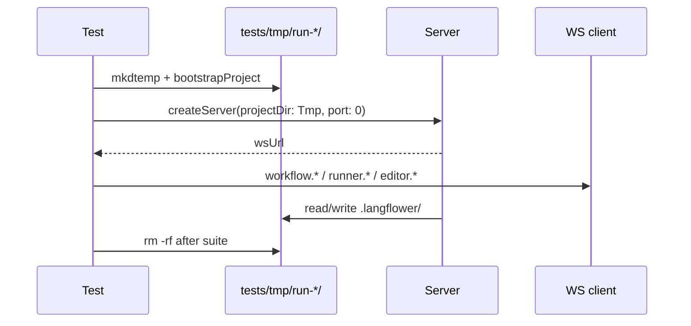

# Testing Strategy

How Langflower is tested: **unit tests** for pure logic, **WebSocket tests** for
default UI transport (commands + push), and **integration tests** with a temp
project folder. REST is an ADR-012 bulk escape hatch, not a test layer.

**Status:** strategy defined; runner and suites are added incrementally with
[DONE/EPICS/README.md](DONE/EPICS/README.md) and
[DONE/LLM-NODES/llm-nodes-README.md](DONE/LLM-NODES/llm-nodes-README.md).

---

## Goals

| Goal                          | Approach                                                              |
| ----------------------------- | --------------------------------------------------------------------- |
| Fast feedback on domain rules | Unit tests in `packages/shared`, pure server helpers                  |
| API contract stability        | WS tests for commands/push (ADR-012); no REST test tree               |
| Real filesystem + bootstrap   | Integration harness with temp dir under `tests/tmp/`                  |
| No pollution of user machines | Temp projects live only in repo test tmp; always deleted              |
| CI-friendly                   | No browser for WS/integration; unit + WS run headless                 |
| Regressions traceable         | Link tests to [FOUND_BUGS.md](FOUND_BUGS.md) entries when fixing bugs |

**Out of scope (initially):** E2E browser tests (Playwright/Cypress). Add later if
needed; WS tests cover server + contract that UI relies on.

### Bug fixes and the found-bugs log

When a bug is fixed after reproduction:

1. Append an entry to [FOUND_BUGS.md](FOUND_BUGS.md) (same PR when possible).
2. Add a regression test when the behaviour is server/shared-testable; reference the
   test path in the log entry.
3. UI-only bugs may document `Regression test: none` with reason — prefer at least one
   integration or unit test at the nearest testable layer (executor, mapper, guards).

---

## Test pyramid


```mermaid
flowchart TB
	Unit[Unit tests — ms]
	WS[WS integration — temp project + server]
	Int[Filesystem + bootstrap on the same harness]

	Unit --> WS
	WS --> Int

	style Unit fill:#e8f5e9
	style WS fill:#fff3e0
	style Int fill:#e3f2fd
```

| Layer           | Speed   | Isolation               | What it proves                                        |
| --------------- | ------- | ----------------------- | ----------------------------------------------------- |
| **Unit**        | Fastest | Full mock               | Algorithms, validators, mappers, executor graph logic |
| **WS**          | Fast    | Test server + WS client | `workflow.*` / `runner.*` / `editor.*` facts          |
| **Integration** | Slower  | Real FS in `tests/tmp/` | Bootstrap, workflows on disk, full request path       |

---

## Recommended runner

| Package / area                          | Runner                 | Notes                                                      |
| --------------------------------------- | ---------------------- | ---------------------------------------------------------- |
| `shared`, `server`, `tests/integration` | **Vitest**             | ESM-native, fits `type: module`                            |
| `ui` (optional later)                   | **Vitest** + `TestBed` | Thin component tests; prefer mapper/store unit tests first |

Root scripts:

```bash
npm run test              # quiet: prints "ok" or failed-test list
npm run test:details      # live Vitest stream
npm run test:unit
npm run test:integration
npm run test:watch
npm run verify            # build-all + unit + integration
npm run verify:quick      # build-all + unit only
node build/test.mjs --unit
node build/test.mjs --integration
node build/tools/agent-run.mjs verify
```

Default `npm run test` is quiet (`ok` or a failed-test list via
`build/lib/format-error.mjs`). Use `npm run test:details` (or
`node build/test.mjs --details`) for the full Vitest stream. Do **not** use
`npm run test --verbose` — npm steals `--verbose` as its own loglevel flag.

**Hard rules:** `testTimeout` is **5000ms** — do not raise it to green-wash
slow suites. **Integration** files run **sequentially** (`fileParallelism:
false`, `maxWorkers: 1`) so WS servers do not contend. Unit stays parallel —
Vitest sequential mode leaks `vi.mock` across files. See
`.cursor/skills/langflower-build/SKILL.md`.

---

## Dev workflow

Use this table during day-to-day work and before opening a PR.

| When                                                   | Command                                                                             | ~Time   |
| ------------------------------------------------------ | ----------------------------------------------------------------------------------- | ------- |
| Tight loop on pure logic (shared/server unit)          | `npm run test:unit`                                                                 | seconds |
| Changed execution, WS handler, bootstrap, agents, HITL | `npm run build && npm run test:integration`                                         | ~30s    |
| **Default before marking work done (agents)**          | `npm run verify`                                                                    | ~1 min  |
| **Dead code before finish (agents)**                   | `npm run check:dead-code` → delete all → `npm run check:exports` → `npm run verify` | ~1 min  |
| Faster when integration already passed                 | `npm run verify:quick`                                                              | ~45s    |
| Full pre-PR gate                                       | `npm run format && npm run lint && npm run test && npm run build`                   | ~2 min  |

**Integration prerequisites:** tests import `@langflower/server` and `@langflower/shared`
from compiled output. After package changes, run `npm run build` (or use `verify`)
before `test:integration`. Unit tests resolve TypeScript sources via Vitest aliases.

**Prefer integration over a dev server** for execution regressions — see
`.cursor/rules/dev-server-lifecycle.mdc`. Integration harness spins an ephemeral
HTTP/WS server on a random port; no browser, no port 4010.

**Re-run one failing file:**

```bash
npx vitest run tests/integration/ws/execute-fake-llm.ws.test.ts
node build/test.mjs --integration -- tests/integration/ws/execute-ask-user.ws.test.ts
```

---

## 1. Unit tests

**Location:** co-located with source — `*.test.ts` next to the module under test.

```
packages/shared/src/validators/connection-validator.test.ts
packages/ui/src/app/services/tests/bridge-diagram.service.test.ts
packages/runtime/src/runtime.test.ts
packages/ui/src/app/features/feed-folding/tests/execution-feed.service-replay.test.ts
```

### Rules

- **No I/O** — no `fs`, no `fetch`, no Express listen.
- **No Angular** in `shared` / server unit tests.
- Test **pure functions** and **immutable transforms** (input → output, no mutation).
- Use `as const` fixtures; typed helpers from `@langflower/shared`.
- One logical behaviour per `it` / `test`; Arrange–Act–Assert.

### Type-level unit tests

Utility types and registry helpers must stay aligned with their public signatures.
Use compile-time assertions from `types/expect-type.ts`:

```typescript
import { assertTypeEqual, type ExpectEqual } from '../types/expect-type.js';
import {
	getResolvedCommonNode,
	type CommonResolvedNodeConfig,
} from './index.js';

assertTypeEqual<
	ExpectEqual<
		ReturnType<typeof getResolvedCommonNode>,
		CommonResolvedNodeConfig | undefined
	>
>();
```

- Put assertions in `*.types.test.ts` next to the module (or in the utility’s `*.test.ts`).
- `ExpectEqual<Actual, Expected>` → `never` when types diverge → `assertTypeEqual` fails to compile.
- Prefer fixing types over adding `as` casts.

### Priority targets (from implementation plan)

| Module                    | Why                             |
| ------------------------- | ------------------------------- |
| `canConnectPorts`         | Single source of port rules     |
| `supportsInlinePortInput` | UI + executor input resolution  |
| `extractNodeDefinition`   | Registry metadata               |
| `bridge-diagram.service`  | Workflow → ngDiagram projection |
| `RuntimeRunner`           | Start / startNode / interrupt   |

### Example shape

```typescript
import { describe, it, expect } from 'vitest';
import { canConnectPorts } from './connection-validator.js';

describe('canConnectPorts', () => {
	it('allows string to json target', () => {
		expect(canConnectPorts('string', 'json')).toBe(true);
	});
});
```

---

## 2. Transport tests (UI-shaped)

Tests imitate how the Angular app talks to the server — **not** a full browser.

### WebSocket (default)

Most UI services use the typed WebSocket bus from
`packages/shared/src/langflower-bus-config.ts`. Integration tests use a **WS client
harness** against the test server.

| UI service / action     | WS event flow                                               | Notes                                         |
| ----------------------- | ----------------------------------------------------------- | --------------------------------------------- |
| Session bootstrap       | `session.state.snapshot` → `session.ready`                  | reconnect-safe                                |
| Editor graph mutation   | `editor.*.requested` → `editor.*.delta`                     | authoritative fact (broadcast)                |
| Runner control          | `runner.*.requested` → `runner.*` telemetry                 | session graph                                 |
| Palette reload          | `palette.reload.requested` → `palette.snapshot`             | system catalog only                           |
| Custom palette update   | `customPalette.update.requested` → `customPalette.snapshot` | errors + status; pack `COMPILATION_ERRORS.md` |
| Workflow save/load/list | `workflow.*.requested` → workflow snapshots                 | persisted JSON                                |

```
tests/integration/
├── helpers/                  # temp project, test server, scenario composer
├── ws/                       # LangflowerWsClient suites (primary surface)
│   ├── langflower-ws-client.ts
│   ├── workflows.ws.test.ts
│   ├── editor*.ws.test.ts
│   └── execute-*.ws.test.ts
├── bootstrap-*.test.ts
└── eval-regression-gate.test.ts
```

Workflow CRUD / config / nodes / runner control are **WS-only** integration
coverage. Do **not** add a parallel `tests/integration/api/` tree for those —
REST remains a bulk escape hatch (ADR-012) if/when needed.

---

## 3. Integration tests (temporary project folder)

Integration tests prove **bootstrap + filesystem + WS** together. Each run uses a
**fresh directory** under the repo — never `demo-project/` or the developer’s home.

### Temp directory convention

```
tests/tmp/
└── run-<timestamp>-<random>/     # one isolated “user project” per suite or test file
    └── .langflower/              # created by bootstrapProject()
        ├── config.json
        ├── nodes/
        ├── workflows/
        └── .cache/
```

| Rule              | Detail                                                                              |
| ----------------- | ----------------------------------------------------------------------------------- |
| **Location**      | `tests/tmp/` only (gitignored)                                                      |
| **Creation**      | `fs.mkdtemp(path.join(repoRoot, 'tests/tmp/run-'))`                                 |
| **Teardown**      | `afterAll` / `finally`: stop server, `fs.rm(dir, { recursive: true, force: true })` |
| **Parallel runs** | Unique subdir per worker if Vitest pool is enabled                                  |
| **Never commit**  | `tests/tmp/` is in `.gitignore`                                                     |

### Harness flow

```
tests/integration/helpers/
├── repo-paths.ts
├── temp-project.ts
├── test-server.ts              # in-process server + stopTestServer(handle)
├── workflow-scenarios.ts       # scenario factories
└── workflow-scenario-registry.ts  # WORKFLOW_SCENARIO_COMPOSER + ready gates
```


```mermaid
sequenceDiagram
	participant Test
	participant Tmp as tests/tmp/run-*/
	participant Server
	participant WS as WS client

	Test->>Tmp: mkdtemp + bootstrapProject
	Test->>Server: createServer(projectDir: Tmp, port: 0)
	Server-->>Test: wsUrl
	Test->>WS: workflow.* / runner.* / editor.*
	Server->>Tmp: read/write .langflower/
	Test->>Tmp: rm -rf after suite
```

Integration suites use the **WS client** (`@langflower/shared/langflower-ws-waits`

- local harness helpers). No browser; no fixed port 4010.

### LLM chain integration tests

Prove full chains via `LangflowerWsClient` (no browser). Matrix below lists
**live** runtime suites. Product roadmap is use-case Status —
[PRODUCT.md](PRODUCT.md).

Do **not** add `it.todo` under `execute-*.ws.test.ts` names. Registered
scenarios must use types in `getCommonReactiveNodeCatalog()`;
`scenarioReadyById` **throws** if a type is missing (no `skipIf` graveyard).
Composer self-test asserts every `WORKFLOW_SCENARIO_COMPOSER` row is
catalog-ready.

| Test file                                                     | What it actually proves                                                                          |
| ------------------------------------------------------------- | ------------------------------------------------------------------------------------------------ |
| `tests/integration/ws/execute-*.ws.test.ts`                   | Live runtime suites (Fake LLM, HITL, Chat Input, smoke, agents, checkpoint, delay, eval gate, …) |
| `tests/integration/ws/custom-palette-compile-tool.ws.test.ts` | Custom-node esbuild / palette compile                                                            |
| `tests/integration/bootstrap-sample-workflows.test.ts`        | Skeleton seed files (`starter.json`, `agents-dialog.json`, …)                                    |

**Feedback / settle (unit, current stack):** `packages/runtime/src/runtime.test.ts`
(`stopsRun` finish → done); `packages/shared/src/execution/derive-run-settle-outcome.test.ts`.
There is no `workflow-executor.service.test.ts`.

Fake LLM: `common-fake-llm` + `.langflower/mock-llm.json` (see node-library §14).

### Live OpenAI-compatible + MCP tool calling (gap)

**Status (2026-07):** CI and default `verify` prove **Fake LLM**, **scripted**
`tool_calls`, and **fixture MCP stdio** (echo server). They do **not** prove that a
**real** OpenAI-compatible model chooses tools / MCP tools correctly.

| Covered today (no cloud key)                                                      | Not covered without a live provider                                               |
| --------------------------------------------------------------------------------- | --------------------------------------------------------------------------------- |
| `common-fake-llm` WS demos + Fake tool-loop                                       | Model-authored `tool_calls` / multi-round loops                                   |
| `openai-mcp-tool-loop.test.ts` — **injected** `tool_calls` → MCP transport invoke | Same path with a **real** chat-completions stream                                 |
| MCP stdio/http clients + system/wire `ToolHandle[]` fixtures                      | Live inventory → model selects `<mcp_name>__<tool>` → result back into context    |
| Builtin harness invoke with Fake / scripted loops                                 | Live builtin `read`…`move`/`bash` (and MCP) under role budgets + `permission.ask` |

**Maintainer constraint:** no reliable access to an OpenAI-compatible **cloud** API
right now, so tool/MCP calling on MCP-wired `common-openai-llm` nodes cannot be
manually or CI-verified end-to-end. Local endpoints (e.g. LM Studio) count as live
when they expose tools; many local builds do not — treat them as optional, not a
substitute for the checklist below until a run passes.

**Do not** flip use-case Status to Implementable on agent/MCP tool paths until the
relevant cases below pass on a real provider (Fake/`--replay` stay topology-only).

#### Opt-in live checklist (manual or future `LANGFLOWER_LIVE_LLM=1` suite)

Prereqs: project `langflower.jsonc` with a working OpenAI-compatible `baseUrl` +
key (env placeholder); either system `mcp.servers` + Inspector `enabledMcpIds`,
or wire `common-mcp-stdio` / `common-mcp-http` → LLM `tools`. Prefer
`demo-project` or a throwaway copy.

| #   | Case                                  | Setup                                                             | Pass when                                                                                                  |
| --- | ------------------------------------- | ----------------------------------------------------------------- | ---------------------------------------------------------------------------------------------------------- |
| L1  | Chat stream only                      | `common-openai-llm`, no tools                                     | `reasoning`/`draft` (or content) stream; run settles `success` / expected ports                            |
| L2  | Builtin tool round-trip               | LLM + harness builtins (`read`/`glob`); prompt forces a file read | Model emits tool call → harness result → final answer cites file; feed shows tool technical line           |
| L3  | Multi-round tool loop                 | Prompt needs ≥2 tool steps                                        | ≥2 `tool_calls` rounds; no hang; context includes prior tool results                                       |
| L4  | `permission.ask`                      | Policy `ask` on a tool the model will call                        | Gate in composer/feed; Allow continues; Deny fails closed without silent success                           |
| L5  | MCP inventory visible                 | System MCP enabled and/or wire to `tools`                         | Inventory dump shows `<mcp_name>__<tool>`                                                                  |
| L6  | MCP invoke (happy path)               | Fixture or real MCP tool; prompt forces that tool                 | Real model selects MCP tool id → transport invoke → result in next completion; run settles                 |
| L7  | MCP disabled                          | System id not in `enabledMcpIds`, or wire removed                 | Tool absent from inventory; no silent “success” pretending the tool ran                                    |
| L8  | MCP + builtin mix                     | Prompt needs one builtin + one MCP tool                           | Both fire in one run; order may vary; both results visible to the model                                    |
| L9  | Bad credentials / unreachable baseUrl | Wrong key or down endpoint                                        | Node/run fails with actionable error; no infinite retry storm                                              |
| L10 | WS reconnect mid-stream (optional)    | Start L1/L6; drop browser; reopen while process lives             | Live or settled chrome per [detachable-long-run](use-cases/detachable-long-run.md); no silent second Start |

**Suggested first live slice when a key exists:** L1 → L2 → L6 (chat, builtin,
MCP). Record date + provider/model in the PR or a short note under
[FOUND_BUGS](FOUND_BUGS.md) / STATUS if behaviour surprises the Fake path.

**Automation target (later):** gated suite skipped unless
`LANGFLOWER_LIVE_LLM=1` (and secrets via env); never required for default
`verify`. Until then this section is the contract for manual proof.

### Example lifecycle

There is **no** `tests/integration/api/` tree and no `saveWorkflowBulk`
helper. Workflow CRUD is WS (`workflow.list.snapshot`,
`workflow.current.snapshot`). Copy the harness from
`tests/integration/ws/workflows.ws.test.ts`.

```typescript
import { afterAll, beforeAll, describe, expect, it } from 'vitest';
import { createLangflowerWsClient } from './ws/langflower-ws-client.js';
import {
	requestWorkflowList,
	waitSessionReady,
} from '@langflower/shared/langflower-ws-waits';
import {
	createTempProject,
	removeTempProject,
} from './helpers/temp-project.js';
import { startTestServer, stopTestServer } from './helpers/test-server.js';

describe('workflow CRUD (integration)', () => {
	let projectDir: string;
	let urls: Awaited<ReturnType<typeof startTestServer>>;
	let client: ReturnType<typeof createLangflowerWsClient>;

	beforeAll(async () => {
		projectDir = await createTempProject();
		urls = await startTestServer({ projectDir });
		client = createLangflowerWsClient(urls.wsUrl);
		await waitSessionReady(client);
	});

	afterAll(async () => {
		client.close();
		await stopTestServer(urls);
		await removeTempProject(projectDir);
	});

	it('lists workflows over WS', async () => {
		const { workflows } = await requestWorkflowList(
			client,
			(list) => list.workflows.length > 0,
		);
		expect(workflows.length).toBeGreaterThan(0);
	});
});
```

---

## What we do not test (yet)

| Area                                    | Reason                                                                                                                 |
| --------------------------------------- | ---------------------------------------------------------------------------------------------------------------------- |
| ngDiagram drag/drop                     | API + mapper unit tests cover data; E2E later                                                                          |
| Browser open (`open` package)           | CLI smoke manual / optional subprocess test                                                                            |
| User custom node esbuild                | Covered by `custom-palette-compile-tool.ws.test.ts`                                                                    |
| Browser WebSocket UI                    | E2E later; integration uses WS client harness                                                                          |
| Live OpenAI-compatible tool + MCP loops | No cloud API access in maintainer env; Fake/scripted only — [checklist](#live-openai-compatible--mcp-tool-calling-gap) |

---

## Fixtures

Committed static data only under `tests/fixtures/` (not `tests/tmp/`).

```
tests/fixtures/
├── eval/                     # golden eval packs
├── mcp/echo-server.mjs       # fixture MCP stdio
└── static/index.html         # static HTTP smoke
```

Graph fixtures live in `tests/integration/helpers/scenarios/*.ts` (composer
factories). Do **not** add a parallel `tests/fixtures/workflows/` tree.

---

## Local cleanup scripts

| Command           | Removes                                                                                                                                                                 |
| ----------------- | ----------------------------------------------------------------------------------------------------------------------------------------------------------------------- |
| `npm run clean`   | `dist/`, `.angular/`, `tsconfig.tsbuildinfo`, `node_modules/.cache`, `coverage/`, `tests/tmp/*` (keeps `.gitignore`), `tests/tests/tmp/`, demo `.langflower/**/.cache/` |
| `npm run cleanup` | `node_modules/` and lockfiles (fresh `npm install`)                                                                                                                     |

Use **`clean`** before builds when artifacts are stale; use **`cleanup`** only when
resetting dependencies.

---

## CI checklist (planned)

- [x] `npm run test:unit` — Vitest unit project via `build/test.mjs`
- [x] `npm run test:integration` — WS + temp-project harness (`tests/integration/`)
- [x] `npm run verify` — build-all + unit + integration (local/CI one-shot)
- [ ] `npm run test` (unit + integration) on every PR in CI
- [ ] Fail build if `tests/tmp/` is left dirty (teardown enforced)
- [ ] No `.env` or secrets in tests; use temp config only

---

## Adding tests with implementation phases

| Phase         | Tests that exist today                                    |
| ------------- | --------------------------------------------------------- |
| Server + CLI  | `project-bootstrap.ws.test.ts`, `config-draft.ws.test.ts` |
| Common nodes  | catalog unit tests; `editor-palette-visible.ws.test.ts`   |
| Workflow CRUD | `workflows.ws.test.ts` (list/load/save/delete over WS)    |
| Demo execute  | live `tests/integration/ws/execute-*.ws.test.ts`          |

Update epic / use-case Status in [DONE/EPICS/](DONE/EPICS/README.md) and
[use-cases/](use-cases/README.md) when suites
land.

---

## Desktop launcher (Rust / Cargo)

The Slint supervisor is **not** on the Vitest DAG. After changing
`launcher/`, run:

```bash
npm run launcher:test
```

That is `cargo test` via the portable Rust wrapper. Suites live in
`launcher/tests/` and do not open the window. READY / `--no-open`
contracts are shared with `packages/cli/src/start-command.ts` — change
both sides together.

Author guide: [launcher/docs/testing.md](../launcher/docs/testing.md).
CI: `.github/workflows/launcher-ci.yml` (`cargo test --locked`).

## Related docs

- [TODO/EPICS/README.md](TODO/EPICS/README.md) — active product epic queue
- [DONE/EPICS/README.md](DONE/EPICS/README.md) — archived epics 00–46
- [architecture/ARCHITECTURE.md](architecture/ARCHITECTURE.md) — API table
- [architecture/PRINCIPLES.md](architecture/PRINCIPLES.md) — immutability, strict types in tests
- [tests/README.md](../tests/README.md) — folder layout pointer
- [DONE/EPICS/16-mcp-optional.md](DONE/EPICS/16-mcp-optional.md) — MCP landed; live model proof still open
