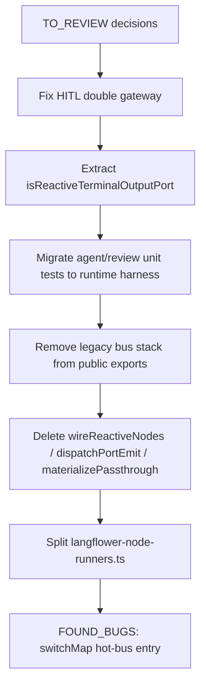

# Runtime cleanup — items to review (Phase 8)

Started: 2026-06-18. Companion: [`docs/TODO/runtime-refactor.md`](TODO/runtime-refactor.md).

This file captures **duplication**, **weak boundaries**, and **condense** opportunities
found during server cutover to `@langflower/runtime`. Not a backlog — each item needs
an explicit decision (delete, merge, move package, or keep with reason).

---

## P0 — Two execution stacks (weak boundary)

**Resolved (2026-06-19):** all common nodes run through `@langflower/runtime`
reactive adapter; `defineNode` wraps batch `execute` in shared; server uses
`resolved.execute` for Agent/Review/Ask User and `concatMap` + `runNodeWithRetry`
for retryable batch nodes. Legacy `batch-node-adapter` and `langflower-batch-runner`
removed.

---

## P0 — Duplicate terminal-port predicates

**Resolved (2026-06-18):** `isReactiveTerminalOutputPort()` in
`packages/shared/src/reactive-terminal-ports.ts`; used by server WS bridge
(`runtime-execution-events.ts`). Runtime adapter relies on node `completeReactiveRun`.

---

## P0 — Duplicate activity / run-idle tracking

**Resolved (2026-06-18):** `NodeActivityTracker` deleted from shared. Production uses
`ReactiveRunTracker` in `@langflower/runtime` only.

---

## P1 — Duplicate HITL gateway registration (fixed)

**Resolved (2026-06-19):** `buildExecutionContext.waitForUserInput` delegates to
`waitForUserInputAsString` only — single `trackGatewayWaitForUserInput` in
`createGatewayAwareWaitForUserInput`.

**Review (open):** whether gateway bridge is still needed at all now that
`resolveUserInput` calls `runtime.resumeUserInput` directly (gateway may be
redundant for WS path).

---

## P1 — Awaiting-input dedupe by question text (fixed)

**Resolved (2026-06-19):** `runtime-execution-events.ts` no longer dedupes
`awaiting-input` by `${nodeId}:${question}`. That blocked multi-turn HITL loops
where the same prompt repeats (inline LLM feedback integration test).

---

## P1 — `getReactiveNodeRuntimes()` misnomer

`packages/shared/src/common-nodes/index.ts` builds a `Map` of `createReactiveNodeRuntime`
factories. Server **only** uses it in `validateWorkflowNodes()` to check reactive type
registration — not for execution.

**Condense:**

```typescript
export const REGISTERED_REACTIVE_NODE_TYPES: ReadonlySet<string>;
// or validateReactiveNodeType(type) — no factory map
```

Remove `getReactiveNodeRuntimes` from public exports once validation uses a set.

---

## P1 — Dead legacy bus / batch dispatch (orphan exports)

**Resolved (2026-06-18):** `dispatch-port-emit`, `publish-batch-outputs-to-bus`,
`wire-router-channels`, and legacy bus tests deleted. `synthesizePassthroughOutputs`
kept; router/partial-run covered by runtime integration tests.

---

## P1 — `wireReactiveNodes` + `getReactiveNodeRuntimes` export surface

**Resolved (2026-06-18):** removed from public exports; validation uses
`getRegisteredReactiveNodeTypes()`.

---

## P2 — Overlap: reactive node `execute` vs runtime adapter

Reactive node handlers return `Record<string, Observable<unknown>>`.
Both adapters subscribe similarly:

| Concern              | Legacy `reactive-node-runtime.ts`        | `reactive-node-adapter.ts`           |
| -------------------- | ---------------------------------------- | ------------------------------------ |
| Input wiring         | `buildReactiveInputs` + bus              | `inputRegistry` + materialized graph |
| Run start            | `combineLatest` / agent ports            | handler calls `markRunStarted`       |
| Run end              | `completeReactiveRun` in node `finalize` | same                                 |
| Output subscribe     | emit + terminal complete on emit         | push to output bus                   |
| Review combineLatest | duplicated in legacy runtime             | in node handler only                 |

**Condense:** legacy file is mostly a second adapter — hard to delete until tests move.

---

## P2 — WS bridge vs runtime events (boundary ok, but dense)

Two layers:

1. `runtime-execution-events.ts` — subscribes `runtime.events$`, port streams, builds sink
2. `runtime-ws-bridge.ts` — maps sink → WS push payloads

**Review:** merge into one module or rename `RuntimeExecutionSink` to live in server
websocket folder. Current split is fine if `run-workflow.test.ts` keeps sink testable.

**Weak typing:** `RuntimeExecutionReporter` omits several sink callbacks (awaiting, output
complete) — reporter is partial facade; consider one interface.

---

## P2 — `buildExecutionContext` size (`langflower-node-runners.ts`)

Split into `langflower-execution-context.ts`, `langflower-reactive-runner.ts`,
`langflower-runner-helpers.ts` (2026-06-18). Batch handler removed (2026-06-19).

**Remaining condense candidates:**

- `createAskApprovalHandler` duplicates gateway wait pattern with Ask User node

---

## P2 — Duplicate `completeReactiveRun` / `finalize` in node factories

`create-agent-node.ts` and `create-review-node.ts` both:

```typescript
.pipe(
  switchMap(/* execute */),
  finalize(() => { ctx.completeReactiveRun?.(); }),
)
```

**Condense:** small helper `withReactiveRunLifecycle(inner$)` in shared agent utilities.

---

## P2 — Test / debug debt

| Item                                          | Location                                    |
| --------------------------------------------- | ------------------------------------------- |
| `Promise.race` 500ms timeout wrappers         | `workflow-run-session.review.test.ts`       |
| Diagnostic `getPendingRunCount` in assertions | `review-nodes.test.ts`                      |
| Flaky mock ordering                           | `bootstrap-plan-mock.test.ts` (integration) |

---

## P2 — Stale documentation (cleanup pass)

Update references from removed modules:

| Doc                              | Stale reference                                   |
| -------------------------------- | ------------------------------------------------- |
| `docs/NAVIGATION.md`             | `execution-ws-bridge.ts` → `runtime-ws-bridge.ts` |
| `docs/STATUS.md`                 | same                                              |
| `packages/server/AGENTS.md`      | same                                              |
| `docs/EXECUTION_ARCHITECTURE.md` | already updated                                   |
| `packages/shared/AGENTS.md`      | still describes `ReactivePortBus` as production   |

Files **already deleted** (docs may still mention):

- `packages/server/src/services/workflow-run-driver.ts`
- `packages/server/src/websocket/execution-ws-bridge.ts`

---

## P2 — Package boundary smells

| Smell                                                  | Detail                                                                            |
| ------------------------------------------------------ | --------------------------------------------------------------------------------- |
| `@langflower/runtime` depends on `@langflower/shared`  | Acceptable for `WorkflowGraph`, `ExecutionContext`; avoid server types in runtime |
| Server imports `getReactiveNodeRuntimes`               | **Fixed:** `getRegisteredReactiveNodeTypes()` in validation                       |
| UI has no `@langflower/runtime` dep                    | OK for now; duplicates WS event semantics in `WorkflowExecutionService`           |
| `node_modules/@langflower/runtime` copies in workspace | Normal monorepo link; ensure no edited code in node_modules                       |

---

## Suggested cleanup order



---

## Decisions log

| Date       | Item                               | Decision                                                                                                                                          |
| ---------- | ---------------------------------- | ------------------------------------------------------------------------------------------------------------------------------------------------- |
| 2026-06-19 | Two execution stacks               | **Done:** reactive-only; `langflower-batch-runner`, runtime `batch-node-adapter`, `executeCommonNode` removed                                     |
| 2026-06-19 | Awaiting dedupe by question        | **Fix:** removed — allow repeated HITL prompts                                                                                                    |
| 2026-06-19 | HITL double `trackGateway`         | **Done:** single registration in `createGatewayAwareWaitForUserInput`                                                                             |
| 2026-06-18 | `isReactiveTerminalOutputPort`     | **Done:** `packages/shared/src/reactive-terminal-ports.ts`; used in legacy runtime + WS bridge                                                    |
| 2026-06-18 | `getReactiveNodeRuntimes`          | **Done:** validation uses `getRegisteredReactiveNodeTypes()`; factory map deprecated, removed from public exports                                 |
| 2026-06-18 | Agent/review unit tests            | **Done:** runtime harness `run-shared-reactive-node.ts`; shared keeps direct `execute` max-attempts test only                                     |
| 2026-06-18 | Legacy stack deletion              | **Done:** removed `ReactivePortBus`, `NodeActivityTracker`, `reactive-node-runtime`, `dispatch-port-emit`, `wireRouterChannels`, legacy bus tests |
| 2026-06-18 | Split `langflower-node-runners.ts` | **Done:** `langflower-execution-context.ts`, `langflower-reactive-runner.ts`, `langflower-runner-helpers.ts`                                      |
| 2026-06-18 | `withReactiveRunLifecycle`         | **Done:** `packages/shared/src/reactive-run-lifecycle.ts` in agent/review nodes                                                                   |
| 2026-06-18 | Review test `Promise.race`         | **Done:** rely on vitest timeout + status assertion                                                                                               |
| 2026-06-18 | Mock agent `scriptPromise` cache   | **Fix:** reload `mock-llm.json` per call; keep per-run `llmCallIndex` for `callIndex` matching across feedback loops                              |
|            | Golden comparison tests            | **Skip** — document in runtime-refactor                                                                                                           |

Add rows as items are resolved or rejected.
