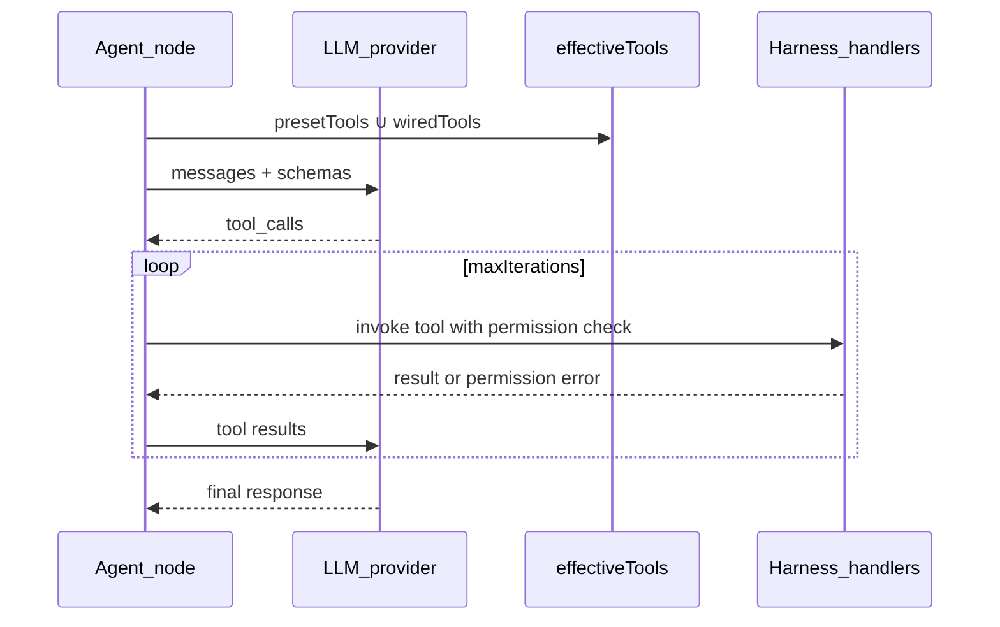

# Node library

## Goal

Give users a set of ready-made building blocks — literals, logic, text
processing, AI agents, filesystem/shell/web access, knowledge base, and web
crawling — so most workflows can be built entirely from built-ins, without
writing a custom node.

## Runtime catalog vs this doc

**Shipped palette nodes** are only those registered in
[`packages/common-nodes/src/catalog.ts`](../../packages/common-nodes/src/catalog.ts).
See [STATUS.md](../STATUS.md) for the current list.

Much of this file is the **target** product catalog (ports, security model,
rollout). Rows marked **done** historically overstated reality — treat
**`catalog.ts` + STATUS** as truth. Many folders under `packages/common-nodes`
have `NODE.md` stubs without `node.ts`.

| Status word | Meaning here                                        |
| ----------- | --------------------------------------------------- |
| **done**    | In `catalog.ts` and runnable                        |
| **stub**    | `NODE.md` (and maybe helpers) only — not registered |
| **planned** | Spec / epic; not implemented                        |

**Catalog Status ≠ use-case Status.** End-user scenarios
([docs/use-cases/](../use-cases/README.md)) stay **Blocked** until agent
runtime prerequisites (tool-loop + built-in tools) land —
[DONE/EPICS/](../DONE/EPICS/README.md). Text-only LLM + HITL can run today;
that does **not** make coding-agent Implementable.

**Product lock (LLM):** one node type (`common-openai-llm` /
`common-fake-llm`) with **role presets** (Plan/Coder/Explorer) — not separate
`common-agent-*` palette types. See [LLM_NODES.md](../LLM_NODES.md).

## Core Principles

- **Batteries included, sandboxed by default** — every node that touches the
  filesystem, shell, or network runs on the server under a project-root
  sandbox; nothing reaches outside the project directory or the user's
  explicit permission rules.
- **Typed ports everywhere** — every node's inputs/outputs declare a wire
  type; the palette and canvas enforce the same compatibility rules for
  built-in and custom nodes alike.
- **The environment decides, not just the model** — "hard harness" nodes
  (Assert, Gate, IF, Switch, Review, HITL) let a workflow branch on verifiable
  conditions instead of trusting an LLM's self-report.
- **Composable, not monolithic** — harness capabilities (read file, web
  fetch, grep, …) exist both as standalone palette nodes and as tools an
  Agent node can call — a user is never forced to go through an agent to use
  a capability.
- **No silent path/URL escapes** — path and network access nodes validate
  every path against the project root and every request against basic SSRF
  guards; this is a deliberate reaction to real-world node-based-tool CVEs.

## Feature Details

**Target** palette groupings (not all shipped — see Runtime catalog above):

- **AI / Agents (target)** — LLM with Plan/Coder/Explorer **presets**, Review /
  Critique nodes, Review Gate, Chat Input. Today: LLM + internal tool-loop +
  `common-review` / `common-critique`
    - HITL; role profiles and Chat Input remain epics. Chat Input — see
      [hitl-chat.md](hitl-chat.md).
- **Logic** — Router + Merge + Assert / IF / Switch / Compare / Gate
  **shipped** (hard harness).
- **Flow** — Delay + Checkpoint + Loop + Repeat **shipped**.
- **Text** — Concat + Split (paced) + Read/Write/Append File **shipped**;
  Template, one-shot Split (`parts[]`), Replace, … planned/stub.
- **Primitives** — String, String (multiline), Number, Boolean **shipped**;
  JSON helpers planned.
- **Output** — Preview + Finish **shipped**.
- **Harness (target)** — Read/List/Glob/Grep/Web Fetch/Write/Edit/Bash as
  palette nodes and/or agent tools — **not shipped** (epic 01).
- **Embeddings** — Embed text, Embed similarity, Embed provider (`EmbedHandle`
  wire for custom packs) — epic 42 **landed**.
- **Memory** — `common-memory-tools` → `.langflower/memory/` (markdown tools;
  not vector KB — [ADR-033](../ADR.md#adr-033--markdown-memory-tools-no-embedding-as-base)).
- **Knowledge / Crawl** — vector KB pipeline **removed** (ADR-033); crawl nodes
  (epic 12) in catalog.

A typical "hard harness" pipeline chains agent and gate nodes so a step's
success is verified before the next step runs, e.g.:
Plan → Assert(plan valid) → [fail: Refine] / [pass: Implement] → Assert(tests
pass) → Review → QA.

**Historical:** vector KB graph nodes (`common-kb-*`) were removed (ADR-033).
Use **Embeddings** catalog nodes + pack-owned storage, or markdown memory tools.

A typical **Embeddings** manual check is `String → common-embed-text → Preview`
on **`preview`**, optionally `vector → common-embed-similarity`. Custom packs
wire `common-embed-provider.embed → consumer.embed` (`EmbedHandle`).

Every harness node that reads/writes files or makes HTTP requests is
constrained to the current project's root directory, denies a default list
of sensitive paths (e.g. `.env`, git config), and applies allow/ask/deny
permission rules a user configures per project (see
[project-configuration.md](project-configuration.md)).

## Implementation Details

- Node package layout and reactive-binding conventions:
  [packages/common-nodes/AGENTS.md](../../packages/common-nodes/AGENTS.md).
- Author conventions for adding a new built-in or custom node (folder layout,
  ports, tests): [docs/NODES.md](../NODES.md), reactive SDK reference in
  [packages/node-sdk/AGENTS.md](../../packages/node-sdk/AGENTS.md).
- Harness sandbox and permission resolution: **planned** under
  `packages/server/src/harness/` (directory not present yet — epic 01);
  summarized in [docs/ARCHITECTURE.md](../ARCHITECTURE.md) when landed.
- Custom user-authored nodes (distinct from this built-in catalog): see
  [getting-started.md](getting-started.md) and `spec.md` §4.

The rest of this document is the full built-in node catalog — per-node port
reference, security model, rollout status, and design history — kept in one
place instead of a separate spec file. Related background docs:
[docs/EXECUTION_ARCHITECTURE.md](../EXECUTION_ARCHITECTURE.md) (runtime
execution), [docs/REACTIVE_NODES.md](../REACTIVE_NODES.md) (reactive SDK and
port telemetry), [docs/CONFIG.md](../CONFIG.md) (LLM + embedding providers, harness
permissions), [docs/TESTING.md](../TESTING.md) (integration harness, WS
client), [docs/STATUS.md](../STATUS.md) (implementation status).

---

## 1. Product vision

Langflower provides UX similar to [OpenCode](https://opencode.ai/docs/tools/), but
with **explicit visual chaining** instead of a hidden tool loop.

| OpenCode (CLI)                       | Langflower (visual)                                         |
| ------------------------------------ | ----------------------------------------------------------- |
| Agent modes (plan, build, review)    | Workflow phases wired as nodes + gates                      |
| Built-in tools (read, grep, glob, …) | **Harness** common nodes                                    |
| Permission config                    | `langflower.jsonc` `permission` + agent presets             |
| Human questions                      | **Review Gate** (`requestChanges`) + editor composer (HITL) |
| Feedback in chat                     | **Feedback edges** → LLM rerun                              |

### Hard harness

The environment — not the LLM alone — decides whether a step succeeded and which
branch runs next:

1. **Assert** / **Gate** nodes evaluate conditions (tests passed, schema valid, grep found pattern).
2. Failed assert → node error → executor marks branch failed; workflow routes via **IF** / **Switch**.
3. **Review Gate** pauses for human input; **feedback** edges trigger LLM refinement.

Typical agent pipeline:

```
Plan (LLM) → Assert(plan schema) → [fail] → Refine (LLM + feedback)
            → [pass] → Implement (LLM + harness tools) → Assert(tests)
            → [pass] → Review (LLM) → Assert(checklist) → QA (Bash/tests) → Done
```

---

## 2. Node retirement policy

Early demos shipped a small common-node set for executor/canvas smoke. Only a
subset is **production**; draft/test types stay out of the palette (see
[§12 Migration](#12-migration-from-early-demo-nodes)).

### 2.1 Shipped — in `catalog.ts`

| Node                      | Type                                               | Mode     | Status   |
| ------------------------- | -------------------------------------------------- | -------- | -------- |
| Fake LLM                  | `common-fake-llm`                                  | reactive | **done** |
| OpenAI-compatible LLM     | `common-openai-llm`                                | reactive | **done** |
| MCP stdio                 | `common-mcp-stdio`                                 | reactive | **done** |
| MCP http                  | `common-mcp-http`                                  | reactive | **done** |
| Tool collection           | `common-tool-collection`                           | reactive | **done** |
| HITL Review Gate          | `common-hitl-review-gate`                          | reactive | **done** |
| Chat Input                | `common-chat-input`                                | reactive | **done** |
| Router                    | `common-router`                                    | reactive | **done** |
| Merge                     | `common-merge`                                     | reactive | **done** |
| Delay                     | `common-delay`                                     | reactive | **done** |
| Checkpoint                | `common-checkpoint`                                | reactive | **done** |
| Repeat                    | `common-repeat`                                    | reactive | **done** |
| Concat                    | `common-concat`                                    | reactive | **done** |
| Split (paced)             | `common-split-paced`                               | reactive | **done** |
| Read File                 | `common-read-file`                                 | reactive | **done** |
| Write File                | `common-write-file`                                | reactive | **done** |
| Append File               | `common-append-file`                               | reactive | **done** |
| String / Number / Boolean | `common-string`, `common-number`, `common-boolean` | reactive | **done** |
| String (multiline)        | `common-string-multiline`                          | reactive | **done** |
| Preview                   | `common-preview`                                   | reactive | **done** |
| Finish                    | `common-finish`                                    | reactive | **done** |

**Not shipped (do not list as done):** `common-agent-*`, remaining harness
FS/shell palette nodes (list/glob/grep/edit/bash). Read/Write/Append File ship
as **Text** via `ctx.files`. Hard harness Assert/IF/Switch/Compare/Gate and
`common-review` are **shipped**.

**Roles:** Plan/Coder/Explorer are **presets on the LLM node**, not separate
palette types ([LLM_NODES.md](../LLM_NODES.md)).

**Router** is not replaced by IF/Switch. It provides reactive identity
routing on dynamic channels and selective partial runs
(`getSelectiveDownstreamNodeIds`). IF/Switch handle harness **decisions**;
Router handles **stream fan-out / fan-in**.

### 2.2 Replace — Constant → Primitives

| Retired                                                                    | Replacement                                                      |
| -------------------------------------------------------------------------- | ---------------------------------------------------------------- |
| `common-constant` (untyped string)                                         | `common-string`, `common-number`, `common-boolean`               |
| `common-ask-user` / `common-hitl-ask-user` / `common-hitl-approval-choice` | `common-hitl-review-gate` (+ `common-chat-input` for cold-start) |
| `common-fake-tool-registration`                                            | `common-*-tools` packs (KB / Crawl / Memory)                     |
| `common-fake-mcp-server` / `common-mcp-server`                             | `common-mcp-stdio` / `common-mcp-http` (`tools`)                 |

### 2.3 Draft/test — keep out of production registry

`common-concat` and `common-delay` are **shipped** in `catalog.ts` (useful
flow/text nodes). Distinct from the planned `common-join` (single `lines[]` +
separator param).

| Node    | Type             | Reason                    |
| ------- | ---------------- | ------------------------- |
| Collect | `common-collect` | Multi-port demo only      |
| Triple  | `common-triple`  | Reactive emit demo only   |
| Flaky   | `common-flaky`   | Retry policy test fixture |
| Throw   | `common-throw`   | Error policy test fixture |

Test-only behaviour (retry, error policy) stays in **internal test fixtures**,
not the production catalog.

---

## 3. Design principles

1. **Common-node ownership** — built-in definitions live in
   `packages/common-nodes/src/` and use the public
   `@langflower/node-sdk` SDK.
2. **Injected runtime I/O** — file, shell, HTTP, KB, crawl capabilities are
   implemented in `@langflower/tools` and exposed through the run
   `ExecutionContext`; common nodes compose those injected capabilities.
3. **Project-root sandbox** — harness paths resolve under `<project-root>/`
   (parent of `.langflower/`), or under `harness.allowedRoots` when set
   (ADR-014 extension — Obsidian vaults outside the project). Paths outside
   every fence → error. No silent deny.
4. **Typed ports** — primitives use `string` / `number` / `boolean` wire
   types; runtime/editor port metadata and canvas connection checks enforce
   compatibility.
5. **Immutable definitions** — `readonly` ports and params per [PRINCIPLES.md](../PRINCIPLES.md).
6. **Security lessons** — Flowise removed read/write file tools after path-traversal CVEs; Langflower validates every path (see [§10](#10-security--permissions)).

---

## 4. Node spec template

Every common node is documented with:

| Field                | Description                                                       |
| -------------------- | ----------------------------------------------------------------- |
| `type`               | Stable id, prefix `common-`                                       |
| `displayName`        | Palette label                                                     |
| `category`           | Palette group (see [§9](#9-palette-categories))                   |
| `inputs` / `outputs` | Port names, wire types, defaults, cardinality, feed / passthrough |
| `uiSchema`           | Inspector parameters; use `as const` for inferred params          |
| `bind`               | Builds the `StatefulConnection` / `StatefulObservable` graph      |
| `serverRuntime`      | Required injected `ExecutionContext` capabilities, if any         |
| `priority`           | P0 / P1 / P2                                                      |
| `status`             | `done` \| `stub` \| `planned`                                     |

Implementation uses `defineReactiveNode` from
`@langflower/node-sdk`. `defineReactiveNode` first probes `bind` for
serializable port metadata; every `getInstance()` calls `bind` again for a
fresh live graph. Therefore `bind` must not perform module-level I/O or mutate
shared state.

Use `makeInput`, `configureOutput`, and `combineInputs` from the bind helpers.
Optional initialization inputs declare `defaultValue`; only ordered feedback
turns use the `startWith('')` + `concatMap` pattern. Passthrough outputs pass
the input connection directly and set `inferTypeFrom` so both demand and
dynamic wire typing stay explicit.

For `StatefulObservable` semantics, pure folds, subscription boundaries, and
the `withLatestFrom` restriction, reference
[REACTIVITY.md](../REACTIVITY.md) rather than duplicating those rules here.
Full examples:
[HOW_TO_WRITE_REACTIVE_NODES.md](../HOW_TO_WRITE_REACTIVE_NODES.md).

---

## 5. Production nodes (current)

Detailed port specs below for **target** shapes. Shipped set is §2.1 /
`catalog.ts` only.

### 5.1 Agent nodes — `common-agent-{preset}` (superseded)

**Category:** AI · **Mode:** reactive · **Status:** planned (superseded by LLM
role presets) · **Server:** was `ctx.executeAgent`

> **Product lock:** do not ship separate `common-agent-*` types. Use
> `common-openai-llm` / `common-fake-llm` + `rolePreset` + tool-loop (epic 01).
> Spec below is historical / target behavior for presets.

Replaces the retired batch `common-llm` node. Plain chat: `common-agent` with
`enabledTools: []`.

| Direction | Port            | Type          | Notes                                                        |
| --------- | --------------- | ------------- | ------------------------------------------------------------ |
| In        | `systemPrompt`  | string        | optional, multiline                                          |
| In        | `userPrompt`    | string        | required, multiline                                          |
| In        | `feedback`      | string        | wire-only; feedback edge from Review / Review Gate           |
| In        | `tools`         | tool-handle   | **multi** — packs, MCP nodes, jsonc MCP via `EC.toolHandles` |
| Out       | `reasoning`     | stream string | reasoning stream                                             |
| Out       | `draftResponse` | stream string | partial assistant text while running                         |
| Out       | `response`      | string        | final assistant text                                         |
| Out       | `toolLog`       | json          | `[{ tool, input, output, error? }]`                          |

| Param              | Type         | Default                 | Notes                                |
| ------------------ | ------------ | ----------------------- | ------------------------------------ |
| `providerId`       | select       | from `langflower.jsonc` |                                      |
| `model`            | select       | per provider            |                                      |
| `temperature`      | number       | preset-specific         |                                      |
| `maxTokens`        | number       | 4096                    |                                      |
| `maxIterations`    | number       | preset-specific         | tool-call loop cap                   |
| `maxFeedbackTurns` | number       | `50` (`0` = unlimited)  | Soft↔Hard revise storm cap (epic 08) |
| `structuredOutput` | json         | —                       | optional JSON Schema                 |
| `enabledTools`     | tool-id-list | —                       | custom agent only                    |

**Feedback loop:** reactive agents re-run when `feedback` port receives a value
(bus or feedback edge). Batch `runFeedbackReruns` skips reactive types.
`maxFeedbackTurns` caps feedback turns after turn 0 (`0` = unlimited). Past
the cap: `toolLog` warning + cycle error on `response` (not a silent drop).

Presets, permissions, and wired tools: see [§8.11](#811-agent-nodes---common-agent-preset).

---

### 5.2 Review — `common-review`

**Category:** AI · **Mode:** reactive · **Status:** done (epic 03 / phase 7) ·
**Server:** shared chat factory + port-routed `accept`/`feedback` control tools

| Direction | Port            | Type          | Notes                                                |
| --------- | --------------- | ------------- | ---------------------------------------------------- |
| In        | `systemPrompt`  | string        | optional                                             |
| In        | `task`          | string        | required — original task / acceptance criteria       |
| In        | `result`        | string        | required — agent output to review                    |
| In        | `tools`         | tool-handle   | **multi** — packs, MCP, Sub-Agent handles, jsonc MCP |
| Out       | `reasoning`     | stream string | short preamble                                       |
| Out       | `draftResponse` | stream string | streamed tokens before a control tool                |
| Out       | `response`      | string        | passthrough of `result` on **accept**                |
| Out       | `feedback`      | string        | revision notes on **feedback** (not a node error)    |
| Out       | `toolLog`       | string        | control-tool lines + inventory logs                  |

| Param           | Type   | Default | Notes                                             |
| --------------- | ------ | ------- | ------------------------------------------------- |
| `providerId`    | select | —       | OpenAI-compatible provider                        |
| `model`         | select | —       | per provider                                      |
| `skillId`       | select | —       | optional skill markdown                           |
| `maxIterations` | number | 5       | caps non-compliant completions before fail-closed |

Wire `feedback` → agent `feedback` for Agent → Review → Fail → Agent loops.
Control tools stay `accept` / `feedback` (port-routed). Inventory / MCP /
Sub-Agent handles match the shared LLM `tools` contract (`defineLlmNode`) —
Review is a **full agent with a path fork**, not a yes/no stub.

**Anti-pattern:** do not use a peer `common-openai-llm` with a single `response`
as an accept gate (fan-out the same text to «revise» and «done»). That node
cannot decide which graph branch should run. Soft↔Hard critique on a `feedback`
edge is text handoff only; «agreed» requires Review (or HITL Review Gate)
`accept` → `response`. `maxFeedbackTurns` is a storm guardrail, not agreement.
See [MECHANICS-tool-execution](../DONE/EPICS/MECHANICS-tool-execution.md)
anti-criteria and [LLM_NODES.md](../LLM_NODES.md) § Review.

---

### 5.2b Critique — `common-critique`

**Category:** AI · **Mode:** reactive · **Status:** done · **Server:** same
path-choice kernel as Review (`ai/features/path-choice/`), different framing ports

| Direction | Port           | Type             | Notes                                   |
| --------- | -------------- | ---------------- | --------------------------------------- |
| In        | `systemPrompt` | string           | optional attack rubric                  |
| In        | `assignment`   | string           | required — original assignment / topic  |
| In        | `packet`       | string           | required — artifact under attack        |
| In        | `tools` / …    | (same as Review) | optional inventory / MCP / Sub-Agent    |
| Out       | `response`     | string           | passthrough of `packet` on **accept**   |
| Out       | `feedback`     | string           | attack / revision notes on **feedback** |

Use Critique when the first string is **not** acceptance criteria to fulfill
(e.g. adversarial red-team). Review keeps `task`/`result` for gate framing.
See [LLM_NODES.md](../LLM_NODES.md) § Critique and
[adversarial-red-team](../use-cases/adversarial-red-team.md).

---

### 5.3 Retired HITL — Ask User / Approval Choice

`common-ask-user`, `common-hitl-ask-user`, and `common-hitl-approval-choice`
were **deleted** (not palette-hidden). Use:

- **`common-hitl-review-gate`** (§5.3b) — mid-run clarify / approve /
  request-changes (`result` in; `requestChanges` → `feedback`;
  `approve` → `response`)
- **`common-chat-input`** — cold-start composer entry

Do not add new references to the retired types.

---

### 5.3b HITL Review Gate — `common-hitl-review-gate`

**Category:** HITL · **Mode:** reactive · **Status:** done

Review gate with **separate HITL inputs** for approve vs request-changes (not
actions inside one config). Node handler routes inputs to outputs.

| Direction | Port             | Type    | HITL control                                                       |
| --------- | ---------------- | ------- | ------------------------------------------------------------------ |
| In        | `result`         | string  | wire-only upstream content                                         |
| In        | `approve`        | boolean | hidden; `kind: 'button'`, `payload: true`; `promptFrom: 'preview'` |
| In        | `requestChanges` | string  | hidden; `kind: 'textarea'`; `promptFrom: 'preview'`                |
| Out       | `preview`        | string  | passthrough of `result` (keeps upstream pulled; HITL context)      |
| Out       | `response`       | string  | emitted when `approve === true` (reviewed content)                 |
| Out       | `feedback`       | string  | emitted from `requestChanges` textarea                             |

No panel params. Integration:
[`execute-hitl-inputs.ws.test.ts`](../../tests/integration/ws/execute-hitl-inputs.ws.test.ts).

---

### 5.4 Router — `common-router`

**Category:** Flow · **Mode:** reactive · **Status:** done

System node — bypass ports from edges (`bypassPorts`); no separate canvas builder.

| Direction | Port              | Type          | Notes                                                  |
| --------- | ----------------- | ------------- | ------------------------------------------------------ |
| In        | `ch`              | dynamic multi | single bypass base input; slots map to router channels |
| Out       | `ch`, `ch@1`, ... | dynamic       | slot-specific passthrough handles from the base input  |
| Out meta  | `passthroughFrom` | —             | output type follows the base input                     |

Default channel: `ch`. Additional channels use output handles like `ch@1`;
their upstream input edge still targets the base input with a slot index
(`toPort: ['ch', 1]` in runtime terms).

**Use cases:**

- Fan-in multiple upstream batch nodes into channel-specific downstream paths
- Partial re-run: changing one upstream updates only matching downstream branch

See [REACTIVE_NODES.md](../REACTIVE_NODES.md).

---

### 5.5 Preview — `common-preview`

**Category:** Output · **Mode:** batch · **Status:** done

Sink node for inspecting wired values on the canvas and in the work log. Accepts
**any** wire type on input; output is always a **display string** (JSON for
objects).

| Direction | Port   | Type   | Notes                                                           |
| --------- | ------ | ------ | --------------------------------------------------------------- |
| In        | `text` | any    | required; `inline: 'preview'`                                   |
| Out       | `text` | string | formatted display text; `passthroughFrom` for connection typing |

**UI:** read-only preview box on the `text` input port row shows the last
value received during execution (`runner.input-received`). Work log mirrors
completed preview output as an assistant message.

**Use cases:**

- Debug intermediate values in a chain (`String` → `Preview`, `LLM` → `Preview`)
- Final sink when the workflow result should be human-readable text on canvas

---

## 6. Primitives category

Replace `common-constant` with three typed nodes. **Priority P0** · **Status:** done

Primitives are **reactive** nodes with a single `value` input port carrying the
literal — `inline` on that port drives the on-node editor (`lf-node-port-row` /
`InlineConfig`, see [packages/ui/AGENTS.md](../../packages/ui/AGENTS.md)). No wire
is required: an unconnected port seeds from `defaultValue`. The output passes
the input straight through.

### 6.1 String — `common-string`

| Input   | Type   | `inline` | Default |
| ------- | ------ | -------- | ------- |
| `value` | string | `'text'` | `''`    |

| Output  | Type   |
| ------- | ------ |
| `value` | string |

### 6.2 Number — `common-number`

| Input   | Type   | `inline` | Default |
| ------- | ------ | -------- | ------- |
| `value` | number | `'text'` | `0`     |

| Output  | Type   |
| ------- | ------ |
| `value` | number |

### 6.3 Boolean — `common-boolean`

| Input   | Type    | `inline`    | Default |
| ------- | ------- | ----------- | ------- |
| `value` | boolean | `'boolean'` | `false` |

| Output  | Type    |
| ------- | ------- |
| `value` | boolean |

### 6.4 String (multiline) — `common-string-multiline`

Same passthrough as String; the on-node editor is a textarea.

| Input   | Type   | `inline`           | Default |
| ------- | ------ | ------------------ | ------- |
| `value` | string | `'text-multiline'` | `''`    |

| Output  | Type   |
| ------- | ------ |
| `value` | string |

**Migration:** workflows using `common-constant` map `params.value` → `common-string`
with the same value moved to `inputs.value`. Numeric/boolean literals require
explicit node type.

---

## 7. Catalog by category (status vs `catalog.ts`)

Summary tables. **P0** nodes have port detail in [§8](#8-p0-node-port-reference).
Statuses below match [STATUS.md](../STATUS.md) / `catalog.ts` (2026-07-19).

### 7.1 Logic

| Node       | Type                | P   | Status   | Description                                                                          |
| ---------- | ------------------- | --- | -------- | ------------------------------------------------------------------------------------ |
| Router     | `common-router`     | —   | **done** | Reactive channel routing                                                             |
| Merge      | `common-merge`      | P1  | **done** | Fan-in / combine                                                                     |
| Delay      | `common-delay`      | —   | **done** | Async delay                                                                          |
| Checkpoint | `common-checkpoint` | —   | **done** | Explicit durable resume boundary                                                     |
| Repeat     | `common-repeat`     | —   | **done** | Emit `value` N times (first ASAP, then on `trigger`), `index` (0-based), then `done` |
| IF         | `common-if`         | P0  | **done** | Boolean condition → `true` / `false` outputs                                         |
| Switch     | `common-switch`     | P0  | **done** | Value + rules → `pass` / `fail` / `default`                                          |
| Compare    | `common-compare`    | P0  | **done** | `a`, `b`, `op` → `result: boolean`                                                   |
| Assert     | `common-assert`     | P0  | **done** | **Hard harness:** fail run branch if condition false                                 |
| Gate       | `common-gate`       | P0  | **done** | Forward `value` when `pass` true                                                     |
| Loop       | `common-loop`       | P2  | **done** | Map-collect `items[]` → external body → `results` (epic 07)                          |

### 7.2 Text

| Node           | Type                    | P   | Status   | Description                                                           |
| -------------- | ----------------------- | --- | -------- | --------------------------------------------------------------------- |
| Concat         | `common-concat`         | P1  | **done** | Multi `value` (`zip`) + `separator` → join when all slots fresh       |
| Split (paced)  | `common-split-paced`    | P1  | **done** | Split on divider; one non-empty chunk per trigger; `index` + `finish` |
| Read File      | `common-read-file`      | P0  | **done** | `ctx.files.read`; `update` dynamic re-read; relative-only             |
| Write File     | `common-write-file`     | P1  | **done** | `ctx.files.write`; path inline + content wire-only; no permission ask |
| Append File    | `common-append-file`    | P1  | **done** | `ctx.files.append` + multiline delimiter                              |
| Template       | `common-template`       | P0  | planned  | `{{var}}` substitution from `context` json                            |
| Split          | `common-split`          | P0  | planned  | Delimiter split → `parts[]` (not paced emit)                          |
| Replace        | `common-replace`        | P0  | planned  | Find/replace (literal or regex)                                       |
| Regex Extract  | `common-regex-extract`  | P0  | planned  | Pattern → `matches[]`                                                 |
| Join           | `common-join`           | P1  | planned  | `lines[]` + separator                                                 |
| Trim           | `common-trim`           | P1  | planned  | Whitespace trim                                                       |
| Markdown Strip | `common-markdown-strip` | P1  | planned  | MD → plain text                                                       |
| Truncate       | `common-truncate`       | P2  | planned  | Max length + ellipsis                                                 |
| Hash           | `common-hash`           | P2  | planned  | SHA-256 fingerprint                                                   |

### 7.3 AI

**Shipped:** LLM + internal tool-loop + `common-review` + fake tool registration

- HITL. **Not shipped:** separate agent palette types, Chat Input, role tool
  profiles (epic 04).

| Node                  | Type                      | P   | Status      | Description                                                                                                                                          |
| --------------------- | ------------------------- | --- | ----------- | ---------------------------------------------------------------------------------------------------------------------------------------------------- |
| Fake LLM              | `common-fake-llm`         | —   | **done**    | Demo stream + scripted internal tool-loop                                                                                                            |
| OpenAI-compatible LLM | `common-openai-llm`       | —   | **done**    | Real chat; role presets; internal tool-loop (epic 01)                                                                                                |
| MCP stdio             | `common-mcp-stdio`        | —   | **done**    | Node-owned stdio MCP → `tools` (`ToolHandle[]`) ([node-local-mcp](../use-cases/node-local-mcp.md))                                                   |
| MCP http              | `common-mcp-http`         | —   | **done**    | Node-owned HTTP MCP → `tools` (`ToolHandle[]`)                                                                                                       |
| Review Gate           | `common-hitl-review-gate` | —   | **done**    | HITL approve / request-changes                                                                                                                       |
| Review (LLM tools)    | `common-review`           | —   | **done**    | `accept` / `feedback` → ports — epic 03                                                                                                              |
| Critique (LLM tools)  | `common-critique`         | —   | **done**    | attack framing `assignment`/`packet` — path-choice                                                                                                   |
| Plan/Coder/Explorer   | _(presets on LLM)_        | —   | partial     | Prompts/skills today; tool profiles epic 04                                                                                                          |
| `common-agent-*`      | —                         | —   | planned     | **Superseded** — do not implement as separate types                                                                                                  |
| Chat Input            | `common-chat-input`       | P0  | **done**    | epic 13; see [hitl-chat.md](hitl-chat.md)                                                                                                            |
| Sub-Agent             | `common-sub-agent`        | P2  | **partial** | OUT `subagent-registration` + in-node loop shipped; L1+ open — [ADR-021](../ADR.md#adr-021--sub-agent-registration--port-routed-spawn-nodeid-filter) |
| Memory Tools          | `common-memory-tools`     | P2  | **done**    | Pack → `tools` (`memory_get`…`delete`); harness invoke                                                                                               |
| Tool collection       | `common-tool-collection`  | P2  | **done**    | Optional hub: combine many `tools` → one `ToolHandle[]` (last-wins) — [ADR-035](../ADR.md#adr-035--uniform-inventory-wire--optional-tool-collection) |
| Memory                | `common-memory`           | P2  | **done**    | Secondary graph I/O via `ctx.memory`                                                                                                                 |

### 7.4 Harness (filesystem, shell, web)

OpenCode analog in parentheses. Target: server-side, project-root sandbox.

**Shipped as Text** (not Harness palette): Read / Write / Append File use
`ctx.files` (path fence, relative-only, **no** permission ask). Remaining rows
are still planned agent-style harness palette dual-surface.

| Node        | Type                 | P   | OpenCode      | Status   | Description                                  |
| ----------- | -------------------- | --- | ------------- | -------- | -------------------------------------------- |
| Read File   | `common-read-file`   | P0  | `read`        | **done** | Text — `ctx.files` + `update` re-read        |
| Write File  | `common-write-file`  | P1  | `write`       | **done** | Text — `ctx.files` overwrite                 |
| Append File | `common-append-file` | P1  | —             | **done** | Text — append + delimiter                    |
| List Files  | `common-list-files`  | P0  | `list`        | planned  | Directory entries                            |
| Glob        | `common-glob`        | P0  | `glob`        | planned  | Pattern → paths; **respects `.gitignore`**   |
| Grep        | `common-grep`        | P0  | `grep`        | planned  | Regex search → matches                       |
| Web Fetch   | `common-web-fetch`   | P0  | `webfetch`    | planned  | HTTP GET → body, status                      |
| Edit File   | `common-edit-file`   | P1  | `apply_patch` | planned  | Exact replace or unified diff                |
| Bash        | `common-bash`        | P1  | `bash`        | planned  | Shell command + timeout (default-deny nudge) |

Server module: `packages/server/src/harness/` — **not present** (epic 01).

### 7.5 Primitives (additional)

| Node                      | Type                             | P   | Status   | Description                   |
| ------------------------- | -------------------------------- | --- | -------- | ----------------------------- |
| String / Number / Boolean | see [§6](#6-primitives-category) | P0  | **done** | Typed literals                |
| Set Fields                | `common-set-fields`              | P0  | planned  | n8n-style field map → json    |
| JSON Parse                | `common-json-parse`              | P0  | planned  | string → json                 |
| JSON Stringify            | `common-json-stringify`          | P0  | planned  | json → string                 |
| Passthrough               | `common-passthrough`             | P1  | planned  | Identity `any` (escape hatch) |
| Noop                      | `common-noop`                    | P2  | planned  | Scope anchor for partial runs |

### 7.6 Output

| Node    | Type             | P   | Status   | Description                              |
| ------- | ---------------- | --- | -------- | ---------------------------------------- |
| Preview | `common-preview` | —   | **done** | Display wired value on canvas + work log |
| Finish  | `common-finish`  | —   | **done** | `stopsRun` sink                          |

### 7.7 Embeddings

OpenAI-compatible embeddings via server-bound credentials. Settings default:
`embedding: "providerId/modelId"` ([CONFIG § Embeddings](../CONFIG.md#embeddings)).

| Node             | Type                      | P   | Status   | Description                                                                   |
| ---------------- | ------------------------- | --- | -------- | ----------------------------------------------------------------------------- |
| Embed text       | `common-embed-text`       | P1  | **done** | `text` → `vector` (json) + `dim` + compact `preview`; optional panel override |
| Embed similarity | `common-embed-similarity` | P1  | **done** | Two `vector` (json) → `score` (cosine); no HTTP, no provider panel            |
| Embed provider   | `common-embed-provider`   | P1  | **done** | `embed` out (`embed-handle` / `EmbedHandle`) for batch pack consumers         |

**UC1:** `String → Embed text → Preview` on **`preview`**. **UC2:** one Embed
provider, fan-out **`embed`** to pack ingest/search. Ingest:
`embedTexts(..., { role: 'document' })`; search: `{ role: 'query' }`. Do **not**
wire agent `tools` for float batches — use `EmbedHandle` ([ADR-033](../ADR.md#adr-033--markdown-memory-tools-no-embedding-as-base)).

### 7.7b Removed — vector knowledge base

Former `.langflower/kb/` pipeline and `common-kb-*` palette nodes are **removed**
([ADR-033](../ADR.md#adr-033--markdown-memory-tools-no-embedding-as-base),
[STATUS](../STATUS.md)). Agent memory uses `common-memory-tools` under
`.langflower/memory/`. Contradiction-curation use-case docs describe historical
graph shapes only.

**Historical layout (removed):**

```
.langflower/kb/
├── manifest.json
└── collections/{collectionId}/chunks.jsonl + vectors.bin
```

| Node (removed)   | Type               |
| ---------------- | ------------------ |
| KB Tools         | `common-kb-tools`  |
| KB Ingest        | `common-kb-ingest` |
| KB Embed         | `common-kb-embed`  |
| KB Search        | `common-kb-search` |
| KB List/Delete/… | `common-kb-*`      |

### 7.7a Obsidian vault helpers

Markdown helpers for personal Obsidian vaults (**done**, epic 11). Vault
**filesystem** I/O stays on harness builtins with optional
`harness.allowedRoots` for paths outside the Langflower project root.

| Node                 | Type                               | P   | Status   | Description                                    |
| -------------------- | ---------------------------------- | --- | -------- | ---------------------------------------------- |
| Obsidian Frontmatter | `common-obsidian-frontmatter`      | P1  | **done** | Parse / patch YAML frontmatter                 |
| Obsidian Wikilinks   | `common-obsidian-wikilink-rewrite` | P1  | **done** | Extract + rename `[[wikilink]]` targets        |
| Obsidian Build MOC   | `common-obsidian-build-moc`        | P1  | **done** | Compose Map of Content note from title + links |

**Helper pipeline:** `String (inbox) → Frontmatter → Wikilinks → Build MOC`

Demo: `demo-project/.langflower/workflows/obsidian-kb.json`.

### 7.8 Web crawl

Storage root: `<project>/.langflower/crawl/{runId}/` — **done** (epic 12).
Server injects `ctx.harness.webFetch` (SSRF) + `ctx.crawl` at run seed time.

| Node          | Type                   | P   | Status   | Description                                      |
| ------------- | ---------------------- | --- | -------- | ------------------------------------------------ |
| Crawl Tools   | `common-crawl-tools`   | P0  | **done** | Pack → agent `tools` (`crawl_fetch`…`crawl_bfs`) |
| Fetch URL     | `common-fetch-url`     | P0  | **done** | Secondary I/O: Web Fetch + HTML → text           |
| Extract Links | `common-extract-links` | P1  | **done** | Secondary I/O: HTML → absolute `links[]`         |
| Crawl         | `common-crawl`         | P1  | **done** | Secondary I/O: BFS from seed                     |
| Save Page     | `common-save-page`     | P1  | **done** | Secondary I/O: persist under crawl dir           |

Guards: private IP / localhost / link-local blocked; optional
`harness.allowedHosts`; `maxBytes` / timeouts; crawl budget via `maxPages` /
`maxDepth`. Optional `robots.txt` remains P2.

---

## 8. P0 node port reference

Detailed specs for first implementation wave.

### 8.1 Assert — `common-assert`

Hard harness core. Failure throws → node `failed` → downstream skip unless wired from success branch.

| In          | Type    | Required                         |
| ----------- | ------- | -------------------------------- |
| `condition` | boolean | yes                              |
| `message`   | string  | no (default: "Assertion failed") |
| `value`     | any     | no (passthrough on success)      |

| Out     | Type | Notes                                              |
| ------- | ---- | -------------------------------------------------- |
| `value` | any  | passthrough from `value` input when condition true |

### 8.2 IF — `common-if`

| In          | Type    | Required |
| ----------- | ------- | -------- |
| `condition` | boolean | yes      |
| `value`     | any     | no       |

| Out     | Type | Notes                      |
| ------- | ---- | -------------------------- |
| `true`  | any  | emits when condition true  |
| `false` | any  | emits when condition false |

Only the matching output port receives a value per execution.

### 8.3 Switch — `common-switch`

| In      | Type   | Required |
| ------- | ------ | -------- |
| `value` | string | yes      |

| Param           | Type   | Notes                                                               |
| --------------- | ------ | ------------------------------------------------------------------- |
| `rules`         | json   | `[{ "match": "pass", "output": "pass" }, …]` — match → named output |
| `matchMode`     | select | `equals` \| `regex`                                                 |
| `defaultOutput` | string | fallback port name (default `"default"`)                            |

**Outputs (shipped):** static ports `pass`, `fail`, `default` from default rules.
Panel `rules` rematch values onto those port names only (custom names clamp to
the static set). Unmatched values route to `defaultOutput`.

### 8.4 Compare — `common-compare`

| In  | Type | Required |
| --- | ---- | -------- |
| `a` | any  | yes      |
| `b` | any  | yes      |

| Param | Type   | Options                                                     |
| ----- | ------ | ----------------------------------------------------------- |
| `op`  | select | `eq`, `ne`, `lt`, `gt`, `lte`, `gte`, `contains`, `matches` |

| Out      | Type    |
| -------- | ------- |
| `result` | boolean |

### 8.4b Gate — `common-gate`

Soft block (no node failure). Forwards `value` only when `pass === true`.

| In      | Type    | Required |
| ------- | ------- | -------- |
| `pass`  | boolean | yes      |
| `value` | any     | no       |

| Out     | Type | Notes                          |
| ------- | ---- | ------------------------------ |
| `value` | any  | emits only when `pass` is true |

### 8.5 Template — `common-template`

| In         | Type   | Required |
| ---------- | ------ | -------- |
| `context`  | json   | yes      |
| `template` | string | yes      |

| Out      | Type   |
| -------- | ------ |
| `result` | string |

Syntax: `{{path.to.key}}` with JSON context (Mustache-like; exact engine TBD).

### 8.6 Read File — `common-read-file`

Category: **Text**. I/O via `ctx.files` (no harness permission ask). Absolute
paths rejected.

| In       | Type    | Required | Notes                                        |
| -------- | ------- | -------- | -------------------------------------------- |
| `path`   | string  | yes      | Inline 1-line; relative to project root      |
| `update` | dynamic | no       | Wire-only tick; re-reads when path unchanged |

| Out       | Type   |
| --------- | ------ |
| `content` | string |

### 8.6b Write File — `common-write-file`

| In        | Type   | Required | Notes                                              |
| --------- | ------ | -------- | -------------------------------------------------- |
| `path`    | string | yes      | Inline 1-line                                      |
| `content` | string | yes      | Wire-only; `multi: 'merge'` (each emission writes) |

| Out    | Type   | Notes                     |
| ------ | ------ | ------------------------- |
| `path` | string | Relative path after write |

### 8.6c Append File — `common-append-file`

| In          | Type   | Required | Notes                                                          |
| ----------- | ------ | -------- | -------------------------------------------------------------- |
| `path`      | string | yes      | Inline 1-line                                                  |
| `delimiter` | string | no       | Inline multiline; default `\n\n`; inserted when file non-empty |
| `content`   | string | yes      | Wire-only; `multi: 'merge'` (each emission appends)            |

| Out    | Type   | Notes                      |
| ------ | ------ | -------------------------- |
| `path` | string | Relative path after append |

### 8.7 List Files — `common-list-files`

| In     | Type   | Required                  |
| ------ | ------ | ------------------------- |
| `path` | string | yes (directory, relative) |

| Param       | Type    | Default |
| ----------- | ------- | ------- |
| `recursive` | boolean | false   |

| Out | Type |
| --------- | ---- | ------------------------------------ |
| `entries` | json | `[{ name, type: file\|dir, size? }]` |

### 8.8 Glob — `common-glob`

| In        | Type   | Required |
| --------- | ------ | -------- |
| `pattern` | string | yes      |

| Param | Type   | Default                     |
| ----- | ------ | --------------------------- |
| `cwd` | string | `.` (project root relative) |

| Out | Type |
| ------- | ---- | ----------------------- |
| `paths` | json | string[] relative paths |

Uses ripgrep/gitignore rules (same as OpenCode): paths and files listed in
`.gitignore` are excluded unless `param.respectGitignore: false`.

### 8.9 Grep — `common-grep`

| In        | Type   | Required |
| --------- | ------ | -------- |
| `pattern` | string | regex    |

| Param     | Type   | Default         |
| --------- | ------ | --------------- |
| `include` | string | `*` glob filter |
| `cwd`     | string | `.`             |

| Out | Type |
| --------- | ---- | ------------------------ |
| `matches` | json | `[{ path, line, text }]` |

Respects `.gitignore` by default (ripgrep backend).

### 8.10 Web Fetch — `common-web-fetch`

| In    | Type   | Required |
| ----- | ------ | -------- |
| `url` | string | yes      |

| Param       | Type   | Default   |
| ----------- | ------ | --------- |
| `timeoutMs` | number | 30000     |
| `maxBytes`  | number | 5_000_000 |

| Out       | Type   |
| --------- | ------ |
| `body`    | string |
| `status`  | number |
| `headers` | json   |

SSRF: block private IP ranges and `localhost` by default (configurable allowlist).

### 8.11 Role presets on LLM nodes (Plan / Coder / Explorer)

There are **no** separate `common-agent-*` palette types. Plan / Coder /
Explorer are **`rolePreset`** values on `common-openai-llm` /
`common-fake-llm` (epic 04). One implementation: LLM + internal tool-call
loop + role tool allowlist + permission posture overlay.

| Port / param                 | Type                  | Notes                                            |
| ---------------------------- | --------------------- | ------------------------------------------------ |
| In `systemPrompt`            | string                | optional; else preset system text                |
| In `userPrompt`              | string                | required                                         |
| In `feedback`                | string                | wire-only (feedback edge)                        |
| In `tools`                   | tool-registration     | **multi** — optional extra registrations         |
| Param `rolePreset`           | select                | `custom` \| `plan` \| `coder` \| `explorer`      |
| Param `toolPermissions`      | tool-permission-table | deny/ask/allow per tool; preset materializes     |
| Param `maxIterations`        | number                | default 100 (per feedback turn; no hard ceiling) |
| Param `maxFeedbackTurns`     | number                | default 50; `0` = unlimited Soft↔Hard revise cap |
| Param `providerId` / `model` | select                | from `langflower.jsonc`                          |
| Out `reasoning`              | stream string         | optional; live chunks + final value for wiring   |
| Out `draftResponse`          | stream string         | partial assistant text while the agent runs      |
| Out `response`               | string                | final text                                       |
| Out `toolLog`                | json                  | `[{ tool, input, output, error? }]`              |

#### Built-in role profiles

| Preset       | Materialized `toolPermissions` (visible; no hidden overlay)   |
| ------------ | ------------------------------------------------------------- |
| **Plan**     | read/glob/grep allow; write/create ask; edit/delete/bash deny |
| **Coder**    | all allow; bash/delete ask                                    |
| **Explorer** | read allow; write/create ask; other builtins deny             |
| **Custom**   | all builtins allow                                            |

Selecting a preset in the Inspector **materializes** `toolPermissions`; further
edits stick until the next preset apply. Project `permission` is the **floor**.
Merge rules: [LLM_NODES.md](../LLM_NODES.md) § Author-time tool permissions.

#### Additional tools via wiring

Optional `tools` edges add registrations beyond harness builtins. Inventory =
tools whose effective decision (floor + node) is not `deny`. Runtime gates use
`mergeProjectAndNodePermissions` (no role posture).

### 8.12 Chat Input — `common-chat-input`

**Category:** AI · **Mode:** reactive · **Status:** done (epic 13)

The entry point for chat-style runs. `message` is a hidden HITL port with an
editable inline — on-node multiline (like String) and composer, no incoming
handle. Prefill on the node body or in the composer; the text is stored as
`inputs.message` so Stop then Start reuses it.

| Direction | Port      | Type   | Notes                                                 |
| --------- | --------- | ------ | ----------------------------------------------------- |
| In        | `message` | string | `hidden` + `inline`; on-node / composer; no handle    |
| Out       | `message` | string | the user's message, submitted via the feed's composer |

A workflow that contains a Chat Input node cannot be started with the plain
Run action — see [workflow-execution.md § Starting a run](workflow-execution.md) —
because there is nothing to run until a first message exists. The feed shows
a composer with **Start** (not Run) for that node's cluster; submitting it
emits `message`, which is what actually starts the run. Composer layout:
[feed-panel.md](feed-panel.md) § Composer layout. Typically wired straight
into an agent's `userPrompt`, optionally alongside a feedback edge from a
Review or Review Gate node for multi-turn conversations (see
[hitl-chat.md](hitl-chat.md)).

---

## 9. Palette categories

Runtime Level-2 labels come from each node's `category` (`AI`, `Tools`,
`HITL`, `Flow`, …). Historical / aspirational names may still appear in older
sections of this file — treat `catalog.ts` + this table as the palette SoT.

| Section        | Nodes (shipped grouping)                                                      |
| -------------- | ----------------------------------------------------------------------------- |
| **AI**         | OpenAI LLM, Fake LLM, Sub-Agent, Review, Critique                             |
| **Embeddings** | Embed text, Embed similarity, Embed provider                                  |
| **Tools**      | MCP stdio, MCP http, Memory Tools, Crawl Tools, Tool collection               |
| **Primitives** | String, String (multiline), Number, Boolean, Set Fields, JSON Parse/Stringify |
| **Flow**       | Router only (primary)                                                         |
| **Text**       | Concat, Split (paced), Read/Write/Append File; Template, Split, Replace…      |
| **Output**     | Preview, Run Output                                                           |
| **HITL**       | Review Gate, Chat Input                                                       |
| **Advanced**   | `paletteSecondary: true` — Logic (all), Flow except Router, Crawl graph I/O   |

**Dual-surface / secondary (normative):** [ADR-023](../ADR.md#adr-023--palette-palettesecondary--collapsed-advanced).
Primary **Tools** holds MCP wire nodes, tool registration packs
(`memory-tools`, `crawl-tools`), and optional **Tool collection**. Entire
**Logic** and all **Flow** nodes except Router set `paletteSecondary: true`
and appear under **Advanced**, subdivided by original `category`. Crawl graph
I/O stays Advanced under **Crawl**. Prefer packs → agent `tools`
([MECHANICS C5](../DONE/EPICS/MECHANICS-tool-execution.md)).

No **Debug** section in production palette.

UI sidebar: `packages/ui/src/app/features/palette/` — Level 1 by
`PaletteNodeDefinition.source` (`system` | `custom`); Level 2 by node
`category`, plus collapsed **Advanced** for `paletteSecondary`.

---

## 10. Security & permissions

### 10.1 Project-root sandbox

- **Root** = directory passed to `langflower start [project-dir]` (parent of `.langflower/`).
- Resolve: `path.resolve(root, userPath)` must stay under `root` (no `..`, no symlink escape).
- Default **deny list** (readable paths blocked): `.env`, `.env.*`, `**/.git/config`, `**/credentials*`.
- Configurable in `langflower.jsonc` under `harness.denyPaths` (planned).

### 10.2 SSRF (Web Fetch / Crawl)

- Deny RFC1918, link-local, metadata IPs by default.
- Optional `harness.allowedHosts` allowlist for crawl/fetch.

### 10.3 Bash

- Default / first-run floor: **`allow`** (all builtins). Harden via project
  `permission.bash` when needed.
- Node Inspector **Tool permissions** table (`tool | deny | ask | allow`) sets
  per-agent `toolPermissions`; effective = stricter(project floor, node).
  Floor deny hides the row; floor ask hides the allow radio.
- Coder preset materializes `bash: ask`; Plan/Explorer materialize `bash: deny`.
  No hidden role overlay at runtime.
- Deny without ask returns a tool error that cites policy.
- UI approval when policy is `ask` — HITL composer Allow/Deny.

### 10.4 Glob / Grep

- Backend uses ripgrep (or equivalent) with **`.gitignore` honoured by default**.
- Param `respectGitignore` (boolean, default `true`) on Glob and Grep nodes.

### 10.5 Flowise lesson

Read/Write file tools were removed from Flowise after directory-traversal RCEs.
Langflower never exposes raw paths to the LLM without server-side validation.

---

## 11. Agents, tool loop, and harness wiring

### 11.1 Two ways to use harness capabilities

| Mode                        | Use case                                                      |
| --------------------------- | ------------------------------------------------------------- |
| **Agent preset node**       | Opinionated tool set + permissions (Plan / Coder / Explorer)  |
| **Standalone harness node** | Explicit step in the graph (`Read File` → `Template` → `LLM`) |
| **Agent + wired harness**   | Extend preset with extra tools via `tools` port               |

### 11.2 Tool loop (inside agent nodes)



Agent nodes run the full tool loop server-side (`execute-agent`). Harness tool
nodes export `tool-registration`; wire to agent `tools` (multi).

### 11.3 Tool manifest (harness → agent)

Each harness node publishes a stable tool id:

| Harness node | Tool id      | Typical LLM tool name |
| ------------ | ------------ | --------------------- |
| Read File    | `read_file`  | `read_file`           |
| List Files   | `list_files` | `list_files`          |
| Glob         | `glob`       | `glob`                |
| Grep         | `grep`       | `grep`                |
| Web Fetch    | `web_fetch`  | `web_fetch`           |
| Write File   | `write_file` | `write_file`          |
| Edit File    | `edit_file`  | `edit_file`           |
| Bash         | `bash`       | `bash`                |
| Review Gate  | `ask_user`   | `ask_user`            |

Wiring: edge from harness output `toolRegistration` (`wireType: **tool-registration**`,
**multi** on agent `tools`) → agent input `tools`.

`tool-registration` payload shape (immutable record):

```ts
{
  readonly toolId: string;       // LLM function name (e.g. "grep")
  readonly name: string;         // display / alias
  readonly description: string;
  readonly inputSchema: object; // JSON Schema
  readonly handler?: ToolHandler; // pack/custom tools; builtins may omit
}
```

Pack/custom tools attach `handler` at authoring time (import from
`@langflower/tools/domain-tool-configs` or define locally). The internal tool
loop calls `registration.handler(args, toolCtx)`. Builtins omit `handler` and
use `harness.invoke`. There is **no** closed harness `toolId` → handler map for
domain tools ([ADR-019](../ADR.md#adr-019--tool-handlers-on-registration-not-harness-toolid-registry)).

Standalone harness nodes still run in batch order when not wired to an agent.

### 11.4 Permission merge order

1. Global `langflower.jsonc` → `permission.*`
2. Agent preset profile (Plan / Coder / Explorer)
3. Path-specific rules on the tool call (e.g. write target `*.md`)

Denied call → tool result error to LLM; repeated failures can trigger Assert downstream.

### 11.5 Embedding provider (catalog)

Settings default + catalog Embeddings nodes. See
[CONFIG.md § Embeddings](../CONFIG.md#embeddings). Effective identity is
`embedding: "providerId/modelId"` (distinct from chat `model`). `common-embed-text`
and `common-embed-provider` call `POST /v1/embeddings` via server-bound
credentials; empty panel fields fall back to the Settings default.
`common-embed-provider` emits `EmbedHandle` on wire type `embed-handle` for custom
packs — **not** `ToolHandle`. Similarity is offline cosine only.

---

## 12. Migration from early demo nodes

| From                           | To                 | Notes                                                      |
| ------------------------------ | ------------------ | ---------------------------------------------------------- |
| `common-constant`              | `common-string`    | `params.value` moves to `inputs.value` for string literals |
| `common-collect`               | `common-join`      |                                                            |
| `common-delay`                 | —                  | Remove                                                     |
| `common-triple`                | —                  | Remove; update reactive tests                              |
| `common-flaky`, `common-throw` | test fixtures only | Not in palette                                             |

Keep `router-two-channels.json` fixture. Remove or rewrite `triple-emit.json`,
`delay-preview.json`, `throw-preview.json`.

---

## 13. Sample workflows

### 13.1 Shipped sample workflows

First-run bootstrap copies only the **minimum** skeleton workflow
(`starter.json`) when missing — see [skeleton](skeleton.md) /
[bootstrap-new-project](../use-cases/bootstrap-new-project.md). Catalog
samples (`node-writer`, `agents-dialog`, `simple-coder`, `advanced-coder`)
live under `packages/server/skeleton/workflows/` and are **not** auto-copied.
Demo-project still holds dogfood workflows (e.g. `basic-coder`, `example`)
for CI / local exploration.

Seed logic: `packages/server/src/bootstrap/project-bootstrap.service.ts`.

Linear chat with human refinement (`simple.json`):

```
[String] ──userPrompt──► [LLM] ──response──► [Review Gate]
                              ▲                    │
                              └── feedback ────────┘
```

Use the **mock LLM provider** (see [§14](#14-mock-llm-chain-testing)) to run these
workflows without API keys. Agent samples use `promptContains` entries in
`.langflower/mock-llm.json` (seeded from `mock-llm.json.tpl`).

### 13.2 Coder workflow — `coder.json`

```
[Goal] ──userPrompt──► [Coder Agent] ◄──tools── [Grep]
[Search pattern] ──pattern──► [Grep]
```

Default `systemPrompt` and `skills`: [§20.2](#202-coder-agent--common-agent-coder).

### 13.3 Explorer workflow — `explorer.json`

```
[Topic] ──userPrompt──► [Explorer Agent] ◄──tools── [Web Fetch]
[Seed URL] ──url──► [Web Fetch]
```

Defaults: [§20.3](#203-explorer-agent--common-agent-explorer).

### 13.4 Hard harness plan → QA (sketch)

```json
{
	"nodes": [
		{
			"id": "goal",
			"type": "common-string",
			"data": { "inputs": { "value": "Add login form" } }
		},
		{ "id": "plan", "type": "common-agent-plan", "data": { "params": {} } },
		{
			"id": "assert-plan",
			"type": "common-assert",
			"data": { "params": {} }
		},
		{
			"id": "implement",
			"type": "common-agent-coder",
			"data": { "params": {} }
		},
		{
			"id": "test",
			"type": "common-bash",
			"data": { "params": { "command": "npm test" } }
		},
		{
			"id": "assert-tests",
			"type": "common-assert",
			"data": { "params": {} }
		}
	],
	"edges": [
		{
			"source": "goal",
			"sourcePort": "value",
			"target": "plan",
			"targetPort": "userPrompt"
		},
		{
			"source": "plan",
			"sourcePort": "response",
			"target": "assert-plan",
			"targetPort": "value"
		},
		{
			"source": "assert-plan",
			"sourcePort": "value",
			"target": "implement",
			"targetPort": "userPrompt"
		},
		{
			"source": "test",
			"sourcePort": "exitCode",
			"target": "assert-tests",
			"targetPort": "condition"
		}
	]
}
```

(Node ids and assert wiring simplified; real graphs need Compare nodes for `exitCode === 0`.)

### 13.5 KB ingest + query (planned)

```
Glob(**/*.md) → Read File → KB Ingest → KB Embed
common-string (question) → KB Search → LLM (userPrompt + context)
```

---

## 14. Mock LLM (chain testing)

`common-fake-llm` is a shipped reactive canvas stand-in. It streams
deterministic `reasoning` and `draftResponse` values before its final
`response`, and reports wired `tool-handle` inventory in reasoning. It does not impersonate a provider or read a hidden
script file.

Use it to exercise the real graph, runtime, WebSocket telemetry, work log, and
HITL projections without an API key:

```text
workflow → RuntimeFacade → common-fake-llm
         → runner.output-emitted → execution feed / canvas chrome
```

Implementation and coverage:

- `packages/common-nodes/src/ai/nodes/fake-llm/node.ts`
- `packages/common-nodes/src/ai/nodes/fake-llm/node.test.ts`
- `tests/integration/ws/execute-fake-llm.ws.test.ts`
- `tests/integration/ws/execute-fake-llm-debate-loop.ws.test.ts`

OpenAI-compatible adapter tests may still use an explicit HTTP fake when the
provider boundary itself is under test; that is separate from
`common-fake-llm`.

---

## 15. Wire types (extensions)

Wire types are declared by node/runtime port metadata. Add a new semantic wire
type only when a concrete node needs it and update every connection-validation
boundary in the same change.

| Type                | Use                                                   |
| ------------------- | ----------------------------------------------------- |
| `tool-registration` | Harness → Agent `tools` (multi); tool manifest record |
| `embed-handle`      | Embed provider → pack consumer; live `EmbedHandle`    |
| `file-path`         | Relative path within project root                     |
| `url`               | Validated HTTP(S) URL                                 |
| `phase`             | `plan` \| `refine` \| `implement` \| `review` \| `qa` |

Do not document a single `canConnectPorts` owner: no such public API currently
exists. Runtime/editor and canvas validation must agree on any extension.

---

## 16. Delivery tracking (no Stage labels)

Historical **Stage 1 / 2 / 3** rollout text was deleted — it was outdated after
epics 00–16 landed.

| Need                          | Where                                                                                   |
| ----------------------------- | --------------------------------------------------------------------------------------- |
| Product purpose / north star  | [PRODUCT.md](../PRODUCT.md)                                                             |
| End-user readiness            | [use-cases/](../use-cases/README.md)                                                    |
| Completed capability plans    | [DONE/EPICS/README.md](../DONE/EPICS/README.md)                                         |
| Built-in vs custom node load  | [ADR-020](../ADR.md#adr-020--built-in-vs-custom-node-loading)                           |
| Project-root harness I/O      | [ADR-014](../ADR.md#adr-014--project-root-harness-io)                                   |
| Tool handlers on registration | [ADR-019](../ADR.md#adr-019--tool-handlers-on-registration-not-harness-toolid-registry) |

---

## 17. Feature roadmap

Track delivery in [DONE/EPICS/README.md](../DONE/EPICS/README.md) and open
use-case gaps in [use-cases/README.md](../use-cases/README.md).

**Critical path (product):** full [coding-agent](../use-cases/coding-agent.md)
pipeline → Implementable (basic Plan→Coder is smoke only).

Capability epics 01–16 are archived under DONE; do not reopen as a Stage DAG.

---

## 18. References

| Source                                                                         | Relevant patterns                             |
| ------------------------------------------------------------------------------ | --------------------------------------------- |
| [n8n Core nodes](https://docs.n8n.io/integrations/builtin/core-nodes/)         | Set, IF, Switch, Merge, HTTP Request          |
| [n8n LangChain nodes](https://docs.n8n.io/integrations/builtin/cluster-nodes/) | Agent + tools + vector store (concept only)   |
| [OpenCode tools](https://opencode.ai/docs/tools/)                              | read, glob, grep, apply_patch, bash, webfetch |
| [OpenCode agents](https://opencode.ai/docs/agents/)                            | plan/build modes, permission keys             |
| Flowise CVE history                                                            | Mandatory path sandbox for file tools         |

---

## 19. Resolved decisions

| Topic                 | Decision                                                                                                                                   |
| --------------------- | ------------------------------------------------------------------------------------------------------------------------------------------ |
| Tool loop wiring      | **Agent preset nodes** (Plan/Coder/Explorer) with bundled tools; harness nodes connectable via `tools`                                     |
| Embedding provider    | **`embedding: "providerId/modelId"`** in config + Embeddings catalog nodes — [CONFIG § Embeddings](../CONFIG.md#embeddings); not vector KB |
| KB vector storage     | **Removed** — ADR-033; use markdown memory tools + optional pack-owned indexes via `EmbedHandle`                                           |
| Glob / Grep           | **Respect `.gitignore` by default** (ripgrep)                                                                                              |
| Bash                  | **`deny` by default**; **`ask`** where agent preset allows (Coder); configurable patterns in `langflower.jsonc`                            |
| Write / edit / create | **`allow` by default**; `delete` **`ask`**; Plan/Explorer postures still tighten                                                           |
| Structured output     | **`structuredOutput` param** on agent and Review nodes — not a separate node type                                                          |
| Rollout / roadmap     | **Use-case Status** (Partial → Implementable) — [PRODUCT.md](../PRODUCT.md); no Stage 1/2/3                                                |
| Switch outputs        | **Dynamic output ports** from `rules` param                                                                                                |
| `tools` wiring        | Wire type **`tool-handle`** / **`tool-registration`**, **multi** port on agent                                                             |
| `embed` wiring        | Wire type **`embed-handle`** — live `EmbedHandle`; not agent inventory                                                                     |

## 20. Open questions

(none blocking P0 — revisit for Custom Agent and Sub-Agent.)

---

## 21. Agent defaults (system prompts & skills)

Agent nodes ship with editable defaults in `node.data.params`:

| Param           | Type   | Notes                                                |
| --------------- | ------ | ---------------------------------------------------- |
| `systemPrompt`  | string | Panel + multiline; user can override                 |
| `skills`        | json   | string[] — markdown skill blocks appended at runtime |
| `maxIterations` | number | default per preset                                   |

Runtime message assembly:

```
effectiveSystem = systemPrompt + "\n\n---\n\n" + skills.join("\n\n---\n\n")
```

### 20.1 Plan Agent — `common-agent-plan`

**Default `systemPrompt`:**

```markdown
You are the Plan agent in a Langflower workflow.

Understand the user's goal, explore the codebase read-only, and produce a clear
implementation plan. Do not modify source code or non-documentation files.

Write plans in Markdown with sections: Goal, Context, Steps, Risks, Open questions.

When requirements are ambiguous, use ask_user before finalizing the plan.
```

**Default `skills`:**

```json
[
	"Exploration: use glob and grep to locate relevant files before reading. Read only what you need.",
	"Planning: keep steps small and testable. Note dependencies between steps.",
	"Documentation: you may write or update *.md and docs/** to capture the plan."
]
```

| Param           | Default |
| --------------- | ------- |
| `maxIterations` | 15      |

### 20.2 Coder Agent — `common-agent-coder`

**Default `systemPrompt`:**

```markdown
You are the Coder agent in a Langflower workflow.

Implement the requested changes in the project repository. Make minimal, correct
edits. Prefer precise file edits over large rewrites.

When tests are available, run them to verify your work. Summarize what you changed
in your final response.
```

**Default `skills`:**

```json
[
	"Before editing: read the file regions you will change.",
	"After editing: run the project test command (e.g. npm test) when bash is allowed.",
	"Do not commit, push, or change git state unless the user explicitly asks."
]
```

| Param           | Default |
| --------------- | ------- |
| `maxIterations` | 25      |

### 20.3 Explorer Agent — `common-agent-explorer`

**Default `systemPrompt`:**

```markdown
You are the Explorer agent in a Langflower workflow.

Research the topic using web_fetch. Synthesize findings into clear Markdown notes.
Do not modify application source code—only \*.md research notes.

Cite URLs. Separate facts from inference.
```

**Default `skills`:**

```json
[
	"Web: prefer primary sources; note retrieval date when relevant.",
	"Notes: save under notes/ or docs/research/ unless the user specifies a path.",
	"Scope: answer the stated goal; list follow-up questions if the topic is broad."
]
```

| Param           | Default |
| --------------- | ------- |
| `maxIterations` | 12      |

### 20.4 UI behaviour

- On palette drop, agent nodes load defaults into `params.systemPrompt` and `params.skills`.
- Sample workflows (`simple.json`, `plan.json`, `coder.json`, `explorer.json`) ship on bootstrap; see [§13](#13-sample-workflows).
- Skills render as a collapsible list in the node params panel (editable strings).

---

## 22. Code map

| Area                       | Path                                                                       |
| -------------------------- | -------------------------------------------------------------------------- |
| Common node definitions    | `packages/common-nodes/src/`                                               |
| Router node                | `packages/common-nodes/src/flow/router/`                                   |
| Catalog resolution         | `packages/common-nodes/src/catalog.ts`                                     |
| Runtime session            | `packages/server/src/session/langflower-session.ts`                        |
| Runner intent wiring       | `packages/server/src/bridge/wire-runner-handlers.ts`                       |
| LLM nodes and adapters     | `packages/common-nodes/src/ai/`                                            |
| HITL inject (bridge)       | `packages/server/src/bridge/wire-runner-handlers.ts` (`runner.hitl.event`) |
| Harness capabilities       | `packages/tools/src/`                                                      |
| Bootstrap sample workflows | `packages/server/src/bootstrap/project-bootstrap.service.ts`               |
| Fake LLM node              | `packages/common-nodes/src/ai/nodes/fake-llm/node.ts`                      |
| Fake LLM integration tests | `tests/integration/ws/execute-fake-llm.ws.test.ts`                         |
| Palette UI                 | `packages/ui/src/app/features/palette/`                                    |
