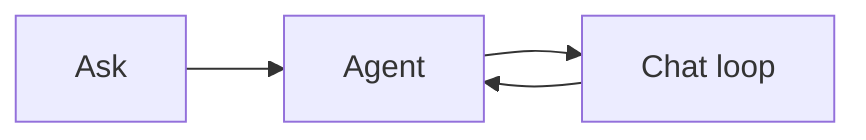
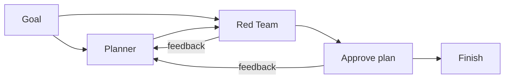
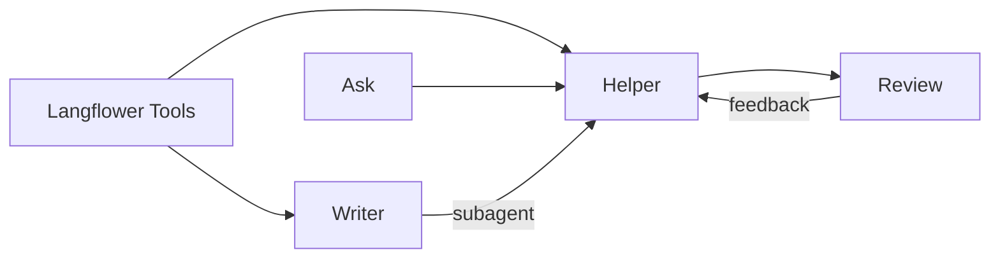
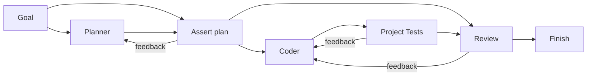
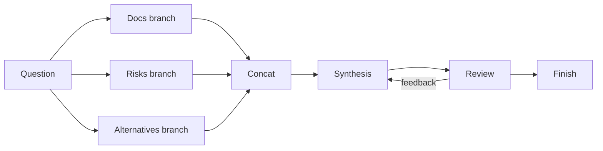
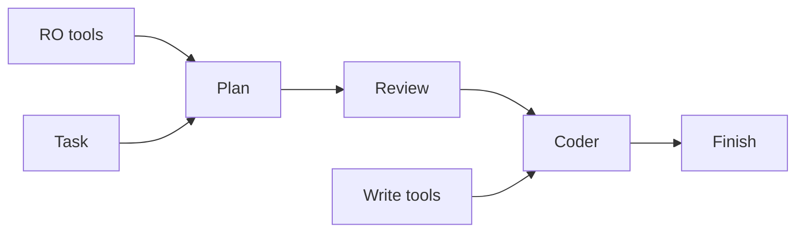
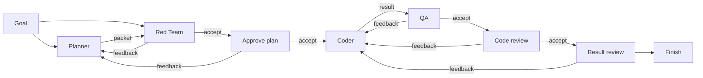
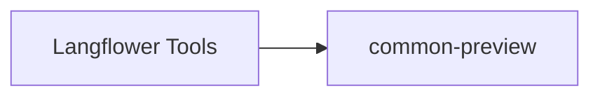
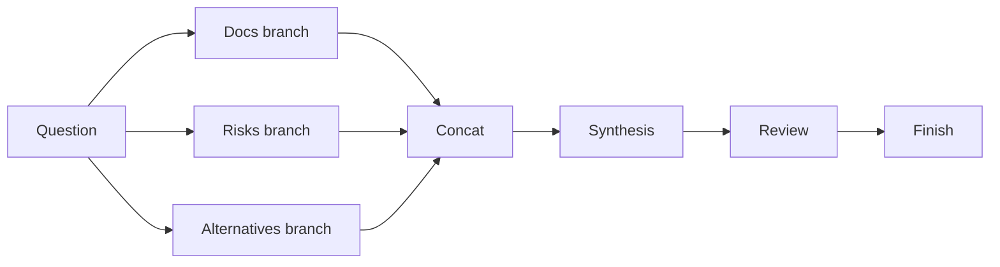
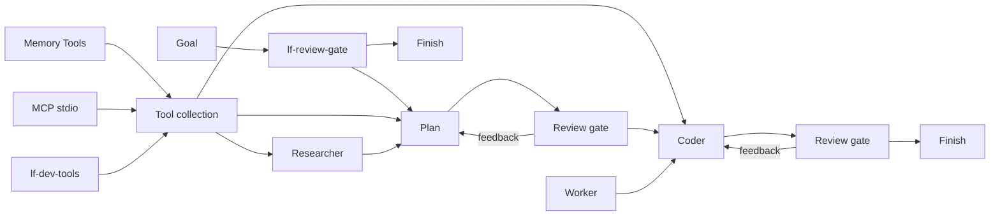

# README screenshots

Each section is one README slot. A file used twice counts once: the extra slot is `absent`.

## Intro

1. **Purpose.** Show the loop itself, before any larger workflow. Ask feeds an Agent, and Chat loop sends feedback back into the Agent.

2. **Diagram.** Nodes on the frame. This canvas is not the graph saved in `starter.json`.

3. **Screenshot.** [Hero.png](Hero.png)

4. **Workflow.** Title bar says Starter. Saved file: [demo-project/.langflower/workflows/starter.json](../../demo-project/.langflower/workflows/starter.json)

5. **Status.**
    - Active: nothing. Edges are idle.
    - Feed: placeholder, "Run the workflow to see execution progress here." Ask text is "Write a custom node".

6. **Ready.** ok

## Agents can talk to agents

1. **Purpose.** Planner and Red Team with a feedback path between them. One agent's output feeds another so the second can challenge the first.

2. **Diagram.**

3. **Screenshot.** [plan-red-team.png](plan-red-team.png)

4. **Workflow.** [demo-project/.langflower/workflows/red-team.json](../../demo-project/.langflower/workflows/red-team.json)

5. **Status.**
    - Active: Goal to Planner is green. Planner to Red Team is yellow, so the critique has not finished. Approve plan and Finish are idle.
    - Feed: the goal "Draft a short plan to add a dark-mode toggle." and "working …". No Red Team reply.

6. **Ready.** ok

## Add capabilities

1. **Purpose.** The default Starter, with room to add capabilities. Skills, tools, and a Writer sub-agent on one graph. The palette is part of this frame.

2. **Diagram.**

3. **Screenshot.** [starter.png](starter.png)

4. **Workflow.** [demo-project/.langflower/workflows/starter.json](../../demo-project/.langflower/workflows/starter.json)

5. **Status.**
    - Active: Ask to Helper to Review is green. Review is waiting. Writer is on the canvas and not in the run.
    - Feed: user "hi", a Helper greeting, then Approve / Send feedback. No tool call and no Writer turn.

6. **Ready.** ok

## Put checks into the graph

1. **Purpose.** One check on the path, with accept, reject, feedback, and retry visible as graph edges.

2. **Diagram.**

3. **Screenshot.** [gate.png](gate.png)

4. **Workflow.** [demo-project/.langflower/workflows/checks.json](../../demo-project/.langflower/workflows/checks.json)

5. **Status.**
    - Active: Goal to Planner is green. Planner is streaming. Assert plan, Coder, Project Tests, and Review are idle, so neither gate has fired.
    - Feed: goal "Add a /health JSON endpoint." and Planner text about available tools. No accept, reject, or feedback message.

6. **Ready.** need improvement. Retake `checks.json` after Assert plan or Project Tests sends feedback. That return edge should be the live path, and the feed should show the feedback or an accept. This frame only shows Planner starting, so the check has not happened.

## Parallel work

1. **Purpose.** Docs, Risks, and Alternatives, then Concat. A question fans out and later merges.

2. **Diagram.**

3. **Screenshot.** [fan-out.png](fan-out.png)

4. **Workflow.** [demo-project/.langflower/workflows/fan-out.json](../../demo-project/.langflower/workflows/fan-out.json)

5. **Status.**
    - Active: Question to the three branches is green. Branch outputs toward Concat are yellow. Synthesis, Review, and Finish are idle.
    - Feed: question "Should this project add a public HTTP API?" and "working …". No merged brief.

6. **Ready.** ok

## Give each agent only the capabilities it needs

1. **Purpose.** Each stage gets only the tools wired to it. Plan has RO tools and does not edit. After Review, Coder has Write tools.

2. **Diagram.** Permissions is a straight line.

3. **Screenshot.** [permission.png](permission.png)

4. **Workflow.** [demo-project/.langflower/workflows/permissions.json](../../demo-project/.langflower/workflows/permissions.json)

5. **Status.**
    - Active: nothing. Edges are idle. RO tools is wired only to Plan. Write tools is wired only to Coder. Review sits between them.
    - Feed: placeholder, "Run the workflow to see execution progress here." The task text is "Read and implement spec.md".

6. **Ready.** ok

## A complete coding-agent workflow

1. **Purpose.** One coding pipeline from a goal through Planner, Red Team, Approve plan, Coder, QA, Code review, Result review, and Finish. Each accept output has one consumer.

2. **Diagram.**

3. **Screenshot.** [coding_agent.png](coding_agent.png)

4. **Workflow.** [demo-project/.langflower/workflows/coding-workflow.json](../../demo-project/.langflower/workflows/coding-workflow.json)

5. **Status.**
    - Active: nothing. Edges are idle. Goal feeds Planner and Red Team. Approve plan goes only to Coder. QA, Code review, and Result review follow in order. Finish is last.
    - Feed: placeholder, "Run the workflow to see execution progress here." The goal text is "Read and implement spec.md".

6. **Ready.** ok

## Watch the graph execute

1. **Purpose.** A running Starter, green and yellow edges beside the Work log. Green has a result, yellow is pending, gray has not run, red is an error.

2. **Diagram.**

3. **Screenshot.** [feed.png](feed.png)

4. **Workflow.** [demo-project/.langflower/workflows/starter.json](../../demo-project/.langflower/workflows/starter.json)

5. **Status.**
    - Active: Helper and its tools edges are green. Review feedback is yellow. No red edge. Gray is only the not-yet-run remainder, not called out.
    - Feed: a long Helper answer about custom nodes, then Review with Approve / Send feedback.

6. **Ready.** ok

## Watch agent events

1. **Purpose.** The four agent ports showing up as the agent runs: `reasoning`, `draftResponse`, `toolLog`, and `response`.

2. **Diagram.**

3. **Screenshot.** [events.png](events.png)

4. **Workflow.** [demo-project/.langflower/workflows/starter.json](../../demo-project/.langflower/workflows/starter.json)

5. **Status.**
    - Active: Helper is working. The `reasoning` port is glowing.
    - Feed: the ask "list current custom nodes and recompile them", then Helper with that reasoning visible in the Work log.

6. **Ready.** ok

## Inspect any connection

1. **Purpose.** A Preview node on a connection, showing what the node received and what the previous node emitted.

2. **Diagram.**

3. **Screenshot.** [inspect.png](inspect.png)

4. **Workflow.** [demo-project/.langflower/workflows/inspect.json](../../demo-project/.langflower/workflows/inspect.json)

5. **Status.**
    - Active: the tools edge into Preview is green.
    - Feed: the same `compile_custom_nodes` payload is on the Preview node and in the Work log under Preview.

6. **Ready.** ok

## The Work log is connected to the graph

1. **Purpose.** From an event to its source node, and from the graph to the event to the payload. Hover a Work log event and the node that produced it lights up.

2. **Diagram.**

3. **Screenshot.** [highlight.png](highlight.png)

4. **Workflow.** [demo-project/.langflower/workflows/fan-out.json](../../demo-project/.langflower/workflows/fan-out.json)

5. **Status.**
    - Active: Fan-out is running. Alternatives branch is highlighted on the canvas.
    - Feed: the visible Work log is that branch's research, starting with the alternatives / do-nothing angle.

6. **Ready.** ok

## Langflower builds Langflower

1. **Purpose.** The development workflow running: memory tools, MCP, dev tools, review gates, and coding agents.

2. **Diagram.** Main nodes. Routers on the saved graph are omitted.

3. **Screenshot.** [lf_dev.png](lf_dev.png)

4. **Workflow.** [.langflower/workflows/langflower-dev.json](../../.langflower/workflows/langflower-dev.json)

5. **Status.**
    - Active: Plan is running. Memory tools are green. Coder, Worker, and the later review gates are on the canvas and idle.
    - Feed: Plan reasoning and memory reads (`get_memory_tree`, `read_memory_section`). No coder or review turn yet.

6. **Ready.** ok

## Desktop launcher

1. **Purpose.** Choose a folder, keep recent projects, start Langflower, open the UI again, and run several instances.

2. **Diagram.** No workflow graph. The frame is the launcher window.

3. **Screenshot.** [launcher.png](launcher.png)

4. **Workflow.** None. The launcher is the Rust app in [launcher/](../../launcher/).

5. **Status.**
    - Active: the launcher is Ready. Four recent projects are Running on ports 4010–4013, each with Open UI.
    - Feed: none. This is not a workflow run. The folder field shows `D:\Projects\forbidden-garden`, and Start Langflower is enabled.

6. **Ready.** ok
