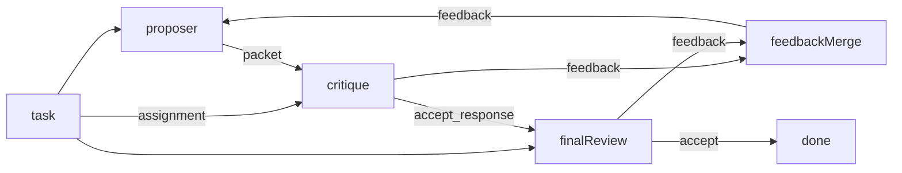
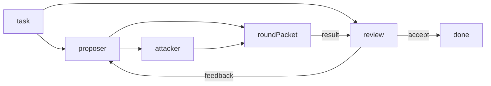

# Adversarial red team

**Status:** Partial — two conflict-model demos landed; CI Fake proves wiring,
not attack quality.

## Value

Ship workflows where a **proposer** drafts a claim packet, an independent
**attacker** (red-team) critiques it, and a **Review** persona either accepts
the outcome or sends revision notes. Critique is a second node with its own
prompt and tools — **not** the same model talking to itself in one turn.

Two conflict-resolution models are demoable side by side:

1. **Agree then Review** — Proposer ⇄ **Critique** (`common-critique`):
   `feedback` = not agreed (Merge→Proposer); `accept`→`response` = agreed
   (claim → final Review). Critique is path-choice with attack framing
   (`assignment`/`packet`), not Review's gate framing (`task`/`result`).
   A single-output LLM attacker cannot encode that path choice.
2. **Review each round** — each Proposer→Attacker round is Concat'd into a
   round packet for Review; Review accept or feedback→Proposer (no
   Attacker→Proposer auto-loop).

## UX scenarios

### S1 — Start an adversarial red-team run

**Who:** Developer with a claim, plan, or design that looks too clean.

**Want:** Pressure-test it with a second agent — not one agent’s self-critique.

**Do:** Configure a real LLM (e.g. LM Studio / `openai` in
`.langflower/langflower.jsonc`), start the demo project, load either
**Adversarial — agree then Review** (`adversarial-agree-then-review`) or
**Adversarial — Review each round** (`adversarial-review-each-round`), and
**Run**.

**Expect:**

- Run MUST start the proposer → attacker topology (not a single-agent
  self-review turn).
- Proposer vs attacker activity MUST be visible in the
  [feed](../features/feed-panel.md) and
  [workflow execution](../features/workflow-execution.md) surfaces — not a
  hidden inner monologue.

### S2 — Proposer drafts; attacker attacks

**Who:** Same developer watching the first exchange.

**Want:** An independent critic with its own system prompt and tool budget —
not the proposer restating its own draft.

**Do:** Let the proposer produce a packet; let that packet flow to the
critique stage (variant 1: → Critique `packet`; variant 2: →
attacker `userPrompt`).

**Expect:**

- Proposer and critique stage MUST be distinct real-LLM nodes (distinct
  prompts).
- Proposer tool budget in the demo MUST include `read` / `glob` / `grep`.
  Critique shares the LLM inventory contract (tools/MCP/subagents when
  wired) — not a yes/no stub.
- Critique MUST clearly challenge the proposer’s packet (not a restatement).

### S3 — Conflict resolution (model-specific)

**Who:** Same developer after the first attack.

**Want:** Clear causal sequence for how critique becomes revise or accept.

**Do:** Observe the model-specific edges (see [Workflow shape](#workflow-shape)).

**Expect (agree then Review):**

- Red-team stage MUST be `common-critique` (not a single-output LLM and not
  `common-review` gate framing): `feedback` → Merge → Proposer;
  `accept`→`response` → final Review `result`.
- «Agreed» MUST be that Critique `accept` emission — not `maxFeedbackTurns`
  and not fan-out of a peer LLM `response`.
- Final Review `feedback` MUST also Merge into the same Proposer `feedback`
  path.
- Proposer MUST revise when feedback arrives, capped by `maxFeedbackTurns`
  (past the cap: visible `toolLog` + `response` error — not a silent drop).

**Expect (Review each round):**

- There MUST be **no** Attacker → Proposer `feedback` edge.
- Proposer + Attacker outputs MUST Concat into Review `result` (round packet).
- Review `feedback` MUST wire to Proposer `feedback` for the next round.

### S4 — Accept after the adversarial exchange

**Who:** Operator / final Review after critique has landed.

**Want:** Final Accept endorses the post-adversarial artifact; the run MUST
NOT finish from critique text alone.

**Do:** At final **Review** (`common-review`), call `accept` to reach Finish.

**Expect:**

- Agree-then-Review: final Review `result` MUST be the **proposer claim
  packet**, arriving only on Critique `accept`→`response`.
- Review-each-round: Review `result` MUST be the **concat round packet**
  (claim + findings).
- Demo Accept MUST use `common-review` port-routed `accept` → Finish.

### S5 — Re-run as a first-class red-team pass

**Who:** Developer repeating the pass on the same project.

**Want:** The same workflow is re-runnable and auditable — not a one-off chat
prompt pasted twice.

**Do:** Re-run either adversarial workflow.

**Expect:**

- Re-running MUST exercise the same conflict model again through Accept →
  Finish.

## UI specs

| Spec                                                    | Scenarios covered                                                                                                                                                                                                                            |
| ------------------------------------------------------- | -------------------------------------------------------------------------------------------------------------------------------------------------------------------------------------------------------------------------------------------- |
| [Feed panel](../features/feed-panel.md)                 | [S1](#s1--start-an-adversarial-red-team-run), [S2](#s2--proposer-drafts-attacker-attacks), [S3](#s3--conflict-resolution-model-specific), [S4](#s4--accept-after-the-adversarial-exchange), [S5](#s5--re-run-as-a-first-class-red-team-pass) |
| [HITL chat](../features/hitl-chat.md)                   | [S4](#s4--accept-after-the-adversarial-exchange)                                                                                                                                                                                             |
| [Workflow execution](../features/workflow-execution.md) | [S1](#s1--start-an-adversarial-red-team-run), [S2](#s2--proposer-drafts-attacker-attacks), [S3](#s3--conflict-resolution-model-specific), [S5](#s5--re-run-as-a-first-class-red-team-pass)                                                   |

## Runtime requirements

| Need                                                          | Why (scenario)                                                                                                                                       | Today                  |
| ------------------------------------------------------------- | ---------------------------------------------------------------------------------------------------------------------------------------------------- | ---------------------- |
| Distinct proposer vs critique stage                           | Distinct prompts ([S2](#s2--proposer-drafts-attacker-attacks))                                                                                       | Landed (epic 08)       |
| Red-team as `common-critique` path choice (variant 1)         | «Agreed» = accept→response ([S3](#s3--conflict-resolution-model-specific))                                                                           | Landed                 |
| Merge fan-in for critique + final Review feedback (variant 1) | Negotiate then Review ([S3](#s3--conflict-resolution-model-specific))                                                                                | Landed                 |
| Concat round packet for Review (variant 2)                    | Review each round ([S3](#s3--conflict-resolution-model-specific))                                                                                    | Landed                 |
| `maxFeedbackTurns` on proposer                                | Cap revise storms ([S3](#s3--conflict-resolution-model-specific))                                                                                    | Landed                 |
| Shared session history on Proposer **and** Critique/Review    | Both sides see prior `messages[]` across revise rounds ([S2](#s2--proposer-drafts-attacker-attacks) / [S3](#s3--conflict-resolution-model-specific)) | Landed (ADR-016 shell) |
| `common-review` accept → Finish (demo, real LLM)              | Accept after critique ([S4](#s4--accept-after-the-adversarial-exchange))                                                                             | Landed                 |

## Workflow shape

### Variant 1 — agree then Review

`demo-project/.langflower/workflows/adversarial-agree-then-review.json`:

Red-team is `common-critique` so «agreed» is an explicit graph path
(`accept`→`response`) with attack framing (`assignment`/`packet`). Final
gate stays `common-review`. A peer LLM with one `response` cannot do that —
see [LLM_NODES](../LLM_NODES.md) § Critique / Review and
[MECHANICS](../DONE/EPICS/MECHANICS-tool-execution.md) anti-criteria.

### Variant 2 — Review each round

`demo-project/.langflower/workflows/adversarial-review-each-round.json`:

### Soft↔Hard debate (related demo, not this Expect bar)

`soft-vs-hard-harness.json` is a separate openai Soft↔Hard debate on the
`feedback`-edge pattern (no Finish; Stop / `maxFeedbackTurns` ends storms). It
illustrates unbounded critique; it is **not** a MUST for these Accept→Finish
demos. The same `feedback` pattern is the planner red-team stage in
[coding-agent.md](coding-agent.md).

## Status

**Partial** — both real-LLM demo graphs landed for side-by-side comparison.

**Implementable when** S1–S5 Expects pass on both demos with a **real** LLM
(critique clearly challenges the packet; variant 1 «agreed» via Critique
`accept`; Accept→Finish).

### Missing parts

| Layer          | Gap                                                                 | Scenarios | Done when                                                 |
| -------------- | ------------------------------------------------------------------- | --------- | --------------------------------------------------------- |
| End-user proof | Real-LLM Accept→Finish quality on both variants                     | S1–S5     | Live provider run meets Expects                           |
| Feed UX        | Clear multi-node / multi-port streaming when Review overlaps drafts | S1–S3     | Work log keeps causal sequence readable under concurrency |

### Workarounds

- **Authorable / runnable Partial** — either demo workflow with LM Studio /
  configured `openai`.
- Soft↔Hard debate workflow for longer critique until Stop /
  `maxFeedbackTurns` (related pattern; not the Accept bar).

### Demo / CI

- Demo variant 1: `adversarial-agree-then-review.json`
- Demo variant 2: `adversarial-review-each-round.json`
- Soft↔Hard debate (related): `soft-vs-hard-harness.json`
- Epic: [08-adversarial-multi-llm.md](../DONE/EPICS/08-adversarial-multi-llm.md)

### Run path (end-user)

1. Start LM Studio (or configure `openai` in `.langflower/langflower.jsonc`).
2. `langflower start ./demo-project` (or `npm run dev` against the demo project).
3. Load **Adversarial — agree then Review** or **Adversarial — Review each round**.
4. **Run** and compare Work log sequences.
5. Variant 1: Critique `feedback` revises Proposer; its `accept` unlocks
   final Review. Final Review `accept` → Finish (or `feedback` → Merge).
   Variant 2: final Review after each concat round.
6. On final accept, Finish ends the run.
