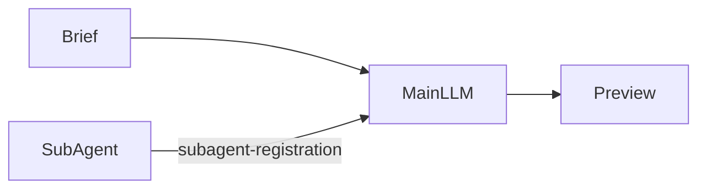

# Agent swarm

**Status:** Partial — L0 Main→Explorer Sub-Agent spawn demo landed; CI Fake is
Mock-testable topology only.

## Value

Feel orchestration as **graph topology**: Main wires Explorer Sub-Agent
`tools` into Main `tools` and **invokes** the specialist (ADR-021). The
Sub-Agent is an ordinary agent with its own provider/model/role — then Main
resumes. Toward a swarm, not a single chat persona. **Not** multi-specialist
fan-out / Concat merge (that is
[research-fanout-merge](./research-fanout-merge.md)).

## UX scenarios

### S1 — Start the Agent swarm demo

**Who:** Developer with a brief that needs a repo scout before a follow-up pass.

**Want:** Spawn an Explorer specialist from the graph — not one agent pretending
to be a team in a single thread.

**Do:** Configure a real LLM (e.g. LM Studio / `openai` in
`.langflower/langflower.jsonc`), start the demo project, load workflow
**Agent swarm** (`agent-swarm`), and **Run**.

**Expect:**

- Run MUST exercise Brief → Main → Sub-Agent Explorer → Preview (not a
  single-node self-role-switch turn).
- In the [feed](../features/feed-panel.md), Main and Explorer MUST appear as
  **distinct node-labeled** activity. Main’s invoke / resume turns and Explorer’s
  scout turn MUST both be attributable without reading raw node ids.
- [Workflow execution](../features/workflow-execution.md) MUST show Main vs
  Explorer activity on the canvas for the same run.

### S2 — Main MUST call Explorer on one `tools` wire

**Who:** Same developer watching the first specialist call.

**Want:** Specialist topology on the canvas (one inventory edge) — not an
off-screen manager.

**Do:** Let Main call the Explorer specialist tool; observe Explorer
`subagent-registration` → Main `tools`.

**Expect:**

- Sub-Agent MUST be a `common-sub-agent` node with `subagent-registration`
  wired into Main `tools` (ADR-021).
- Main MUST invoke Explorer as a tool — MUST NOT complete the scout as
  in-LLM-only role-play with no Sub-Agent node.
- Explorer `invoke` MUST resume Main as a normal tool result.

### S3 — Explorer runs under its own chat config

**Who:** Same developer during the specialist pass.

**Want:** The scout is a distinct agent node with its own role / provider /
model — not Main restating an “Explorer:” persona in one prompt, and not a
separate body LLM behind hub ports.

**Do:** Let Explorer accept `invoke({ task })`, run in-node chat, return a
string to Main.

**Expect:**

- Explorer MUST be `common-sub-agent` with its own Inspector chat config
  (`rolePreset: explorer` in the demo; CI may use `scriptedToolTurns`).
- MUST NOT require `item` / `bodyResult` body-handoff edges.
- In the feed, Explorer rows MUST stay labeled as the Sub-Agent node (not
  attributed to Main).

### S4 — Main answers after the Sub-Agent result

**Who:** Same developer after Explorer returns.

**Want:** Main uses the Sub-Agent result, then finishes into Preview.

**Do:** Wait for Main `response` → Preview `text`.

**Expect:**

- After the Explorer tool result, Main MUST emit a final `response` into Preview.
- Preview MUST show Main’s final answer (CI Fake path contains `Swarm done`).
- Feed MUST show Main’s post-spawn answer as Main activity — not as a
  continuation of the Explorer block.

### S5 — Re-run the same spawn topology

**Who:** Developer repeating the pass on the same project.

**Want:** The same Sub-Agent spawn path is re-runnable — not a one-off chat
prompt.

**Do:** Re-run **Agent swarm**.

**Expect:**

- Re-running MUST exercise the same Brief → Main → Sub-Agent → Preview
  structure again, including a real spawn (MUST spawn again — not skip to a
  cached single-thread answer).

## UI specs

| Spec                                                    | Scenarios covered                                                                                                                                                                                                                              |
| ------------------------------------------------------- | ---------------------------------------------------------------------------------------------------------------------------------------------------------------------------------------------------------------------------------------------- |
| [Feed panel](../features/feed-panel.md)                 | [S1](#s1--start-the-agent-swarm-demo), [S2](#s2--main-must-call-explorer-on-one-tools-wire), [S3](#s3--explorer-runs-under-its-own-chat-config), [S4](#s4--main-answers-after-the-sub-agent-result), [S5](#s5--re-run-the-same-spawn-topology) |
| [Workflow execution](../features/workflow-execution.md) | [S1](#s1--start-the-agent-swarm-demo), [S2](#s2--main-must-call-explorer-on-one-tools-wire), [S3](#s3--explorer-runs-under-its-own-chat-config), [S5](#s5--re-run-the-same-spawn-topology)                                                     |

## Runtime requirements

| Need                                                                  | Why (scenario)                                                                                                        | Today                    |
| --------------------------------------------------------------------- | --------------------------------------------------------------------------------------------------------------------- | ------------------------ |
| `common-sub-agent` `subagent-registration` → parent `tools` (ADR-021) | On-canvas specialist ([S2](#s2--main-must-call-explorer-on-one-tools-wire))                                           | Landed (epic 41 stage 2) |
| Sub-Agent in-node chat + own role/provider/model                      | Distinct specialist ([S3](#s3--explorer-runs-under-its-own-chat-config))                                              | Landed                   |
| Real LLM on Main + Sub-Agent (demo); Fake/scripted (CI)               | End-user vs Mock-testable ([S1](#s1--start-the-agent-swarm-demo), [S4](#s4--main-answers-after-the-sub-agent-result)) | Landed                   |

## Workflow shape

Matches `demo-project/.langflower/workflows/agent-swarm.json`:

Dynamic N same-template workers / fan-out→merge live in
[research-fanout-merge](./research-fanout-merge.md) — **not** this Expect bar.

## Status

**Partial** — demo graph and CI Fake path landed. Fake Main + scripted Sub-Agent
tool call is **Mock-testable** only (one `tools` wire / invoke / resume
topology). **Implementable** when S1–S5 Expects pass on the current demo with a
**real** LLM (Main MUST call Explorer; Preview gets Main’s answer; feed
attributes Main vs Explorer distinctly).

### Missing parts

None for this bar A (L0 Main→Explorer spawn on the current demo). Multi-specialist
fan-out / merge is out of scope here — see
[research-fanout-merge](./research-fanout-merge.md).

### Workarounds

None for L0 topology. Real-LLM Implementable still needs a configured provider.
