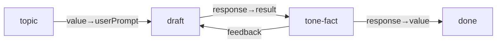

# Article writing

**Status:** Partial — demo topology + CI Fake prove write + HITL + Finish, not
a full research → distinct outline → draft spine.

## Value

Ship a **filesystem article draft** from a topic brief through a visible
editorial graph with an explicit human tone/fact gate and in-place revise —
**not** a one-shot chat reply whose only durable artifact is scrollback.

## UX scenarios

### S1 — Start the Article writing demo

**Who:** Author / editor with a topic brief (audience, length, angle).

**Want:** A reusable editorial graph with a human review gate — not a single
chat turn that “writes something.”

**Do:** Configure a real LLM (e.g. LM Studio / `openai` in
`.langflower/langflower.jsonc`), start the demo project, load workflow
**Article writing** (`article-writing`), and **Run**.

**Expect:**

- Run MUST exercise Topic brief → Outline/draft → Tone/facts HITL → Accepted
  (Finish) — MUST NOT collapse to a single-node self-accept turn.
- Outline/draft and Tone/facts activity MUST appear in the
  [feed](../features/feed-panel.md) and
  [workflow execution](../features/workflow-execution.md) surfaces for those
  nodes.
- When the draft hits `permission.ask` for `write` / `create`, the operator
  MUST Allow (or the run MUST NOT reach a written `articles/draft.md`).

### S2 — Outline/draft writes the article artifact

**Who:** Same author watching the first draft pass.

**Want:** A filesystem article artifact — not only a chat bubble.

**Do:** Let Outline/draft sketch an outline in reasoning, write the body with
the write tool, and reply with a status that includes the file path.

**Expect:**

- Draft MUST be a real-LLM node (`common-openai-llm` in the demo; Fake LLM in
  CI) with tool budget `read` / `write` / `create`.
- Draft MUST write `articles/draft.md` (demo / CI path).
- Draft status / response MUST surface the artifact path so the HITL gate can
  review the file — MUST NOT treat chat text alone as the deliverable.

### S3 — Tone/fact HITL pauses the run

**Who:** Author at the Tone / facts gate after draft.

**Want:** A first-class pause for voice and claims — not an informal “looks
good?” buried in scrollback.

**Do:** Open `articles/draft.md`; Approve or Request changes from the
[HITL](../features/hitl-chat.md) composer.

**Expect:**

- Gate MUST be `common-hitl-review-gate` (Tone / facts) after draft `response`
  → gate `result`.
- Run MUST pause until Approve or Request changes — MUST NOT auto-finish past
  the gate.
- Approve MUST route gate `response` → Accepted (Finish).

### S4 — Reject revises the same draft in place

**Who:** Same author sending tone/fact feedback.

**Want:** Feedback revises the same draft agent with prior context — not a
cold restart from the brief alone.

**Do:** Request changes with feedback; let the draft LLM revise and re-enter
the gate.

**Expect:**

- Reject MUST stay on the gate `feedback` → draft `feedback` edge.
- Draft MUST revise in place (same node / context) and return to Tone / facts
  — MUST NOT require rebuilding the graph.
- Revise turns MUST appear in feed / execution activity for the draft and gate
  nodes.

### S5 — Accept ends on the article file

**Who:** Author after an acceptable draft.

**Want:** Success = accepted article file + clear trail — not “conversation
ended.”

**Do:** Approve at Tone / facts; wait for Accepted (Finish).

**Expect:**

- Approve MUST reach Finish with the artifact path in the finish value (CI:
  contains `articles/draft.md`).
- `articles/draft.md` MUST exist on disk after the draft write (and after any
  revise loop).

### S6 — Re-run the same editorial spine

**Who:** Author starting another piece on the same project.

**Want:** Same gates and artifact path for a new brief — not a one-off chat
prompt.

**Do:** Change the Topic brief if desired; re-run **Article writing**.

**Expect:**

- Re-running MUST exercise the same Topic brief → Outline/draft → Tone/facts
  → Accepted structure again, including HITL pause and the
  `articles/draft.md` write path.

## UI specs

| Spec                                                    | Scenarios covered                                                                                                                                                                                                                                                                  |
| ------------------------------------------------------- | ---------------------------------------------------------------------------------------------------------------------------------------------------------------------------------------------------------------------------------------------------------------------------------- |
| [Feed panel](../features/feed-panel.md)                 | [S1](#s1--start-the-article-writing-demo), [S2](#s2--outlinedraft-writes-the-article-artifact), [S3](#s3--tonefact-hitl-pauses-the-run), [S4](#s4--reject-revises-the-same-draft-in-place), [S5](#s5--accept-ends-on-the-article-file), [S6](#s6--re-run-the-same-editorial-spine) |
| [HITL chat](../features/hitl-chat.md)                   | [S1](#s1--start-the-article-writing-demo), [S3](#s3--tonefact-hitl-pauses-the-run), [S4](#s4--reject-revises-the-same-draft-in-place), [S5](#s5--accept-ends-on-the-article-file)                                                                                                  |
| [Workflow execution](../features/workflow-execution.md) | [S1](#s1--start-the-article-writing-demo), [S2](#s2--outlinedraft-writes-the-article-artifact), [S3](#s3--tonefact-hitl-pauses-the-run), [S4](#s4--reject-revises-the-same-draft-in-place), [S5](#s5--accept-ends-on-the-article-file), [S6](#s6--re-run-the-same-editorial-spine) |

## Runtime requirements

| Need                                                         | Why (scenario)                                                                                                             | Today                              |
| ------------------------------------------------------------ | -------------------------------------------------------------------------------------------------------------------------- | ---------------------------------- |
| Real-LLM draft node (`common-openai-llm`)                    | Outline/draft write ([S2](#s2--outlinedraft-writes-the-article-artifact))                                                  | Landed (epic 05); CI uses Fake LLM |
| Harness tools `read` / `write` / `create` + `permission.ask` | Write `articles/draft.md` ([S1](#s1--start-the-article-writing-demo), [S2](#s2--outlinedraft-writes-the-article-artifact)) | Landed (epics 01–02)               |
| `common-hitl-review-gate` approve / feedback ports           | Tone/fact pause ([S3](#s3--tonefact-hitl-pauses-the-run), [S5](#s5--accept-ends-on-the-article-file))                      | Landed                             |
| Gate `feedback` → draft `feedback` edge                      | Reject→revise in place ([S4](#s4--reject-revises-the-same-draft-in-place))                                                 | Landed                             |
| Finish after approve (`response` → Finish `value`)           | Accepted article path ([S5](#s5--accept-ends-on-the-article-file))                                                         | Landed                             |

## Workflow shape

Matches `demo-project/.langflower/workflows/article-writing.json`:

Nodes: Topic brief (`common-string`) → Outline/draft (`common-openai-llm`,
tools `read`/`write`/`create`) → Tone/facts (`common-hitl-review-gate`) →
Accepted (`common-finish`). Outline and draft are one LLM node. No research /
crawl nodes in this graph.

## Status

**Partial** — demo graph and CI Fake path landed (outline/draft write + HITL
tone/fact + Finish). Fake LLM + HITL approve proves **topology and artifact
write**, not live editorial quality and not research → distinct outline →
draft.

**Implementable when** S1–S6 Expects pass on the demo with a **real** LLM
(article file + HITL pause + reject→revise → Approve→Finish).

### Missing parts

| Layer                                        | Gap                                                                                                            | Scenarios         | Done when                                                                       |
| -------------------------------------------- | -------------------------------------------------------------------------------------------------------------- | ----------------- | ------------------------------------------------------------------------------- |
| Demo / wiring                                | Wire Fetch URL / Crawl / Save Page (epic 12 landed) before outline for source digests                          | — (extends Value) | Research step produces inspectable notes/digest before draft                    |
| Demo / wiring                                | Distinct outline vs draft stages (pilot collapses both into one LLM node)                                      | — (extends Value) | Separate outline artifact/handoff before draft body                             |
| End-user proof                               | Real-LLM Approve→Finish path (not only CI Fake)                                                                | S1–S6             | Live provider run meets Expects; Fake CI remains topology-only                  |
| UI ([feed-panel](../features/feed-panel.md)) | Chat-dense timeline is still Draft ([grok-feed](grok-feed.md)); this UC only requires node activity visibility | S1, S2, S4        | Activity for draft / gate nodes is findable; chat-mirror bar lives in grok-feed |

### Workarounds

- **Authorable / runnable Partial** — demo workflow below with LM Studio /
  configured `openai`; CI Fake for topology + artifact write.
- Authorable graphs can add crawl / research nodes ahead of draft (catalog
  path exists; not wired in this demo).

### Demo / CI

- Demo: `demo-project/.langflower/workflows/article-writing.json`
  (Topic brief → Outline/draft `common-openai-llm` → Tone/facts
  `common-hitl-review-gate` → Accepted `common-finish`; artifact
  `articles/draft.md`)
- CI fake path: `tests/integration/ws/execute-article-writing.ws.test.ts`
  (Fake LLM scripted `write` → HITL approve → Finish; topology + artifact
  only)
- Epic: [05-partial-pilots.md](../DONE/EPICS/05-partial-pilots.md)

### Run path (end-user)

1. Start LM Studio (or configure `openai` in `.langflower/langflower.jsonc`).
2. `langflower start ./demo-project` (or `npm run dev` against the demo project).
3. Load workflow **Article writing** (`article-writing`).
4. **Run**. Allow `write`/`create` asks; open `articles/draft.md` at the HITL
   gate; Approve or Request changes (feedback → draft LLM).
5. On Approve, Accepted (Finish) ends the run.
