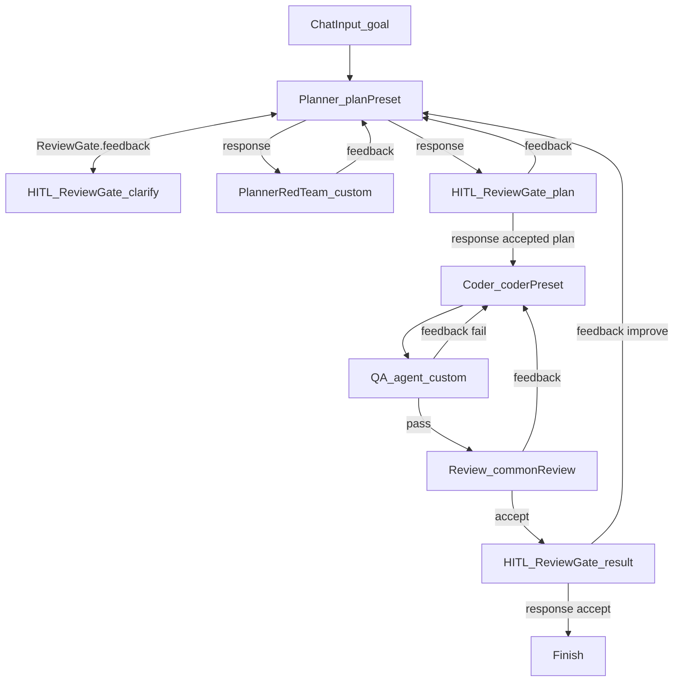

# Coding agent

**Status:** Partial — full multi-loop demo + Fake CI topology landed; S1–S7
Expects with a **real** LLM remain the Implementable bar. Smoke stays
`basic-coder` (not this Value). See [PRODUCT.md](../PRODUCT.md).

## Value

Ship a code change through a **multi-loop** graph: clarify with HITL,
pressure-test the plan with an independent red-team agent, implement under
`permission.ask`, QA with tests, review against principles, then accept or
send improvements that restart planning. Mood is graph-visible stages and
feedback edges — **not** the thin smoke spine in `basic-coder.json`.

## UX scenarios

### S1 — Start with a natural-language goal

**Who:** Developer opening a coding workflow.

**Want:** Describe a bug fix or feature in plain language and kick off the
pipeline from the canvas run.

**Do:** Type a goal in **Chat Input** (e.g. “Failing test in `auth/session.ts`
— fix token refresh”) and **Start**.

**Expect:**

- Goal MUST enter Planner via Chat Input (`message` → Planner.`userPrompt`).
- Plain Run MUST stay disabled for Chat Input graphs; Start from the composer
  MUST begin the run.
- Planner MUST explore the repo with harness tools (read/glob/grep; limited
  `.md` writes as policy allows) and MUST emit a draft plan on `response`
  ready for clarify / red-team / handoff wiring.

### S2 — Clarify requirements mid-plan (HITL)

**Who:** Developer when Planner needs missing requirements.

**Want:** Answer clarifying questions without starting a new run or losing plan
context.

**Do:** Respond on **Review Gate** (Clarify) when Planner routes a question; continue.

**Expect:**

- Run MUST pause at `common-hitl-review-gate`; question MUST be visible in
  feed/composer.
- Reply (`requestChanges`) MUST return on Planner.`feedback` and planning MUST
  continue in the **same** Planner session (ADR-016 feedback), not a cold restart.
- After answers, Planner MUST still be able to reach red-team and/or Coder
  handoff.

### S3 — Pressure-test the plan (red team)

**Who:** Developer watching plan quality before implementation.

**Want:** An independent critic to attack scope, missing tests, and unsafe
assumptions — not the Planner “thinking harder” in one turn.

**Do:** Let the draft plan flow to **Planner Red Team**; observe critique and
any revise turns (capped by `maxFeedbackTurns`).

**Expect:**

- Red-team MUST be a second LLM node (`custom`, read-heavy) with its own
  toolLog / response.
- Critique MUST return on Planner.`feedback` (Soft↔Hard / adversarial
  pattern).
- When the plan is good enough, handoff to Coder MUST proceed; loops MUST
  stay visible on the canvas.
- Pattern MUST align with [adversarial-red-team](adversarial-red-team.md).

### S4 — Implement under permission gates

**Who:** Developer when Coder edits files or runs shell.

**Want:** Real harness edits and commands, with human Allow/Deny for risky
actions, without abandoning the multi-loop story.

**Do:** After human Accept on the plan Review Gate (accepted plan on Gate
`response` → Coder.`userPrompt`); Allow or Deny `permission.ask` in the
feed/composer when bash or elevated writes hit policy.

**Expect:**

- Accepted plan MUST hand off as Gate.`response` → Coder.`userPrompt` (not an
  ad-hoc chat paste).
- Coder (`rolePreset: coder`) MUST enter the harness tool loop
  (`read` … `bash`).
- Destructive or shell actions MUST surface as `permission.ask`; Allow/Deny
  MUST continue or block that tool call.
- Coder summary / change context MUST be available for QA / Review
  downstream.

### S5 — QA loop on test failure

**Who:** Developer after Coder produces a change.

**Want:** Automated test run that sends failures back to Coder until pass (or
cap), then advances.

**Do:** Let **QA Agent** take Coder context, run project tests (typically via
`bash` under permission policy), and observe pass vs feedback.

**Expect:**

- Fail notes MUST return on Coder.`feedback`; Coder MAY revise and MUST be
  able to re-enter QA.
- Pass MUST advance to Review.
- Shell under QA MUST still respect `permission.ask` when policy requires it.

### S6 — Principles review before result HITL

**Who:** Developer (or authored Review node) checking plan / principles fit.

**Want:** Accept or feedback against described principles / plan as graph
structure, not an informal chat note.

**Do:** Let `common-review` evaluate the change; observe `accept` vs `feedback`
ports.

**Expect:**

- Tool `feedback` MUST route to Coder.`feedback` (re-entry visible on canvas).
- Tool `accept` MUST route to Result HITL.
- Review MUST be a distinct stage from QA and from Result HITL.

### S7 — Accept result or restart planning

**Who:** Developer at the end of the pipeline.

**Want:** Accept the outcome, or request improvements that reopen Planner (and
upstream loops) — not a silent one-shot “done” in chat.

**Do:** On **Result HITL** (`common-hitl-review-gate`): Accept → Finish, or
send feedback to improve.

**Expect:**

- Accept MUST route Gate.`response` → Finish with the outcome.
- Improve feedback MUST route to Planner.`feedback` so planning and the
  red-team loop can restart with human notes.
- Re-entry MUST be graph-visible, not a new ad-hoc chat session.

## UI specs

| Spec                                                          | Scenarios covered                                                                                                                                                                                                                                                                                                        |
| ------------------------------------------------------------- | ------------------------------------------------------------------------------------------------------------------------------------------------------------------------------------------------------------------------------------------------------------------------------------------------------------------------ |
| [Feed panel](../features/feed-panel.md)                       | [S1](#s1--start-with-a-natural-language-goal), [S2](#s2--clarify-requirements-mid-plan-hitl), [S3](#s3--pressure-test-the-plan-red-team), [S4](#s4--implement-under-permission-gates), [S5](#s5--qa-loop-on-test-failure), [S6](#s6--principles-review-before-result-hitl), [S7](#s7--accept-result-or-restart-planning) |
| [HITL chat](../features/hitl-chat.md)                         | [S2](#s2--clarify-requirements-mid-plan-hitl), [S4](#s4--implement-under-permission-gates), [S7](#s7--accept-result-or-restart-planning)                                                                                                                                                                                 |
| [Workflow execution](../features/workflow-execution.md)       | [S1](#s1--start-with-a-natural-language-goal), [S3](#s3--pressure-test-the-plan-red-team), [S5](#s5--qa-loop-on-test-failure), [S6](#s6--principles-review-before-result-hitl), [S7](#s7--accept-result-or-restart-planning)                                                                                             |
| [Project configuration](../features/project-configuration.md) | [S1](#s1--start-with-a-natural-language-goal), [S4](#s4--implement-under-permission-gates), [S5](#s5--qa-loop-on-test-failure)                                                                                                                                                                                           |
| [Node library](../features/node-library.md)                   | [S1](#s1--start-with-a-natural-language-goal)–[S7](#s7--accept-result-or-restart-planning)                                                                                                                                                                                                                               |

## Runtime requirements

| Need                                           | Why (scenario)                                                                                                                                                                                                                   | Today  |
| ---------------------------------------------- | -------------------------------------------------------------------------------------------------------------------------------------------------------------------------------------------------------------------------------- | ------ |
| Chat Input cold-start + composer Start         | Goal enters Planner; Run disabled ([S1](#s1--start-with-a-natural-language-goal))                                                                                                                                                | Landed |
| Role presets (`plan` / `coder`) + `custom` LLM | Distinct Planner / Red Team / Coder / QA budgets ([S1](#s1--start-with-a-natural-language-goal)–[S5](#s5--qa-loop-on-test-failure))                                                                                              | Landed |
| Default harness tools + internal tool loop     | Real edits / tests on the project tree ([S4](#s4--implement-under-permission-gates), [S5](#s5--qa-loop-on-test-failure))                                                                                                         | Landed |
| `permission.ask` + feed/composer Allow/Deny    | Human gate for bash / elevated writes ([S4](#s4--implement-under-permission-gates), [S5](#s5--qa-loop-on-test-failure))                                                                                                          | Landed |
| `feedback` ports (ADR-016)                     | Clarify, red-team, QA, review, result→Planner turns ([S2](#s2--clarify-requirements-mid-plan-hitl), [S3](#s3--pressure-test-the-plan-red-team), [S5](#s5--qa-loop-on-test-failure)–[S7](#s7--accept-result-or-restart-planning)) | Landed |
| `common-hitl-review-gate` + `common-review`    | Clarify HITL, principles accept/feedback, result accept/loop ([S2](#s2--clarify-requirements-mid-plan-hitl), [S6](#s6--principles-review-before-result-hitl), [S7](#s7--accept-result-or-restart-planning))                      | Landed |

## Workflow shape

### Node wiring (authorable today)

| Stage             | Node                                                | Key edges                                                                                                |
| ----------------- | --------------------------------------------------- | -------------------------------------------------------------------------------------------------------- |
| Goal              | `common-chat-input`                                 | `message` → Planner.`userPrompt`                                                                         |
| Planner           | `common-openai-llm` `rolePreset: plan`              | Clarify + red-team + plan-gate loops on `feedback`                                                       |
| Clarify HITL      | `common-hitl-review-gate`                           | Planner.`response` → `result`; `feedback` → Planner.`feedback`                                           |
| Planner red team  | `common-openai-llm` `custom` (read-heavy prompt)    | Planner.`response` → Red.`userPrompt`; Red.`response` → Planner.`feedback`                               |
| Plan Accept HITL  | `common-hitl-review-gate`                           | Planner.`response` → `result`; `feedback` → Planner; **`response` (accepted plan) → Coder.`userPrompt`** |
| Coder             | `common-openai-llm` `rolePreset: coder`             | Accepted plan on `userPrompt`; QA / Review loops on `feedback`                                           |
| QA agent          | `common-openai-llm` `custom` (run tests via `bash`) | Coder.`response` → QA; fail → Coder.`feedback`                                                           |
| Principles review | `common-review`                                     | Coder/QA result → `result`; `feedback` → Coder; `response` → Result HITL                                 |
| Result HITL       | `common-hitl-review-gate`                           | `feedback` → Planner.`feedback`; `response` → Finish                                                     |

Related patterns: [adversarial-red-team](adversarial-red-team.md) (red-team stage),
[plan-refine-code-review-qa](plan-refine-code-review-qa.md) (hard Assert /
exitCode gates — optional alternative to agent QA).

## Status

**Partial** — dedicated `coding-agent.json` + Fake CI topology prove the
full multi-loop graph. Smoke remains `basic-coder.json` and is **not** Value.

**Implementable when** S1–S7 Expects pass on the demo with a **real** LLM
(clarify quality, red-team attack, plan/coder HITL, QA, `common-review`
accept/feedback, result→Planner restart). Fake CI is topology-only.

### Missing parts

| Layer          | Gap                                                                       | Scenarios | Done when                                                      |
| -------------- | ------------------------------------------------------------------------- | --------- | -------------------------------------------------------------- |
| End-user proof | Real-LLM S1–S7 Expects on `coding-agent.json` (not only Fake CI topology) | S1–S7     | Live provider run meets Expects; Fake CI remains topology-only |

### Workarounds

- **Partial runnable** — load `coding-agent` with LM Studio / configured
  `openai` (or `cursor-proxy`); Allow harness asks in the feed.
- **Smoke** — `basic-coder` for Chat Input + Plan→Coder harness only (not
  S2–S7 Value).

### Demo / CI

- **Full pipeline (Value):** `demo-project/.../coding-agent.json` —
  ChatInput → Planner ⇄ AskUser + RedTeam + PlanGate → Coder ⇄ QA +
  `common-review` → ResultGate → Finish. Planner/Coder feedback fan-in via
  `common-merge`.
- **Real-LLM path:** configure `lmstudio` / `openai` / `cursor-proxy` in
  `.langflower/langflower.jsonc`; set provider/model on LLM + Review nodes;
  composer **Start** from Chat Input; Allow `permission.ask` for coder/QA.
- **CI fake path:** `tests/integration/ws/execute-coding-agent.ws.test.ts`
  (Fake LLM + HITL Principles Review stand-in for `common-review`; topology
  only — not live provider / Expect quality).
- **Smoke (≠ Value):** `demo-project/.../basic-coder.json` —
  `ChatInput → Plan ⇄ HITL ReviewGate → Coder ⇄ HITL ReviewGate → Finish`.
  CI: `tests/integration/ws/execute-basic-coder.ws.test.ts`.
