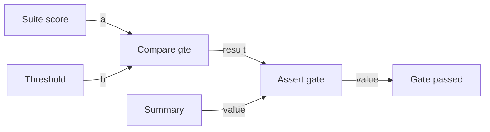

# Eval / regression gate

**Status:** Partial — CLI pack primary path runs per-case Fake `runCase`
(no required `--replay`); canvas Compare→Assert gate landed; real-provider
agent-under-test Expects not proven.

## Value

After a prompt, skill, or agent change, the same **golden fixture pack** must
still clear an agreed score threshold — pass/fail is a suite verdict, not a
feeling from a few chats. A score below the bar **stops** the job
(CLI exit `1` / Assert fail) so a worse agent is not shipped by accident.
**Not** a one-conversation chat harness. **Not** claimed as a live
agent-per-fixture canvas loop today: the demo only proves suiteScore vs
threshold → Assert.

## UX scenarios

### S1 — Clear the canvas Assert gate

**Who:** Author checking stop-on-regression wiring on the graph.

**Want:** Suite score ≥ threshold continues to Finish; the gate is a real
Assert, not a soft log line.

**Do:** `langflower start ./demo-project` → load workflow **Eval regression
gate** (`eval-regression-gate`) with **Suite score** and **Threshold** both
`1` → **Run**.

**Expect:**

- Graph MUST be Suite score / Threshold → Compare(`gte`) → Assert → Finish
  (see demo file).
- When `suiteScore >= threshold`, Assert MUST pass and Finish MUST receive the
  Summary value.
- Activity MUST be visible in [feed](../features/feed-panel.md) /
  [workflow execution](../features/workflow-execution.md).
- MUST NOT claim this demo loads a fixture pack or runs an agent under test —
  numbers are author-edited stand-ins for a suite score.

### S2 — Stop the canvas run on regression

**Who:** Same author simulating a failed suite.

**Want:** Score below threshold fails the gate hard — not a buried warning.

**Do:** On the same workflow, set **Suite score** below **Threshold** (e.g.
`0` vs `1`) → **Run**.

**Expect:**

- Compare(`gte`) MUST yield false; Assert (`gate`) MUST error with the
  regression message.
- Run MUST NOT treat Assert failure as a successful Finish.
- CI WS path proves the same Assert error shape (see Demo / CI).

### S3 — Run the documented CLI pack with replay

**Who:** Author or CI proving pack + scorers + threshold without a live model.

**Want:** Same fixture pack every time; exit `0` when clear, exit `1` on
regression.

**Do:** From repo root (after build), run `langflower eval` on
`tests/fixtures/eval/golden-sample` with `--replay` `replay-pass.json`, then
again with `replay-fail.json` (commands in that pack’s README).

**Expect:**

- Pack MUST declare cases, threshold, scorer (`exact` / `includes`), optional
  `skillPath`.
- Optional skill file MUST load via harness **`read`**, not panel `skillId`.
- Pass replay MUST exit `0` and report gate passed; fail replay MUST exit `1`
  (stop-on-regression).
- Suite score MUST be the mean of per-case scores; gate passes only when
  `suiteScore >= threshold`.

### S4 — Drive each fixture with an agent under test (no required replay map)

**Who:** Author gating an agent after edits; CI proving pack wiring without a
hand-written replay map.

**Want:** Per-case `runCase` is the agent under test — Fake for CI / happy-path
docs; real LLM when the author composes a provider runner — still the same
pack and threshold. `--replay` stays optional for offline maps.

**Do:** From repo root (after `build-all`):

```bash
node packages/cli/bin/langflower.js eval tests/fixtures/eval/golden-sample \
  --project tests/fixtures/eval/golden-sample
```

**Expect:**

- Every fixture MUST exercise the same agent-under-test path (CLI Fake
  skill-token runner when `--replay` is omitted).
- Threshold / fail-closed policy MUST still apply (same as S3).
- Happy-path docs MUST NOT require a hand-maintained `--replay` map.
- **Honesty:** Fake proves pack → `runCase` → score → gate wiring. Real
  provider agent-under-test is composed via
  `runEvalSuite({ runCase })` (see pack README) — not the default CLI path
  and not claimed as proven here.

### S5 — Re-run the same pack after a fix

**Who:** Author who just fixed a regression.

**Want:** Comparable scores across runs on the **same** pack — not a new
ad-hoc prompt each time.

**Do:** Re-run S4 (Fake) or S3 (`--replay`) on the unchanged pack directory
after fixing the agent/skill; or inject a live `runCase` when proving a real
provider.

**Expect:**

- Pack identity (cases + threshold + scorer) MUST stay stable for comparison.
- A cleared threshold MUST be the signal to keep the change — not “I tried
  three chats.”

## UI specs

| Spec                                                          | Scenarios covered                                                                                                          |
| ------------------------------------------------------------- | -------------------------------------------------------------------------------------------------------------------------- |
| [Workflow execution](../features/workflow-execution.md)       | [S1](#s1--clear-the-canvas-assert-gate), [S2](#s2--stop-the-canvas-run-on-regression)                                      |
| [Feed panel](../features/feed-panel.md)                       | [S1](#s1--clear-the-canvas-assert-gate), [S2](#s2--stop-the-canvas-run-on-regression)                                      |
| [Node library](../features/node-library.md)                   | [S1](#s1--clear-the-canvas-assert-gate), [S2](#s2--stop-the-canvas-run-on-regression) (Compare / Assert)                   |
| [Project configuration](../features/project-configuration.md) | [S4](#s4--drive-each-fixture-with-an-agent-under-test-no-required-replay-map) (provider when a live `runCase` is composed) |

CLI pack path (S3 / S4 / S5) is terminal + `@langflower/eval` — not a separate
editor UI surface. HITL triage after a failed gate is **not** on this demo
graph; use feed / execution for Assert errors.

## Runtime requirements

| Need                                                                              | Why (scenario)                                                                                                          | Today                                                     |
| --------------------------------------------------------------------------------- | ----------------------------------------------------------------------------------------------------------------------- | --------------------------------------------------------- |
| `common-compare` (`gte`) + `common-assert`                                        | Canvas stop-on-regression ([S1](#s1--clear-the-canvas-assert-gate), [S2](#s2--stop-the-canvas-run-on-regression))       | Landed (epic 06); demo wired                              |
| `@langflower/eval` pack load + scorers + mean suite score + fail-closed threshold | Fixture suite verdict ([S3](#s3--run-the-documented-cli-pack-with-replay), [S5](#s5--re-run-the-same-pack-after-a-fix)) | Landed (epic 09)                                          |
| CLI `langflower eval` + optional `--replay` map                                   | Offline / CI gate without a live model ([S3](#s3--run-the-documented-cli-pack-with-replay))                             | Landed                                                    |
| Skill file via harness `read` (`skillPath`)                                       | Pack-owned skill, not panel `skillId` ([S3](#s3--run-the-documented-cli-pack-with-replay))                              | Landed                                                    |
| Per-case `runCase` agent under test (Fake default; real via compose)              | Agent under test on the pack ([S4](#s4--drive-each-fixture-with-an-agent-under-test-no-required-replay-map))            | Fake CLI path landed (epic 23); real provider not default |
| Feed / execution projection of Assert fail                                        | See regression stop on canvas ([S2](#s2--stop-the-canvas-run-on-regression))                                            | Landed                                                    |

No new “evalGate” server primitive — pack runner is `@langflower/eval`; canvas
gate reuses Compare + Assert. Agent / Fake / LLM `runCase` is composed outside
`@langflower/eval` (CLI).

## Workflow shape

Matches `demo-project/.langflower/workflows/eval-regression-gate.json`
(shipped demo — **no** fixture loop, **no** agent under test):



Product pack path (not this demo file): load pack → optional skill `read` →
per-case `runCase` → score → aggregate → threshold. Primary CLI path injects
a Fake skill-token `runCase`; `--replay` remains optional for offline maps.

## Status

**Partial** — authorable/runnable canvas Assert gate + CLI pack runner with
Fake primary `runCase` and optional `--replay`. End-user “real LLM agent under
test over the pack” is not Implementable until a live provider meets S4
Expects without Fake-washing.

**Implementable when** S4 Expects pass on a documented pack with a **real**
LLM agent-under-test (no required `--replay` on the happy path), S1–S2 remain
true on the demo Assert graph, and S3/S5 stay available for offline/CI.

### Missing parts

| Layer          | Gap                                                                           | Scenarios | Done when                                                                |
| -------------- | ----------------------------------------------------------------------------- | --------- | ------------------------------------------------------------------------ |
| End-user proof | Real-provider agent under test on a pack                                      | S4        | Live provider meets S4 Expects; Fake / `--replay` remain optional for CI |
| Demo honesty   | Canvas demo stays score/threshold Assert only unless someone wires pack→graph | S1–S2     | No soft claim that the demo enumerates fixtures                          |

### Workarounds

- **CLI Fake primary** — `langflower eval` without `--replay` proves pack →
  `runCase` → scorers → stop-on-regression (topology / skill-token Fake).
- **CLI replay** — `--replay` for hand-written offline maps.
- **Canvas Partial** — edit Suite score / Threshold on
  `eval-regression-gate` to prove Assert stop.
- One-fixture chat still does **not** replace the pack runner.

### Demo / CI

- Demo: `demo-project/.langflower/workflows/eval-regression-gate.json`
  (Suite score → Compare → Assert → Finish)
- Pack: `tests/fixtures/eval/golden-sample/` (+ README)
- CI: `tests/integration/eval-regression-gate.test.ts` (CLI Fake primary +
  pass/fail replay); `tests/integration/ws/execute-eval-regression-gate.ws.test.ts`
  (Assert pass / regression error)
- Epic: [09-eval-regression-gate](../DONE/EPICS/09-eval-regression-gate.md);
  live `runCase` wiring: [23-eval-live-runcase](../TODO/EPICS/23-eval-live-runcase.md)
- Related: [skill-refining](./skill-refining.md),
  [node-library](../features/node-library.md) (Compare / Assert)

### Run path (end-user / CI)

**A. Canvas Assert gate**

1. `langflower start ./demo-project` (or `npm run dev` against the demo
   project).
2. Load workflow **Eval regression gate** (`eval-regression-gate`).
3. Suite score ≥ Threshold → **Run** → Finish.
4. Lower Suite score below Threshold → **Run** → Assert fails (regression
   stop).

**B. CLI pack (primary — Fake agent under test)**

```bash
node packages/cli/bin/langflower.js eval tests/fixtures/eval/golden-sample \
  --project tests/fixtures/eval/golden-sample
```

**C. CLI pack (optional replay)**

```bash
node packages/cli/bin/langflower.js eval tests/fixtures/eval/golden-sample \
  --project tests/fixtures/eval/golden-sample \
  --replay tests/fixtures/eval/golden-sample/replay-pass.json
```

On `replay-fail.json`, exit code is `1`. Programmatic:
`@langflower/eval/run-eval-suite` with an injected `runCase` (Fake, replay, or
real provider).
