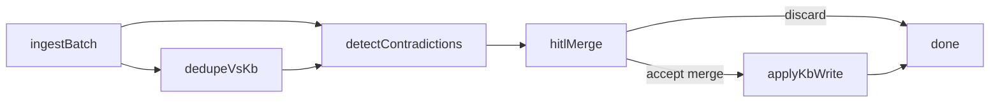

# KB contradiction curation

**Status:** Removed — vector KB / curation nodes deleted
([ADR-033](../ADR.md#adr-033--markdown-memory-tools-no-embedding-as-base)).

**Historical status:** Partial — first-class dedupe / contradiction packets, merge-packet
HITL, gated apply/discard, and dedicated demo + Fake CI landed. Claim
detection is deterministic (heuristic); **Implementable** needs real-LLM
Expects on the same demo.

## Value

Keep a living project knowledge base **consistent** as new sources arrive:
normalize an ingest batch, flag near-duplicates and conflicting claims against
what is already stored, pause for a human merge / keep / discard decision, and
only then write (or refuse) durable KB updates. The deliverable is a
**coherent KB on disk**, not a chat answer. **Not** blind agent edits to
Markdown. **Not** ingest-only / search-only graphs without contradiction gates
([project-kb](project-kb.md) Partial covers those primitives).

## UX scenarios

### S1 — Point a batch at the project KB and start ingest

**Who:** Curator who owns the project KB.

**Want:** A repeatable ingest shape for a new batch (notes, scrapes, export
dumps, Markdown folder) against a known KB root — not an ad-hoc chat paste.

**Do:** Load **KB contradiction curation** (`kb-contradiction-curation`). Set
the batch string to JSON `[{id,text},…]` (or plain text). Seed / point the
trusted collection (demo uses `trusted` under `.langflower/kb/`). **Run**.

**Expect:**

- Run MUST produce a shared ingest shape for later stages (normalize / chunk
  as authored — **not** a shipped dedicated normalize node today).
- Feed / [workflow execution](../features/workflow-execution.md) MUST show
  ingest progress — MUST NOT collapse the batch into a single opaque chat turn.
- MUST NOT durable-write the batch into the trusted KB before dedupe /
  contradiction / HITL (S2–S5).

### S2 — Dedupe against the live KB

**Who:** Same curator when candidates may already exist.

**Want:** Near-duplicates flagged before a second page is created for the same
fact — not silent double-ingest.

**Do:** Let **KB Dedupe** (`common-kb-dedupe`) compare candidates to the live
collection.

**Expect:**

- Dedupe MUST emit structured duplicate / near-duplicate signals (candidates +
  existing entries) — MUST NOT be “the agent noticed in prose.”
- Blind create of a second page for a flagged near-duplicate MUST NOT proceed
  past this stage without a human path (S4).
- Epic 10 `KB Search` / `KB List` alone MUST NOT count as this Expect.

### S3 — Detect contradictions

**Who:** Same curator when claims disagree.

**Want:** Conflicting claims across the new batch and/or against the live KB
surfaced as structured hits — not left for the model to mention casually.

**Do:** Let **KB Contradict** (`common-kb-contradict`) flag conflicts (versions,
owners, negation / polarity) and emit a merge packet.

**Expect:**

- Detect MUST emit structured conflict packets (disputed passages + candidate
  pages / entries) — MUST NOT be unstructured chat dump only.
- Hits MUST flow to a human gate (S4) before durable accept-write.
- Prompt-only “find contradictions” inside a generic agent MUST NOT count as
  shipping this Expect (see [obsidian-kb](obsidian-kb.md) gap pointer).

### S4 — Resolve a merge packet at HITL

**Who:** Curator or reviewer at the merge gate.

**Want:** A contradiction-shaped review packet — disputed passages, candidates,
proposed merge / edit / delete — not a generic Accept on raw agent text.

**Do:** At **Merge packet** (Review Gate), read the packet preview; **Approve**
to apply, or **Request changes** / discard text to finish without apply via
[HITL chat](../features/hitl-chat.md) / feed composer.

**Expect:**

- Packet MUST present disputed passages + proposed merge / edit / delete
  actions as first-class curation content.
- Decision MUST be visible in the [feed](../features/feed-panel.md) as the
  gate outcome — MUST NOT live only in chat memory.

### S5 — Apply accept or leave KB unchanged

**Who:** Same person after the gate.

**Want:** Accept → durable KB mutation as chosen; discard → no durable write
(or draft discarded).

**Do:** On approve, **KB Apply Curation** runs proposed `write` / `edit` /
`delete`; on discard (feedback → Discarded Finish), stop without mutating the
trusted KB.

**Expect:**

- Accept MUST apply through a graph apply path (`common-kb-apply-curation`) —
  MUST NOT rely on ad-hoc agent improvisation outside the gated path.
- Discard MUST leave the trusted KB unchanged.
- `KB List` before write (preview inventory) and `KB Delete` on merge-retire
  are optional authoring aids — landed epic 10 nodes, not a substitute for
  S2–S4.

### S6 — Re-run on the next batch

**Who:** Curator on a later ingest.

**Want:** The same curation pipeline again — auditable history in the feed,
not reconstructing merge decisions from old chat.

**Do:** Re-run the same workflow on a new batch string / candidates JSON.

**Expect:**

- Same graph MUST be re-runnable without rebuilding the product story.
- Each run’s feed MUST show that run’s conflict flags and apply / discard
  outcomes — MUST NOT make chat scrollback the only record of the gate.

## UI specs

| Spec                                                          | Scenarios covered                                                                                                                                                                                                                                                   |
| ------------------------------------------------------------- | ------------------------------------------------------------------------------------------------------------------------------------------------------------------------------------------------------------------------------------------------------------------- |
| [Feed panel](../features/feed-panel.md)                       | [S1](#s1--point-a-batch-at-the-project-kb-and-start-ingest), [S2](#s2--dedupe-against-the-live-kb), [S3](#s3--detect-contradictions), [S4](#s4--resolve-a-merge-packet-at-hitl), [S5](#s5--apply-accept-or-leave-kb-unchanged), [S6](#s6--re-run-on-the-next-batch) |
| [HITL chat](../features/hitl-chat.md)                         | [S4](#s4--resolve-a-merge-packet-at-hitl), [S5](#s5--apply-accept-or-leave-kb-unchanged)                                                                                                                                                                            |
| [Workflow execution](../features/workflow-execution.md)       | [S1](#s1--point-a-batch-at-the-project-kb-and-start-ingest)–[S6](#s6--re-run-on-the-next-batch)                                                                                                                                                                     |
| [Node library](../features/node-library.md)                   | [S1](#s1--point-a-batch-at-the-project-kb-and-start-ingest), [S2](#s2--dedupe-against-the-live-kb), [S3](#s3--detect-contradictions), [S5](#s5--apply-accept-or-leave-kb-unchanged)                                                                                 |
| [Project configuration](../features/project-configuration.md) | [S1](#s1--point-a-batch-at-the-project-kb-and-start-ingest)                                                                                                                                                                                                         |

## Runtime requirements

Acid test only — if we never build it, which Expect dies? Shared agent stack
(real LLM, harness tools, `permission.ask`) assumed from [README.md](README.md);
not restated here.

| Need                                         | Why (scenario)                                                                                                                               | Today                                                 |
| -------------------------------------------- | -------------------------------------------------------------------------------------------------------------------------------------------- | ----------------------------------------------------- |
| KB Ingest / Embed / Search / List / Delete   | Corpus I/O + inventory / retire ([S1](#s1--point-a-batch-at-the-project-kb-and-start-ingest), [S5](#s5--apply-accept-or-leave-kb-unchanged)) | Landed (epic 10) under `.langflower/kb/`              |
| First-class dedupe step / node               | Structured near-duplicate packets ([S2](#s2--dedupe-against-the-live-kb))                                                                    | Landed (`common-kb-dedupe`)                           |
| First-class contradiction-detect step / node | Structured conflict packets ([S3](#s3--detect-contradictions))                                                                               | Landed (`common-kb-contradict`; heuristic)            |
| Contradiction-shaped HITL merge packet       | Human merge / keep / discard on disputed passages ([S4](#s4--resolve-a-merge-packet-at-hitl))                                                | Landed (`kind: kb-contradiction-merge` → Review Gate) |
| Gated apply path after accept                | Durable write / edit / `KB Delete` from decision ([S5](#s5--apply-accept-or-leave-kb-unchanged))                                             | Landed (`common-kb-apply-curation`; discard → Finish) |
| Dedicated curation demo + CI                 | End-to-end Value proof ([S1](#s1--point-a-batch-at-the-project-kb-and-start-ingest)–[S6](#s6--re-run-on-the-next-batch))                     | Landed (Fake CI topology; real-LLM Expects open)      |

## Workflow shape

Dedicated demo: `demo-project/.langflower/workflows/kb-contradiction-curation.json`.
Optional branches: skip HITL when no duplicates/contradictions fire; topic
fan-out of packets; `KB List` before write.

Related shipped pieces (**not** this Value): epic 10 ingest/search/list/delete;
[project-kb](project-kb.md) Partial wiki/Q&A story without contradiction gates.

## Status

**Partial** — dedicated `kb-contradiction-curation.json` + Fake CI prove
candidates → dedupe → contradict → HITL merge packet → gated apply / discard.
Heuristic claim detection + topology CI are **not** end-user real-LLM Expects.
Do not treat ingest-only graphs or prompt-level “find conflicts” as this use
case.

**Implementable when** S1–S6 Expects pass on that demo with a **real** LLM +
tools for claim quality: structured packets, HITL merge, and apply/discard that
mutates or preserves the KB as chosen. Fake CI stays topology / heuristic.

### Missing parts

| Layer          | Gap                                                                                              | Scenarios | Done when                                                     |
| -------------- | ------------------------------------------------------------------------------------------------ | --------- | ------------------------------------------------------------- |
| End-user proof | Real-LLM S1–S6 Expects on `kb-contradiction-curation.json` (not only Fake CI / heuristic detect) | S1–S6     | Live provider meets Expects; Fake CI stays topology/heuristic |

### Workarounds

- **Partial runnable** — seed a trusted collection; load
  `kb-contradiction-curation`; **Run**; Approve merge or discard via feedback.
- **Authorable ingest without contradiction logic** — `KB Ingest` / `Embed` /
  `Search` / `List` / `Delete` (epic 10) for corpus I/O; **does not** fulfill
  this Value alone.
- **Prompt-level curation inside an agent** — may sketch conflicts in chat;
  **does not** ship first-class packets or this Status bar.

### Demo / CI

- **Curation (Value):** `demo-project/.../kb-contradiction-curation.json` —
  String batch → KB Dedupe → KB Contradict → Merge HITL → Apply | Discard.
- **CI fake path:** `tests/integration/ws/execute-kb-contradiction-curation.ws.test.ts`
  (seeded trusted KB; accept mutates; discard unchanged).
- **Unrelated:** [project-kb](project-kb.md) Partial / epic 10 fixture search —
  do **not** count as contradiction curation.
