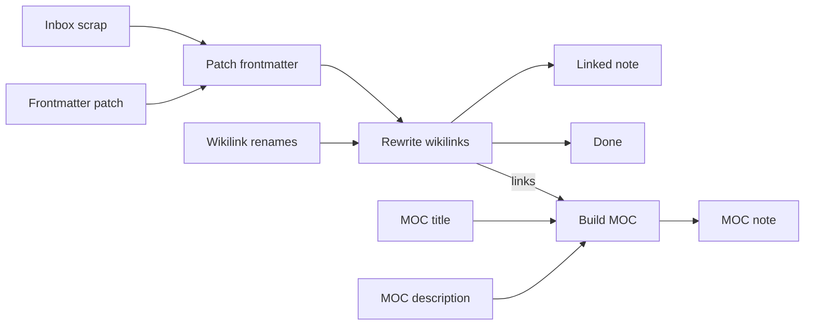

# Obsidian knowledge base

**Status:** Deferred — helpers removed from catalog; see
[TBD-007](../TBD.md#tbd-007--obsidian-vault-helpers). Base memory is
[ADR-033](../ADR.md#adr-033--markdown-memory-tools-no-embedding-as-base).

**Historical status:** Partial — epic 11 helpers + `harness.allowedRoots` landed; demo is
offline inbox → frontmatter → wikilinks → MOC → Preview (no live LLM, no HITL
vault write).

## Value

Grow a durable **personal Obsidian vault** — atomic notes, `[[wikilinks]]`,
MOCs — through an explicit Langflower graph with a human merge before vault
mutation. The owner trusts curated files on disk, **not** a chat transcript
pasted into Markdown. **Not** Obsidian host / graph API. **Not** the shipped
helpers demo as the full claim: those nodes only transform Markdown in-graph
(they do not touch the filesystem).

## UX scenarios

### S1 — Run the Obsidian helpers demo

**Who:** Knowledge owner trying Obsidian-aware Markdown helpers.

**Want:** A reusable offline pipeline for frontmatter, wikilinks, and MOC —
not a one-shot chat dump.

**Do:** Start the demo project, load workflow **Obsidian KB** (`obsidian-kb`),
**Run**. No LLM provider required.

**Expect:**

- Run MUST exercise Inbox scrap → Patch frontmatter → Rewrite wikilinks →
  Linked note Preview / Finish, and the parallel Build MOC → MOC note Preview
  path — MUST NOT require a live LLM.
- Helper and Preview activity MUST appear in the
  [feed](../features/feed-panel.md) and
  [workflow execution](../features/workflow-execution.md) surfaces.
- Demo MUST NOT be treated as proof of vault file write or HITL merge.

### S2 — Frontmatter patch then wikilink rewrite

**Who:** Same owner inspecting the linked-note path.

**Want:** Structured YAML patch and renamed `[[wikilinks]]` — not ad-hoc
string soup.

**Do:** Leave demo String fixtures (Inbox scrap, Frontmatter patch, Wikilink
renames) as shipped; Run; open **Linked note** Preview.

**Expect:**

- `common-obsidian-frontmatter` MUST take `markdown` + `patch` and emit patched
  markdown (demo: title / tags / status).
- `common-obsidian-wikilink-rewrite` MUST take that markdown + `renames` and
  emit rewritten markdown (demo: `Old Topic` → `Topic Hub`, `Draft Atom` →
  `Atomic Note`).
- Linked note Preview MUST show the rewritten markdown — MUST NOT claim a
  write into an Obsidian vault folder.

### S3 — Build MOC from extracted links

**Who:** Same owner on the MOC branch.

**Want:** A Map of Content note composed from title + links + description.

**Do:** Observe Wikilinks `links` → Build MOC; open **MOC note** Preview.

**Expect:**

- `common-obsidian-build-moc` MUST compose MOC markdown from demo inputs:
  title (`Topic Hub`), description, and `links` from the wikilink step.
- MOC note Preview MUST show that markdown.
- There is **no** vault write node on this graph after Build MOC.

### S4 — Re-run the helpers offline

**Who:** Owner repeating the pass.

**Want:** Same offline helper shape every run — not a chat improvisation.

**Do:** Re-run **Obsidian KB**.

**Expect:**

- Re-running MUST exercise the same String → Frontmatter → Wikilinks →
  Preview / Finish and Build MOC → Preview structure again.
- Re-run MUST still require **no** live LLM.

### S5 — Outside-root vault allowlist (authorable I/O)

**Who:** Owner whose vault lives outside the Langflower project root.

**Want:** Harness builtins can reach that vault only when explicitly
allowlisted — not a blanket sandbox escape.

**Do:** Set `harness.allowedRoots` in `.langflower/langflower.jsonc` to the
vault path (see [CONFIG](../CONFIG.md) / demo-project README). Author a graph
that uses harness `read` / `write` / … under that root. _(The shipped
`obsidian-kb` demo does **not** perform this I/O.)_

**Expect:**

- With `allowedRoots` set, path resolution MUST accept paths under those
  roots (ADR-014 extension); deny globs still apply.
- Empty / missing `allowedRoots` MUST keep project-root-only default.
- This scenario MUST NOT be satisfied by the helpers-only demo alone.

### S6 — Agent curation + HITL merge + permissioned write _(target)_

**Who:** Owner processing an inbox or expanding a MOC with agents.

**Want:** Explore → draft notes/links / MOC proposals → human merge →
permissioned vault write — **not** silent bulk overwrite.

**Do:** _(Target)_ Assemble LLM + harness tools + helpers + HITL Review /
Approval; point tools at the vault (project mirror or `allowedRoots`); Run;
Accept / edit / reject before writes.

**Expect:**

- Topology MUST include a human merge gate before destructive or broad vault
  writes — MUST NOT auto-write the vault from draft alone.
- Explore / draft MUST use registered harness tools (`read` / `glob` /
  `grep` / `edit` / `write` / `create` / `delete` as policy allows) under the
  allowed root.
- Helpers MAY sit on the draft/MOC path; vault I/O MUST stay on harness
  builtins (helpers do not write files).
- First-class contradiction / dedupe packets are **out of this demo’s bar** —
  see [kb-contradiction-curation](kb-contradiction-curation.md) (**Partial**).
- Obsidian host / graph API MUST NOT be required for Markdown-on-disk MVP.

## UI specs

| Spec                                                    | Scenarios covered                                                                                                                                                              |
| ------------------------------------------------------- | ------------------------------------------------------------------------------------------------------------------------------------------------------------------------------ |
| [Feed panel](../features/feed-panel.md)                 | [S1](#s1--run-the-obsidian-helpers-demo), [S2](#s2--frontmatter-patch-then-wikilink-rewrite), [S3](#s3--build-moc-from-extracted-links), [S4](#s4--re-run-the-helpers-offline) |
| [Workflow execution](../features/workflow-execution.md) | [S1](#s1--run-the-obsidian-helpers-demo), [S2](#s2--frontmatter-patch-then-wikilink-rewrite), [S3](#s3--build-moc-from-extracted-links), [S4](#s4--re-run-the-helpers-offline) |
| [HITL chat](../features/hitl-chat.md)                   | [S6](#s6--agent-curation--hitl-merge--permissioned-write-target)                                                                                                               |
| [Node library](../features/node-library.md)             | [S1](#s1--run-the-obsidian-helpers-demo)–[S3](#s3--build-moc-from-extracted-links), [S5](#s5--outside-root-vault-allowlist-authorable-io)                                      |

## Runtime requirements

| Need                               | Why (scenario)                                                                                                                   | Today                                                           |
| ---------------------------------- | -------------------------------------------------------------------------------------------------------------------------------- | --------------------------------------------------------------- |
| `common-obsidian-frontmatter`      | Patch YAML ([S2](#s2--frontmatter-patch-then-wikilink-rewrite))                                                                  | Landed (epic 11)                                                |
| `common-obsidian-wikilink-rewrite` | Rename / extract `[[wikilinks]]` ([S2](#s2--frontmatter-patch-then-wikilink-rewrite), [S3](#s3--build-moc-from-extracted-links)) | Landed (epic 11)                                                |
| `common-obsidian-build-moc`        | Compose MOC note ([S3](#s3--build-moc-from-extracted-links))                                                                     | Landed (epic 11)                                                |
| `harness.allowedRoots`             | Outside-root vault fence ([S5](#s5--outside-root-vault-allowlist-authorable-io))                                                 | Landed (ADR-014 extension); **not** exercised by demo graph I/O |
| Real LLM + harness file tools      | Agent explore / draft / write ([S6](#s6--agent-curation--hitl-merge--permissioned-write-target))                                 | Landed (epics 01–05); **not** on demo graph                     |
| HITL Review / Approval gate        | Human merge before vault mutation ([S6](#s6--agent-curation--hitl-merge--permissioned-write-target))                             | Landed nodes; **not** on demo graph                             |

## Workflow shape

Matches `demo-project/.langflower/workflows/obsidian-kb.json`:

All sources are `common-string` fixtures. There is **no** LLM node, **no**
HITL gate, and **no** harness `write` / `create` into a vault on this graph —
Preview only.

## Status

**Partial** — helpers + outside-root allowlist landed; demo proves the offline
Markdown helper spine. End-user explore → draft → curate → HITL → permissioned
vault write is authorable from existing nodes but **not** shipped as a polished
pilot (no Fake-LLM CI path for that spine).

**Implementable when** S6 Expects pass on a documented pilot with a **real**
LLM, HITL merge before vault writes, and tools under project root or
`allowedRoots` — while S1–S4 remain true on the helpers demo and S5 remains
true for allowlisted vault I/O.

### Missing parts

| Layer             | Gap                                                                                       | Scenarios | Done when                                                                                         |
| ----------------- | ----------------------------------------------------------------------------------------- | --------- | ------------------------------------------------------------------------------------------------- |
| Demo / wiring     | Agent explore → draft → curate → HITL → permissioned write pilot (+ Fake LLM CI topology) | S6        | Documented workflow proves merge-before-write; Fake CI = topology only                            |
| Related UC        | First-class contradiction / dedupe packets                                                | S6        | See [kb-contradiction-curation](kb-contradiction-curation.md) (**Partial**) — not inventable here |
| Product packaging | Cross-run vault preferences / “canonical note for X” via Memory                           | S6        | Memory used in a vault-curation pilot (nodes exist; not this demo)                                |
| Out of scope      | Obsidian API / host open-note / graph                                                     | —         | Markdown-on-disk MVP; host API optional later (epic 11)                                           |

### Workarounds

- **Helpers Partial** — run `obsidian-kb` offline for frontmatter / wikilinks /
  MOC Preview.
- **Authorable vault I/O** — set `harness.allowedRoots` (or mirror the vault
  under the project root) and wire LLM + HITL + helpers yourself; not the
  shipped demo claim.
- Mirror-under-project-root when you prefer not to allowlist an absolute path.

### Demo / CI

- Demo: `demo-project/.langflower/workflows/obsidian-kb.json`
  (Inbox scrap → `common-obsidian-frontmatter` →
  `common-obsidian-wikilink-rewrite` → Preview / Finish; parallel
  `common-obsidian-build-moc` → Preview)
- No dedicated WS Fake-LLM CI for an agent/HITL vault spine (helpers demo is
  offline; no LLM)
- Config note: [CONFIG — harness.allowedRoots](../CONFIG.md),
  [demo-project README — Obsidian KB](../../demo-project/README.md)
- Epic: [11-obsidian-kb](../DONE/EPICS/11-obsidian-kb.md)
- Related: [kb-contradiction-curation](kb-contradiction-curation.md),
  [project-kb](project-kb.md),
  [node-library § Obsidian](../features/node-library.md)

### Run path (end-user)

1. `langflower start ./demo-project` (or `npm run dev` against the demo
   project).
2. Load workflow **Obsidian KB** (`obsidian-kb`).
3. **Run** — no LLM required.
4. Inspect **Linked note** and **MOC note** Previews (patched frontmatter,
   rewritten `[[wikilinks]]`, composed MOC).
5. For a real vault path outside the project: set `harness.allowedRoots` and
   author write/HITL steps yourself — not claimed by this demo graph.
