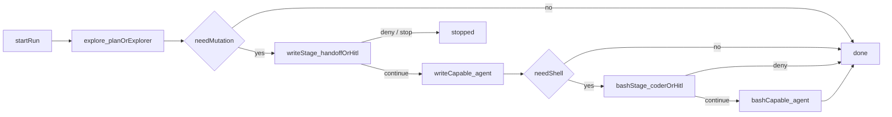

# Permission escalation ops

**Status:** Partial — dedicated staged-ops demo + Fake CI topology landed;
S1–S5 Expects on a real LLM remain open. Smoke `basic-coder` is **not** this
Value.

## Value

Run an agent change safely by separating **explore, mutate, and shell** as
visible graph stages (distinct nodes / role budgets) with human Allow/Deny on
risky calls — **not** one chat-session trust blob that silently widens from
read to bash. Runtime security stays **per-tool policy + `permission.ask`**
(run-scoped grants) — **not** a mid-run “permission tier unlock” state machine.

## UX scenarios

### S1 — Start explore-only

**Who:** Operator investigating a real change (bug, fix, verify).

**Want:** First work stays read-heavy — list/search/read — without mutating
disk or running shell.

**Do:** Start a staged-ops workflow whose first agent stage uses an
explore-heavy budget (e.g. Plan / Explorer `enabledToolIds` + posture).

**Expect:**

- First stage MUST bind a read-heavy tool inventory (at least `read` / `glob` /
  `grep` as authored) — MUST NOT expose `bash` in that stage’s allowlist.
- Explore tool calls MUST appear in the [feed](../features/feed-panel.md) /
  [workflow execution](../features/workflow-execution.md) for that node.
- Mutating or shell tools MUST NOT run in this stage unless the author
  misconfigured the allowlist (policy alone is not a substitute for stage
  inventory).

### S2 — Gate before mutate

**Who:** Same operator when the agent needs to edit or write files.

**Want:** Mutation is a deliberate handoff / ask — not a silent widen of the
same chat trust level.

**Do:** Let the graph reach a write-capable stage (handoff and/or HITL); when
policy is `ask`, Allow or Deny `permission.ask` in the feed/composer.

**Expect:**

- Write-capable tools (`edit` / `write` / `create` / `delete` as authored)
  MUST only become available via **graph stage handoff** (different node /
  `enabledToolIds`) and/or HITL — MUST NOT invent a runtime “unlock write
  tier” API.
- When project/role policy is `ask`, the call MUST pause on `permission.ask`;
  Allow MUST continue that tool+detail (run-scoped); Deny MUST fail closed.
- Feed MUST show the ask cue and Allow/Deny outcome
  ([hitl-chat](../features/hitl-chat.md) / feed composer).

### S3 — Gate before bash

**Who:** Same operator when the plan needs a shell command (test, build).

**Want:** Shell is a further deliberate gate — not bundled with “I already
allowed a write.”

**Do:** Reach a bash-capable stage (e.g. Coder preset); Allow or Deny
`permission.ask` for `bash` when policy requires it.

**Expect:**

- `bash` MUST remain unavailable while the active stage’s allowlist excludes
  it (e.g. Plan/Explorer posture) — MUST NOT treat a prior write Allow as a
  bash grant.
- When `permission.bash` (or role overlay) is `ask`, the call MUST surface
  `permission.ask`; Allow / Deny MUST gate that invoke.
- Deny MUST leave the run without that shell invoke succeeding.

### S4 — See stage + grants in the feed

**Who:** Operator watching the run.

**Want:** Know which graph stage is active and which asks were granted or
refused — not reconstruct trust from chat memory.

**Do:** Watch feed / execution while explore, write, and bash stages run.

**Expect:**

- Active agent node / stage activity MUST be visible in feed and workflow
  execution.
- Each `permission.ask` MUST leave a short cue + Allow/Deny outcome (composer
  is the control surface).
- MUST NOT claim a dedicated “current permission tier” chrome that does not
  exist — stage identity is the **canvas node / role**, not a separate tier
  widget.

### S5 — Re-run the same staged spine

**Who:** Operator repeating the ops path on the same project.

**Want:** The same explore → mutate → bash structure again — grants from a
previous chat session MUST NOT stick.

**Do:** Re-run the same workflow.

**Expect:**

- Re-run MUST exercise the same staged graph again.
- Run-scoped grants from a **prior** run MUST NOT carry over; within a run,
  Allow once MAY remember the same tool+detail (shipped epic 02 behaviour).

## UI specs

| Spec                                                          | Scenarios covered                                                                                                                                                            |
| ------------------------------------------------------------- | ---------------------------------------------------------------------------------------------------------------------------------------------------------------------------- |
| [Feed panel](../features/feed-panel.md)                       | [S1](#s1--start-explore-only), [S2](#s2--gate-before-mutate), [S3](#s3--gate-before-bash), [S4](#s4--see-stage--grants-in-the-feed), [S5](#s5--re-run-the-same-staged-spine) |
| [HITL chat](../features/hitl-chat.md)                         | [S2](#s2--gate-before-mutate), [S3](#s3--gate-before-bash), [S4](#s4--see-stage--grants-in-the-feed)                                                                         |
| [Workflow execution](../features/workflow-execution.md)       | [S1](#s1--start-explore-only), [S2](#s2--gate-before-mutate), [S3](#s3--gate-before-bash), [S4](#s4--see-stage--grants-in-the-feed), [S5](#s5--re-run-the-same-staged-spine) |
| [Project configuration](../features/project-configuration.md) | [S2](#s2--gate-before-mutate), [S3](#s3--gate-before-bash)                                                                                                                   |
| [Node library](../features/node-library.md)                   | [S1](#s1--start-explore-only)–[S3](#s3--gate-before-bash)                                                                                                                    |

## Runtime requirements

| Need                                           | Why (scenario)                                                                                                                        | Today                                            |
| ---------------------------------------------- | ------------------------------------------------------------------------------------------------------------------------------------- | ------------------------------------------------ |
| Harness tools + internal tool loop             | Real explore / mutate / bash invokes ([S1](#s1--start-explore-only)–[S3](#s3--gate-before-bash))                                      | Landed (epic 01)                                 |
| `langflower.jsonc` `permission` + role posture | allow / ask / deny per tool ([S2](#s2--gate-before-mutate), [S3](#s3--gate-before-bash))                                              | Landed (epics 02 / 04)                           |
| `permission.ask` + feed/composer Allow/Deny    | Human gate on ask-policy calls ([S2](#s2--gate-before-mutate), [S3](#s3--gate-before-bash), [S4](#s4--see-stage--grants-in-the-feed)) | Landed (epic 02)                                 |
| Role presets / `enabledToolIds`                | Stage inventories (explore vs coder) ([S1](#s1--start-explore-only)–[S3](#s3--gate-before-bash))                                      | Landed (epic 04)                                 |
| HITL / Review gate nodes                       | Optional graph handoff between stages ([S2](#s2--gate-before-mutate))                                                                 | Landed                                           |
| Dedicated staged-ops demo + CI                 | End-to-end Value proof ([S1](#s1--start-explore-only)–[S5](#s5--re-run-the-same-staged-spine))                                        | Landed (Fake CI topology; real-LLM Expects open) |

## Workflow shape

**Shipped** (`permission-escalation-ops.json`). Stages are **nodes with budgets**,
not runtime tier unlocks:

Related shipped pieces (not this Value alone): Plan→Coder + `permission.ask`
in [coding-agent](coding-agent.md) / `basic-coder` smoke; hard harness gates
(epic 06) for Assert / exitCode — optional, not a substitute for this staged
spine.

## Status

**Partial** — dedicated `permission-escalation-ops.json` + Fake CI prove the
explore → write → bash graph (node/role stages, HITL handoffs, no mid-run
tier invent). `basic-coder` / coding-agent remain **unrelated** smoke / other
Value.

**Implementable when** S1–S5 Expects pass on that demo with a **real** LLM +
tools (explore inventory, write/bash asks, feed stage activity, re-run
grants). Fake CI is topology + scripted tools only.

### Missing parts

| Layer                                        | Gap                                                                                                                                  | Scenarios | Done when                                                    |
| -------------------------------------------- | ------------------------------------------------------------------------------------------------------------------------------------ | --------- | ------------------------------------------------------------ |
| End-user proof                               | Real-LLM S1–S5 Expects on `permission-escalation-ops.json` (not only Fake CI)                                                        | S1–S5     | Live provider meets Expects; Fake CI stays topology/scripted |
| UI ([feed-panel](../features/feed-panel.md)) | Chat-dense timeline is still Draft ([grok-feed](grok-feed.md)); this UC needs ask cues + stage activity, not full chat-mirror parity | S4        | Ask cues + node activity findable on real runs               |

### Workarounds

- **Partial runnable** — load `permission-escalation-ops` with a configured
  provider; Approve write/bash HITL gates; Allow harness asks in the feed.
- **Smoke elsewhere** — [coding-agent](coding-agent.md) / `basic-coder`
  exercise Plan→Coder + asks; they are **not** this use case’s claim.

### Demo / CI

- **Staged ops (Value):** `demo-project/.../permission-escalation-ops.json` —
  ChatInput → Explore (Plan) → Write handoff → Write (coder inventory
  **without** `bash`) → Bash handoff → Bash (Coder) → Finish. Stage identity
  = canvas node / role — no tier widget.
- **Real-LLM path:** configure `lmstudio` / `openai` / `cursor-proxy`; set
  provider/model on Explore / Write / Bash; composer **Start**; Approve HITL
  handoffs; Allow `permission.ask` for write/edit and bash.
- **CI fake path:** `tests/integration/ws/execute-permission-escalation-ops.ws.test.ts`
  (Fake LLM + HITL gates; topology + scripted tool stages — not live provider).
- **Smoke (≠ Value):** `basic-coder.json` — Plan→Coder only; do **not** count
  as permission-escalation ops.
