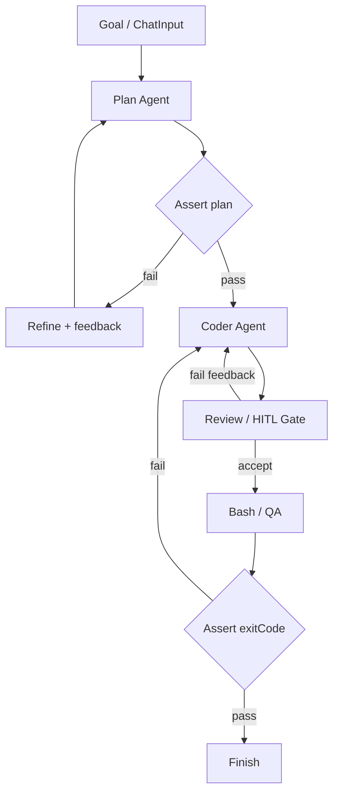

# Plan → refine → implement → review → QA

**Status:** Partial — Assert / Compare / IF / Gate + Plan/Coder/Review are
authorable; **no** dedicated plan→Assert→QA demo. `basic-coder` HITL smoke
MUST NOT count as this Value.

## Value

Ship a small code change through a **hard-harness** graph: plan, Assert the
plan, refine until Assert passes, implement, review, then gate on real test /
shell **exit codes** — **not** on the model saying the work looks good.
Phases are nodes and Assert / Compare / IF edges — **not** prompt discipline
in one chat turn. Distinct from [coding-agent](coding-agent.md) (agent /
HITL feedback loops without Assert / exitCode rails).

## UX scenarios

### S1 — Start a hard-harness plan→QA run

**Who:** Developer who needs verifiable gates on plan and tests.

**Want:** Explicit control flow (Assert / branch / exitCode) — not a chat
agent that self-certifies “done.”

**Do:** Assemble Plan → Assert → Refine / Coder → Review → Bash →
Compare → Assert → Finish from the palette. Enter a goal; Start the run.
(There is **no** dedicated demo workflow for this spine today.)

**Expect:**

- Topology MUST include hard gates (Assert / Compare / IF or Gate) on plan
  and on QA — MUST NOT be Plan→Coder→Finish with only HITL Accept.
- Model prose (“LGTM”, “plan ready”, “tests pass”) alone MUST NOT advance
  past an Assert.
- [Feed](../features/feed-panel.md) / [workflow execution](../features/workflow-execution.md)
  MUST show which phase and which hard gate are active — MUST NOT hide
  Assert fail/pass as an inner agent monologue.

### S2 — Plan Assert fails closed before Coder

**Who:** Same developer when the plan fails a verifiable check.

**Want:** A bad plan stops implementation — not a soft “looks fine” continue.

**Do:** Let Plan emit a plan; let Assert (schema / required sections via
Compare condition) evaluate it. Inspect the failed gate on the canvas /
inspector if needed.

**Expect:**

- Assert fail MUST block Coder — Coder MUST NOT receive the failed plan as a
  pass handoff.
- Fail MUST open the refine path (feedback / Refine → Plan) — MUST NOT
  silent-continue to Coder.
- Feed MUST surface the failed plan Assert (which hard gate stopped progress).

### S3 — Refine until plan Assert passes

**Who:** Same developer on the refine loop.

**Want:** Revision as graph structure until Assert passes or a max Gate fails
the branch.

**Do:** Observe Refine (or Plan + feedback) re-enter; wait for Assert pass or
Gate cap.

**Expect:**

- Refine / feedback MUST re-enter Plan on the canvas (visible edge) — MUST
  NOT be a hidden inner chat loop.
- Plan Assert pass MUST be the Assert / Compare condition true — MUST NOT be
  the model declaring the plan ready in prose.
- Target graph MUST include a max-attempt Gate (or equivalent bounded
  branch); exceeding it MUST fail the branch — MUST NOT unbounded refine.

### S4 — Implement only after plan Assert pass

**Who:** Same developer after the plan gate opens.

**Want:** Coder implements against an Assert-accepted plan, under project
permissions.

**Do:** After plan Assert pass, let Coder (`rolePreset: coder`) run the
harness tool loop; Allow / Deny `permission.ask` in the feed/composer when
policy requires it.

**Expect:**

- Coder MUST start only after plan Assert pass (edge after the hard gate).
- Coder MUST enter the harness tool loop (`read` … `bash` as policy allows).
- Destructive or shell actions under ask policy MUST surface as
  `permission.ask`; Allow/Deny MUST continue or block that tool call.

### S5 — Review accept or feedback before QA

**Who:** Same developer after Coder produces a change.

**Want:** Accept or send revision notes as graph ports — not an informal chat
aside.

**Do:** At Review (`common-review` or `common-hitl-review-gate`): Accept to
advance toward QA, or send feedback to Coder.

**Expect:**

- Review fail / feedback MUST route to Coder.`feedback` (revision visible on
  the canvas).
- Accept MUST continue to the QA stage — MUST NOT Finish from Review alone
  (QA Assert is required downstream in this Value).
- HITL Approve / Send feedback MUST use the
  [HITL chat](../features/hitl-chat.md) / composer control surface when a
  Review Gate is in the graph.

### S6 — QA Assert on exitCode; Done only on pass

**Who:** Same developer after Review accept.

**Want:** Tests / QA commands as a hard gate — Done only when exit-code
checks pass.

**Do:** Run the QA stage (palette Bash / graph shell that yields `exitCode`);
Compare → Assert (`exitCode === 0`); observe pass → Finish or fail → Coder
re-entry.

**Expect:**

- QA MUST feed a verifiable `exitCode` (or Compare boolean from it) into
  Assert — MUST NOT treat model “tests look good” as the gate.
- Assert fail / non-zero exit MUST block Finish.
- Fail MUST re-enter Coder on `feedback` (visible edge).
- Finish MUST require QA Assert pass.

## UI specs

| Spec                                                            | Scenarios covered                                                                                                                                                                                                                                                                              |
| --------------------------------------------------------------- | ---------------------------------------------------------------------------------------------------------------------------------------------------------------------------------------------------------------------------------------------------------------------------------------------- |
| [Visual workflow editor](../features/visual-workflow-editor.md) | [S1](#s1--start-a-hard-harness-planqa-run), [S2](#s2--plan-assert-fails-closed-before-coder), [S3](#s3--refine-until-plan-assert-passes)                                                                                                                                                       |
| [Feed panel](../features/feed-panel.md)                         | [S1](#s1--start-a-hard-harness-planqa-run), [S2](#s2--plan-assert-fails-closed-before-coder), [S3](#s3--refine-until-plan-assert-passes), [S4](#s4--implement-only-after-plan-assert-pass), [S5](#s5--review-accept-or-feedback-before-qa), [S6](#s6--qa-assert-on-exitcode-done-only-on-pass) |
| [HITL chat](../features/hitl-chat.md)                           | [S4](#s4--implement-only-after-plan-assert-pass), [S5](#s5--review-accept-or-feedback-before-qa)                                                                                                                                                                                               |
| [Inspector](../features/inspector.md)                           | [S2](#s2--plan-assert-fails-closed-before-coder), [S6](#s6--qa-assert-on-exitcode-done-only-on-pass)                                                                                                                                                                                           |
| [Workflow execution](../features/workflow-execution.md)         | [S1](#s1--start-a-hard-harness-planqa-run), [S2](#s2--plan-assert-fails-closed-before-coder), [S3](#s3--refine-until-plan-assert-passes), [S6](#s6--qa-assert-on-exitcode-done-only-on-pass)                                                                                                   |

## Runtime requirements

Acid test only — if we never build it, which Expect dies? Shared agent stack
(Plan/Coder presets, harness tools, `permission.ask`) is assumed from
[README.md](README.md); not restated here.

| Need                                                    | Why (scenario)                                                                                                                                                                 | Today                                                                                         |
| ------------------------------------------------------- | ------------------------------------------------------------------------------------------------------------------------------------------------------------------------------ | --------------------------------------------------------------------------------------------- |
| Assert + Compare + IF / Gate on plan                    | Fail-closed plan; refine loop ([S2](#s2--plan-assert-fails-closed-before-coder), [S3](#s3--refine-until-plan-assert-passes))                                                   | Landed (epic 06); CI Assert+IF smoke only — not agent plan spine                              |
| Max-attempt Gate (bounded fail) on refine               | Cap unbounded refine ([S3](#s3--refine-until-plan-assert-passes))                                                                                                              | Gate landed; **no** plan-refine demo wiring this cap                                          |
| Graph `exitCode` → Compare → Assert                     | Hard QA gate ([S6](#s6--qa-assert-on-exitcode-done-only-on-pass))                                                                                                              | Agent tool `bash` landed; palette `common-bash` **planned** — no canvas exitCode→Assert spine |
| Review Accept / `feedback` before QA                    | Accept vs revise; no Finish from Review alone ([S5](#s5--review-accept-or-feedback-before-qa))                                                                                 | Landed                                                                                        |
| `feedback` edges (refine / review / QA → Plan or Coder) | Visible re-entry ([S3](#s3--refine-until-plan-assert-passes), [S5](#s5--review-accept-or-feedback-before-qa), [S6](#s6--qa-assert-on-exitcode-done-only-on-pass))              | Landed                                                                                        |
| Assert fail blocks downstream (no soft pass)            | Coder MUST NOT start on failed plan; Finish MUST NOT start on failed QA ([S2](#s2--plan-assert-fails-closed-before-coder), [S6](#s6--qa-assert-on-exitcode-done-only-on-pass)) | Assert fail-closed landed; **unproven** on agent plan→QA demo                                 |

## Workflow shape

**Target** hard-harness spine (authorable from palette Assert / Compare /
branch nodes + agents). **No** demo JSON matches this graph today.

Related smoke (**not** this Value):
`demo-project/.langflower/workflows/basic-coder.json` —

`ChatInput → Plan ⇄ HITL ReviewGate → Coder ⇄ HITL ReviewGate → Finish`

HITL Accept is **not** plan Assert and **not** exitCode QA.
`soft-vs-hard-harness.json` is a `feedback`-edge debate only — **not** this
Assert spine. Agent / HITL multi-loop coding:
[coding-agent](coding-agent.md).

## Status

**Partial** — hard-harness primitives (Assert / Compare / IF / Switch / Gate)
and Plan/Coder/Review/HITL are **authorable**. The Value is **not**
end-user Implementable: there is no dedicated plan→Assert→refine→Review→
Bash→Assert demo, and palette `common-bash` (graph `exitCode` for QA Assert)
is still planned. `basic-coder` HITL smoke ≠ this Value.

**Implementable when** S1–S6 Expects pass on a dedicated demo + CI + real LLM
path with plan Assert, bounded refine, Review, and QA Assert on graph
`exitCode` (palette `common-bash` or another canvas `exitCode` producer).
HITL-only `basic-coder` MUST NOT count as this claim.

### Missing parts

| Layer                                        | Gap                                                                                                 | Scenarios  | Done when                                             |
| -------------------------------------------- | --------------------------------------------------------------------------------------------------- | ---------- | ----------------------------------------------------- |
| Demo / CI (Runtime)                          | Dedicated plan→Assert→refine→Coder→Review→Bash→Compare→Assert→Finish workflow + CI                  | S1–S6      | Demo exercises hard gates; HITL smoke stays separate  |
| Runtime                                      | Palette `common-bash` (or other graph `exitCode` producer) wired into Compare → Assert in that demo | S6         | QA Assert consumes canvas `exitCode`                  |
| Runtime                                      | Max-attempt Gate (or bounded fail) wired on plan refine in that demo                                | S3         | Exceeding cap fails the branch                        |
| UI ([feed-panel](../features/feed-panel.md)) | Feed surfaces which Assert / phase gate failed or passed (not only a port dump)                     | S1, S2, S6 | Operator can name the hard gate that stopped progress |

### Workarounds

- **Authorable now** — assemble Plan → Assert → IF/Switch/Gate → Coder →
  Review → Compare/Assert → Finish from the palette. Full S6 needs a graph
  `exitCode` source (`common-bash` still planned; agent tool `bash` alone is
  not a canvas Assert input).
- **Partial runnable** — `basic-coder` HITL Plan/Coder ReviewGates only
  (MUST NOT claim S2/S3/S6 hard Assert / exitCode).
- **Assert+IF CI smoke** — `execute-hard-harness.ws.test.ts` (Boolean →
  Assert → IF → Preview); not the agent plan→QA spine.

### Demo / CI

- Smoke (≠ Value): `demo-project/.langflower/workflows/basic-coder.json` —
  HITL ReviewGates around Plan/Coder → Finish.
- CI fake Plan→Coder: `tests/integration/ws/execute-basic-coder.ws.test.ts`
  (thinner than demo JSON; not Assert/QA).
- Hard-harness logic smoke: `tests/integration/ws/execute-hard-harness.ws.test.ts`
  (Assert+IF only).
- Epic: [06-hard-harness-logic.md](../DONE/EPICS/06-hard-harness-logic.md).
- Pattern catalog: [node-library.md](../features/node-library.md) (Hard harness).
