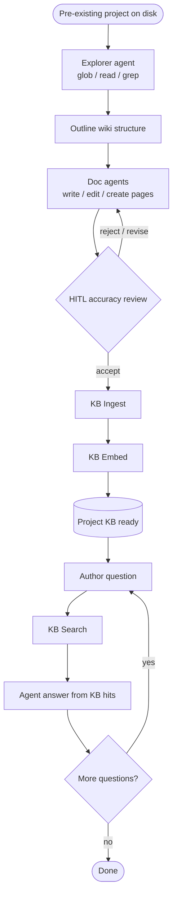

# Project KB

**Status:** Superseded — vector KB removed; use markdown memory under
`.langflower/memory/` via `common-memory-tools` ([ADR-033](../ADR.md#adr-033--markdown-memory-tools-no-embedding-as-base)).
Skeleton samples: `kb-create` / `kb-navigate`.

---

# Project KB (historical)

**Status:** Partial — epic 10 landed KB Ingest / Embed / Search / List / Delete
under `.langflower/kb/`; **no** dedicated explore → HITL → ingest → search
demo workflow. Fixture store tests prove search relevance; ingest-only graphs
are building blocks, not this Value.

## Value

Turn an **already existing** project tree into a living **docs/wiki knowledge
base**: agents explore the repo with harness tools, write structured markdown
under a wiki root, a human reviews accuracy, then **KB Search** answers
questions grounded in that curated corpus.
**Not** a one-shot chat dump about the repo.
**Not** an ingest-only `Glob → Read → KB Ingest → KB Embed` chain without
agent authorship and a HITL accuracy gate (that path is a useful building
block — see Workarounds — not the product claim).

## UX scenarios

### S1 — Start a wiki-build on a pre-existing project

**Who:** Author who already has sources, READMEs, and configs on disk.

**Want:** A resumable explore → document → approve → index pipeline — not a
chat that once summarized the tree.

**Do:** Point Langflower at the project. Assemble (palette) an explore → write
→ HITL → KB Ingest → KB Embed → KB Search graph from existing nodes. There is
**no** `project-kb` demo workflow in `demo-project` today. Skeleton seeds
`kb-create` / `kb-navigate` as related samples (agent Review readiness gate,
not the HITL accuracy path below).

**Expect:**

- Topology MUST include agent authorship + HITL before trusted ingest — MUST
  NOT treat ingest-only as this use case done.
- Activity MUST be visible in [feed](../features/feed-panel.md) /
  [workflow execution](../features/workflow-execution.md).
- MUST NOT claim a shipped pilot workflow id until one lands under
  `demo-project/.langflower/workflows/`.

### S2 — Explore the tree and draft structured wiki pages

**Who:** Same author watching the first authorship pass.

**Want:** Structured pages on disk (overview, modules, APIs, runbooks) — not
only chat text about the repo.

**Do:** Let an explorer / doc agent use harness tools (`glob` / `read` /
`grep`, then `write` / `edit` / `create`) under the project (and permission
policy) to propose a wiki outline and draft markdown under a **chosen wiki
root** (no default layout is documented yet — see Missing parts).

**Expect:**

- Agents MUST survey the tree before writing docs.
- Drafts MUST land as real markdown files under the wiki root — MUST NOT be
  chat-only.
- Tool / permission activity MUST surface in feed / composer when policy asks
  (`permission.ask`).

### S3 — HITL accuracy review before KB trust

**Who:** Accuracy reviewer at the gate after drafts exist.

**Want:** Accept, edit, or reject pages before they become ground truth in the
index — not silent ingest of unchecked model prose.

**Do:** At Ask User / Review Gate (or equivalent HITL), accept, edit, or send
back for revision.

**Expect:**

- Run MUST pause for human accuracy review before trusted ingest.
- Reject / revise MUST return to authorship — MUST NOT ingest rejected pages
  as ground truth.
- Accept MUST be the gate into KB Ingest (or equivalent trusted write path).

### S4 — Ingest and embed accepted wiki pages

**Who:** Same author after accept.

**Want:** Accepted pages become searchable chunks under the project KB — not
a transcript left only in the feed.

**Do:** Run **KB Ingest** → **KB Embed** on accepted content (graph I/O nodes
and/or `common-kb-tools` on an agent). Storage is
`<project>/.langflower/kb/`.

**Expect:**

- Accepted text MUST chunk to disk and embed (local hashing MVP without
  `embedding` in `langflower.jsonc`, or configured `embedding` when present).
- Index MUST live under `.langflower/kb/` (manifest + collection chunks /
  vectors) — see [node-library](../features/node-library.md) §7.7.
- Fixture / unit paths that prove ingest→search relevance MUST NOT be counted
  as the full S1–S5 product story.

### S5 — Ask grounded questions via KB Search

**Who:** Author (or later operator) with questions about the project.

**Want:** Answers grounded in curated wiki chunks — not a fresh ungrounded
chat pass over the whole tree.

**Do:** Run **KB Search** on a question; wire hits into an agent
(`userPrompt` / context). Path-level citation surfacing in the feed is a
pilot gap (Missing parts) — do not treat ad-hoc prompt luck as done.

**Expect:**

- Search MUST return top-K chunks from the curated corpus.
- The agent MUST receive those hits as context for the answer.
- Packaged feed citation of wiki paths is **not** claimed shipped
  (Missing parts).
- Q&A MAY be a later run on the same project KB (same product loop).

### S6 — Refresh stale wiki / index after code changes

**Who:** Author re-running after the living project moved on.

**Want:** Edit/delete/re-ingest so the wiki tracks the project — not a frozen
chat transcript.

**Do:** Re-run authorship + HITL as needed; use **KB List** / **KB Delete**
before re-embed when retiring stale entries; Loop (or batching) when the
corpus is large.

**Expect:**

- Re-runs MUST be able to update pages and the index without inventing a new
  product story.
- Stale entries MUST be listable / deletable before re-embed.
- Large corpora MUST NOT assume a single unbounded Glob/ingest step (Loop or
  equivalent batching).

## UI specs

| Spec                                                          | Scenarios covered                                                                                                                                                                                                      |
| ------------------------------------------------------------- | ---------------------------------------------------------------------------------------------------------------------------------------------------------------------------------------------------------------------- |
| [Feed panel](../features/feed-panel.md)                       | [S1](#s1--start-a-wiki-build-on-a-pre-existing-project), [S2](#s2--explore-the-tree-and-draft-structured-wiki-pages), [S3](#s3--hitl-accuracy-review-before-kb-trust), [S5](#s5--ask-grounded-questions-via-kb-search) |
| [HITL chat](../features/hitl-chat.md)                         | [S3](#s3--hitl-accuracy-review-before-kb-trust)                                                                                                                                                                        |
| [Workflow execution](../features/workflow-execution.md)       | [S1](#s1--start-a-wiki-build-on-a-pre-existing-project), [S4](#s4--ingest-and-embed-accepted-wiki-pages), [S5](#s5--ask-grounded-questions-via-kb-search), [S6](#s6--refresh-stale-wiki--index-after-code-changes)     |
| [Node library](../features/node-library.md)                   | [S2](#s2--explore-the-tree-and-draft-structured-wiki-pages), [S4](#s4--ingest-and-embed-accepted-wiki-pages), [S5](#s5--ask-grounded-questions-via-kb-search), [S6](#s6--refresh-stale-wiki--index-after-code-changes) |
| [Project configuration](../features/project-configuration.md) | [S1](#s1--start-a-wiki-build-on-a-pre-existing-project), [S4](#s4--ingest-and-embed-accepted-wiki-pages)                                                                                                               |

## Runtime requirements

| Need                                                                                 | Why (scenario)                                                                           | Today                           |
| ------------------------------------------------------------------------------------ | ---------------------------------------------------------------------------------------- | ------------------------------- |
| Real LLM + harness tools (`read` / `glob` / `grep` / `write` / `edit` / `create`, …) | Explore + draft wiki files ([S2](#s2--explore-the-tree-and-draft-structured-wiki-pages)) | Landed (epics 01–05)            |
| HITL accept / reject / revise                                                        | Accuracy gate before trust ([S3](#s3--hitl-accuracy-review-before-kb-trust))             | Landed                          |
| `common-kb-ingest` + `common-kb-embed` (`ctx.kb`)                                    | Persist accepted pages ([S4](#s4--ingest-and-embed-accepted-wiki-pages))                 | Landed (epic 10)                |
| `common-kb-search` (optional `common-kb-tools` agent pack)                           | Grounded Q&A ([S5](#s5--ask-grounded-questions-via-kb-search))                           | Landed (epic 10)                |
| `common-kb-list` / `common-kb-delete`                                                | Stale-entry cleanup ([S6](#s6--refresh-stale-wiki--index-after-code-changes))            | Landed (epic 10)                |
| Loop (or batching)                                                                   | Scale explore/write/ingest ([S6](#s6--refresh-stale-wiki--index-after-code-changes))     | Landed (`common-loop`, epic 07) |

No new runtime surface required for the Partial bar — the gap is an end-to-end
pilot graph + conventions, not missing KB node types.

## Workflow shape

**Target** product shape (authorable from existing nodes; **not** a shipped
demo file):

Documented **building-block** graph I/O (node-library §7.7) — **not** this
Value alone:

`Glob → Read File → KB Ingest → KB Embed` /
`String (question) → KB Search → LLM.userPrompt`

Related but **different** use case / demo: Obsidian helpers path is
[obsidian-kb](obsidian-kb.md) (`obsidian-kb.json`) — vault MOC helpers, not
project wiki → KB Search.

## Status

**Partial** — KB pipeline nodes and fixture relevance tests landed (epic 10).
Agent stack + Loop available. Skeleton ships sample workflows `kb-create`
(explore → compose wiki → ingest/embed → **agent** `common-review` readiness
gate) and `kb-navigate` (KB search chat loop). Convention for those samples:
wiki root `.langflower/wiki/`, collectionId `project`. Full use-case bar
(HITL accuracy gate + demo-project `project-kb.json` real-LLM proof) is still
open.

**Implementable when** S1–S6 Expects pass on a dedicated demo (real LLM +
tools): explore → structured wiki write → HITL accept → ingest/embed → search
grounded answers, with a documented wiki-root convention for the pilot.

### Missing parts

| Layer                                                       | Gap                                                                                 | Scenarios | Done when                                                                                    |
| ----------------------------------------------------------- | ----------------------------------------------------------------------------------- | --------- | -------------------------------------------------------------------------------------------- |
| Demo / end-user proof                                       | Explore → HITL → ingest → search workflow under `demo-project` (real LLM + tools)   | S1–S5     | Pilot file exists; live run meets Expects; ingest-only / fixture search alone does not count |
| Conventions                                                 | Documented default docs/wiki layout + sample pages for a pre-existing project pilot | S2, S6    | Pilot wiki-root convention written and used by the demo                                      |
| UI ([feed-panel](../features/feed-panel.md) / agent answer) | Packaged citation surfacing of wiki paths from KB hits                              | S5        | Answers reliably show wiki paths in the feed as part of the pilot                            |

### Workarounds

- **Skeleton samples** — `kb-create` / `kb-navigate` under
  `packages/server/skeleton/workflows/` (seeded on bootstrap). Agent Review
  readiness gate is **not** the HITL accuracy gate in S3.
- **Authorable ingest graph** — `String` / Read → KB Ingest → KB Embed and
  `String` → KB Search work today (local embeddings without `embedding`
  config).
- **Maintenance** — KB List / KB Delete before re-embed.
- **Fixture proof** — `packages/tools` kb-store + common-nodes KB node tests
  (relevance / wiring; not the product story).

These are **not** a production project wiki until the agent-authored + HITL
accuracy path is piloted end to end.

### Demo / CI

- Skeleton: `kb-create.json` + `kb-navigate.json` (not a
  `demo-project/.../project-kb.json` pilot).
- **No** `demo-project/.langflower/workflows/project-kb.json` today.
- Shipped proof: epic
  [10-kb-pipeline](../DONE/EPICS/10-kb-pipeline.md); store fixture tests
  (`packages/tools/src/kb/kb-store.test.ts`); common-nodes KB node + catalog
  smoke tests.
- Related demo (different UC): `obsidian-kb.json` — see
  [obsidian-kb](obsidian-kb.md).
