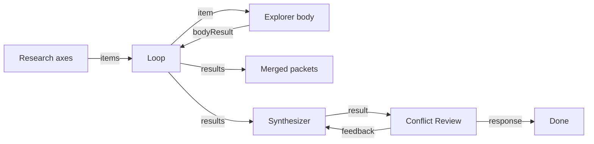

# Research fan-out → merge

**Status:** Partial — demo fans out axes through Loop, merges to Preview,
synthesizes a brief, and gates Finish on conflict Review (`common-review`);
Fake CI proves topology + HITL approve. Real-LLM S1–S3 Expects and S4
selective re-run are not the Implementable bar yet. S5 crawl stays
related-only (`crawl-research`).

## Value

Answer a research question by **fanning out** N axes (topics / seeds) through
one Loop body, **merging** per-axis packets into a `results` JSON barrier,
then synthesizing and pausing at a Review/HITL conflict gate before Finish —
so the brief reflects chosen truth, not whichever branch finished last.
**Not** a single-agent chat that collapses parallelism and provenance into one
opaque thread. **Not** claimed as parallel wall-clock concurrency: demo Loop
is serial map-collect.

## UX scenarios

### S1 — Seed N axes and start the fan-out

**Who:** Developer with a research question split into axes.

**Want:** One graph whose N comes from a runtime list — not N hand-drawn
agent copies.

**Do:** Configure a real LLM (e.g. LM Studio / `openai` in
`.langflower/langflower.jsonc`), load workflow **Research fan-out**
(`research-fanout`), set axes on **Research axes** (`common-string`, newline
list), **Run**.

**Expect:**

- Run MUST drive `common-loop` over the axes list (`items` ← axes `value`).
- Graph width MUST stay fixed; N MUST come from the list, not extra canvas
  nodes.
- Loop body MUST be the Explorer agent (`common-openai-llm`,
  `rolePreset: explorer`) on `item` → `userPrompt`.

### S2 — Collect body packets into merged results

**Who:** Same developer watching the run.

**Want:** Explicit fan-in: each axis packet lands in one merged `results`
array — auditable barrier before any later synthesis.

**Do:** Let each axis complete the Explorer body; observe Loop `results` →
**Merged packets** (`common-preview`).

**Expect:**

- Each body completion MUST return on Loop `bodyResult` (Explorer `response`).
- After all items, Preview MUST show the merged JSON `results` (array of
  packets).
- Demo Explorer prompt REQUIRES short notes + open questions and states
  **no tools** — MUST NOT claim tool/crawl gather on this workflow.
- Activity MUST be visible in [feed](../features/feed-panel.md) /
  [workflow execution](../features/workflow-execution.md).
- v1 Loop MUST be treated as **serial** map-collect (one body session at a
  time). True concurrent branches REQUIRE fixed parallel nodes, not this
  Loop claim.

### S3 — Reconcile conflicting claims at a human gate

**Who:** Operator after merged packets disagree.

**Want:** Pick among conflicting claims (or send a branch back) before a
reconciled brief is treated as done — graph gate, not “last speaker wins.”

**Do:** After merge, let **Synthesizer** draft a brief from Loop `results`;
at **Conflict Review** (`common-review` in the demo) call `accept` to reach
Finish, or send `feedback` to revise the synthesizer. (CI fake path uses
HITL Review Gate approve — same Accept→Finish intent.)

**Expect:**

- A human/Review gate MUST sit after merge/synthesis; merged JSON alone MUST
  NOT count as the reconciled brief.
- Demo conflict gate MUST use `common-review` (`result` ← synth `response`,
  `task` ← reconcile criteria) with `accept` → Finish and `feedback` →
  synthesizer `feedback`.
- CI Fake MUST prove the same Accept→Finish intent via
  [hitl-chat](../features/hitl-chat.md) Review Gate approve (stand-in for
  `common-review`).
- Conflict resolve MUST stay on graph Review / reply routing — not a hidden
  chat loop outside the graph.

### S4 — Re-run only disputed branches

**Who:** Operator after a conflict gate flags some axes.

**Want:** Re-execute disputed axes only; keep good packets — not a full N
re-fan from scratch every time.

**Do:** _(Deferred)_ Re-run selected Loop body paths / disputed axes after
feedback.

**Expect:**

- Partial re-run of disputed branches MUST be first-class for this scenario
  when shipped.
- **Honesty — deferred:** not shipped for this use case (see Missing parts).
  Conflict `feedback` revises the synthesizer only; it does **not** selective
  re-run disputed Loop axes.

### S5 — URL seeds via crawl (related demo, not this graph)

**Who:** Developer who wants page text from seed URLs, not only text axes.

**Want:** Fetch URL / crawl packets that can later sit beside axis research.

**Do:** Load separate workflow **Crawl research** (`crawl-research`): two
seed URLs → `common-fetch-url` ×2 → `common-merge` → Preview.

**Expect:**

- Crawl/Fetch MUST work on that demo graph (SSRF-guarded fetch).
- MUST NOT claim `crawl-research` is wired into `research-fanout` — they are
  separate demos. Decision: keep S5 **related-only** (stated in
  `research-fanout.json` description).

## UI specs

| Spec                                                    | Scenarios covered                                                                                                                                                                                       |
| ------------------------------------------------------- | ------------------------------------------------------------------------------------------------------------------------------------------------------------------------------------------------------- |
| [Feed panel](../features/feed-panel.md)                 | [S1](#s1--seed-n-axes-and-start-the-fan-out), [S2](#s2--collect-body-packets-into-merged-results), [S3](#s3--reconcile-conflicting-claims-at-a-human-gate)                                              |
| [HITL chat](../features/hitl-chat.md)                   | [S3](#s3--reconcile-conflicting-claims-at-a-human-gate), [S4](#s4--re-run-only-disputed-branches)                                                                                                       |
| [Workflow execution](../features/workflow-execution.md) | [S1](#s1--seed-n-axes-and-start-the-fan-out), [S2](#s2--collect-body-packets-into-merged-results), [S4](#s4--re-run-only-disputed-branches), [S5](#s5--url-seeds-via-crawl-related-demo-not-this-graph) |

## Runtime requirements

| Need                                                                    | Why (scenario)                                                                                                                        | Today                                                                                   |
| ----------------------------------------------------------------------- | ------------------------------------------------------------------------------------------------------------------------------------- | --------------------------------------------------------------------------------------- |
| `common-loop` map-collect (`items` / `item` / `bodyResult` / `results`) | Dynamic N fan-out + merge barrier ([S1](#s1--seed-n-axes-and-start-the-fan-out), [S2](#s2--collect-body-packets-into-merged-results)) | Landed (epic 07); **serial** body sessions                                              |
| Real LLM + Explorer `rolePreset` on Loop body                           | Per-axis packet ([S1](#s1--seed-n-axes-and-start-the-fan-out), [S2](#s2--collect-body-packets-into-merged-results))                   | Landed; demo uses notes-only prompt (no tools)                                          |
| Preview / port projection of Loop `results` JSON                        | See merge barrier ([S2](#s2--collect-body-packets-into-merged-results))                                                               | Landed                                                                                  |
| Synthesizer + Review / HITL after merge                                 | Conflict resolve ([S3](#s3--reconcile-conflicting-claims-at-a-human-gate))                                                            | Landed — demo `common-openai-llm` synth + `common-review`; CI Fake synth + HITL approve |
| Fetch URL / crawl nodes                                                 | URL seeds ([S5](#s5--url-seeds-via-crawl-related-demo-not-this-graph))                                                                | Landed (epic 12); separate `crawl-research` demo — **not** wired into fan-out           |
| Partial re-run of disputed Loop items                                   | Selective branch retry ([S4](#s4--re-run-only-disputed-branches))                                                                     | **Deferred** (Missing parts)                                                            |

No new runtime surface for “synthesizeBrief” / “conflictHitl” primitives —
synthesis and gates are authorable LLM + Review wiring on existing ports.

## Workflow shape

Matches `demo-project/.langflower/workflows/research-fanout.json`:

CI fake path: Fake LLM explorer + synthesizer; HITL Review Gate approve
stand-in for `common-review`. Related URL demo:
`demo-project/.langflower/workflows/crawl-research.json` (Fetch ×2 → Merge →
Preview) — separate graph; not wired into fan-out.

## Status

**Partial** — authorable/runnable fan-out → merge Preview → synthesis →
conflict Review → Finish. CI proves Loop map-collect, merged JSON at Preview,
synth → conflict HITL approve → Finish. Real-LLM conflict quality and S4
selective re-run are not proven.

**Implementable when** S1–S3 Expects pass on one demo with a **real** LLM
(axes → Loop → Explorer → merge → synthesis → conflict Review → brief), S4
selective re-run works for disputed axes, and S5 remains related-only (already
decided) or is wired into that graph.

### Missing parts

| Layer            | Gap                                                                                           | Scenarios | Done when                                                                                          |
| ---------------- | --------------------------------------------------------------------------------------------- | --------- | -------------------------------------------------------------------------------------------------- |
| Runtime / wiring | **Deferred:** selective re-run of disputed Loop branches only                                 | S4        | Disputed axes re-execute without full N restart (conflict feedback today revises synthesizer only) |
| Demo / wiring    | **Decided related-only:** Fetch/Crawl stays on `crawl-research.json` — not wired into fan-out | S5        | (closed as related-only; see demo description)                                                     |
| End-user proof   | Real-LLM path for S1–S3 Expects (not only Fake CI topology)                                   | S1–S3     | Live provider meets Expects; Fake CI stays topology/HITL-approve                                   |

### Workarounds

- **Authorable Partial** — run `research-fanout` with a configured provider;
  Preview shows JSON `results`; Conflict Review accept reaches Finish.
- URL text without fan-out Loop — run `crawl-research` separately.
- Fixed parallel Explorer nodes when true concurrency is required (Loop v1 is
  serial).
- Full N re-run after conflict (no selective Loop item retry yet).

### Demo / CI

- Demo: `demo-project/.langflower/workflows/research-fanout.json`
  (Axes → Loop → Explorer → Preview + Synthesizer → `common-review` → Finish;
  S5 crawl related-only; S4 deferred)
- Related crawl demo: `demo-project/.langflower/workflows/crawl-research.json`
- CI: `tests/integration/ws/execute-research-fanout.ws.test.ts` (Loop
  map-collect + merged `results` + Fake synth + HITL conflict approve → Finish)
- Epics: [07-swarm-primitives](../DONE/EPICS/07-swarm-primitives.md),
  [12-crawl-research](../DONE/EPICS/12-crawl-research.md),
  [22-research-fanout-synth-hitl](../TODO/EPICS/22-research-fanout-synth-hitl.md)
- Related: [agent-swarm](./agent-swarm.md),
  [node-library](../features/node-library.md)

### Run path (end-user)

1. Start LM Studio (or configure `openai` in `.langflower/langflower.jsonc`).
2. `langflower start ./demo-project` (or `npm run dev` against the demo
   project).
3. Load workflow **Research fan-out** (`research-fanout`).
4. Edit **Research axes** if needed; ensure Explorer / Synthesizer /
   Conflict Review `providerId` / model match your config.
5. **Run**. Loop walks axes serially; Preview shows merged JSON `results`;
   Synthesizer drafts a brief; Conflict Review `accept` → Finish (or
   `feedback` revises the synthesizer).
6. For URL seeds, load **Crawl research** separately — not on this graph.
