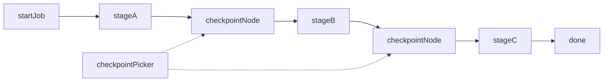

# Resumable checkpoint jobs

**Status:** Partial — explicit `common-checkpoint` / `createCheckpoint` + labeled
picker landed (epic 20); Prefer Partial until manual demo claims Implementable.

## Value

Operator on a long, costly **graph-shaped job** can Stop, close the UI, or
restart the process, then **pick an author-placed checkpoint** and continue
without replaying work before that boundary — **not** “keep the chat tab
open,” not a live chat-harness session, not surprise Continue from every
node completion, and **not** soft Pause / Steer mid-turn
([run-interruption](run-interruption.md)). Hard Stop without a boundary still
does not create resume (S3).

## UX scenarios

### S1 — Author places explicit save boundaries

**Who:** Workflow author of a multi-stage job.

**Want:** Persist only at intended costly stages — not after every node.

**Do:** Insert a dedicated **checkpoint node** after costly stages
(preferred), and/or mark an output with `createCheckpoint?: boolean`
(optional advanced escape).

**Expect:**

- Boundaries MUST be author-visible on the canvas.
- Checkpoint writes MUST fire only when a boundary is crossed — MUST NOT be
  implied by every completed node.
- A human-readable label MAY be stored when the author provides one.

### S2 — Crossing a boundary persists a durable snapshot

**Who:** Operator running a job with checkpoint nodes.

**Want:** Progress before the last boundary survives Stop / sleep / crash.

**Do:** Start the run; let a stage complete through a checkpoint boundary.

**Expect:**

- Crossing the boundary MUST write a JSON-safe upstream snapshot under
  `.langflower/runs/<workflowId>/<runId>/…`.
- The snapshot MUST be listed later with enough identity (time, workflow,
  boundary label when present, fingerprint ok/stale).

### S3 — Stop without a boundary does not create resume

**Who:** Operator who Stops mid-stage before any checkpoint.

**Want:** No surprise Continue on trivial or mid-node stops.

**Do:** Stop (or crash) without having crossed a checkpoint boundary.

**Expect:**

- That Stop MUST NOT create a resumable checkpoint.
- UI MUST NOT offer Continue from that incomplete progress.
- (Rejected auto path: every node completion or Stop mid-Delay writing a
  checkpoint — see ADR-018 alternative C, disabled.)

### S4 — Continue from a chosen checkpoint after Stop / restart

**Who:** Operator after Stop, overnight pause, or process restart — with at
least one valid checkpoint on disk.

**Want:** Resume Stage B without redoing Stage A; choose which boundary, not
only “latest.”

**Do:** Open the project or workflow; open the checkpoint list; choose
**Continue from…** a specific run/boundary.

**Expect:**

- UI MUST show which checkpoints exist (not latest-only Continue).
- Resume MUST skip completed nodes before that boundary and replay
  JSON-safe snapshots; remaining stages MUST run.
- “Continue = latest only” MUST NOT be the product contract.

### S5 — Discard or Run fresh

**Who:** Operator with stale, unwanted, or obsolete checkpoints.

**Want:** Clear control — resume, discard, or start clean.

**Do:** **Discard** a listed checkpoint, or ignore the list and **Run** fresh.

**Expect:**

- Discard MUST remove that resume option.
- Run fresh MUST start a new run — MUST NOT silently resume a prior
  checkpoint.

### S6 — Fingerprint mismatch after editing the graph

**Who:** Operator who checkpointed after stage A, then edited downstream
(or the graph fingerprint no longer matches).

**Want:** A clear failure, not a wrong silent resume.

**Do:** Edit the workflow after a checkpoint exists; try Continue from that
entry.

**Expect:**

- Fingerprint mismatch / stale MUST surface a clear error
  (`STALE_WORKFLOW` / `runner.resume.failed` path per ADR-018).
- Operator MUST be able to **Discard** and proceed without a broken overlay.

## UI specs

| Spec                                                            | Scenarios covered                                                                                                                                                                                                                                                                 |
| --------------------------------------------------------------- | --------------------------------------------------------------------------------------------------------------------------------------------------------------------------------------------------------------------------------------------------------------------------------- |
| [Visual workflow editor](../features/visual-workflow-editor.md) | [S1](#s1--author-places-explicit-save-boundaries)                                                                                                                                                                                                                                 |
| [Workflow execution](../features/workflow-execution.md)         | [S2](#s2--crossing-a-boundary-persists-a-durable-snapshot), [S3](#s3--stop-without-a-boundary-does-not-create-resume), [S4](#s4--continue-from-a-chosen-checkpoint-after-stop--restart), [S5](#s5--discard-or-run-fresh), [S6](#s6--fingerprint-mismatch-after-editing-the-graph) |

Picker / Continue draft notes live in
[workflow-execution](../features/workflow-execution.md) § Continue after Stop /
restart — no separate feature doc.

## Runtime requirements

Acid test only — if we never build it, which Expect dies?

| Need                                                               | Why (scenario)                                                                                                                                                             | Today                                           |
| ------------------------------------------------------------------ | -------------------------------------------------------------------------------------------------------------------------------------------------------------------------- | ----------------------------------------------- |
| Explicit checkpoint node and/or `createCheckpoint` output meta     | Author-visible boundaries; write only on cross ([S1](#s1--author-places-explicit-save-boundaries), [S2](#s2--crossing-a-boundary-persists-a-durable-snapshot))             | **Shipped** (`common-checkpoint` + output meta) |
| Durable store + `RuntimeRunner.resume` overlay                     | Skip completed + replay JSON-safe snapshots ([S2](#s2--crossing-a-boundary-persists-a-durable-snapshot), [S4](#s4--continue-from-a-chosen-checkpoint-after-stop--restart)) | **Shipped**                                     |
| Persist only at explicit boundaries (no auto node/Stop writes)     | No surprise Continue ([S3](#s3--stop-without-a-boundary-does-not-create-resume))                                                                                           | **Shipped**                                     |
| Checkpoint list + resume/discard WS (multi-entry, not latest-only) | Picker Continue / Discard / Run fresh ([S4](#s4--continue-from-a-chosen-checkpoint-after-stop--restart), [S5](#s5--discard-or-run-fresh))                                  | **Shipped** (labeled picker)                    |
| Fingerprint / stale → `runner.resume.failed` + Discard             | Safe refuse after graph edit ([S6](#s6--fingerprint-mismatch-after-editing-the-graph))                                                                                     | **Shipped** (`stale` on summary + resume fail)  |

## Workflow shape

**Target** explicit-boundary spine (author places checkpoint nodes). Demo
`checkpoint-resume` is kept for redesign — **not** an end-user path today.

## Status

**Partial** — epic 20 landed explicit boundaries, labeled picker, STALE+Discard
regression, and green `execute-checkpoint-resume.ws.test.ts`. Prefer **Partial**
until an operator manual demo claims Implementable. HITL / Memory in the
payload remains out of the Implementable bar.

**Implementable when** S1–S6 Expects pass (incl. manual demo): author places
checkpoint nodes (or port flags); crossing them writes labeled checkpoints;
on load the operator sees a clear list and Continues from a chosen entry;
fingerprint mismatch → clear error + Discard; demo + integration cover
explicit boundary → Stop/restart → picker → Finish.

### Missing parts

| Layer             | Gap                                      | Scenarios | Done when                                                              |
| ----------------- | ---------------------------------------- | --------- | ---------------------------------------------------------------------- |
| Runtime _(later)_ | HITL / Memory in checkpoint payload      | —         | Gated answers / Memory survive resume (not in Implementable bar above) |
| End-user proof    | Manual demo S1–S6 on `checkpoint-resume` | S1–S6     | Operator confirms; then Status → Implementable                         |

### Workarounds

None required for the explicit-boundary path — use Checkpoint nodes and the
Continue-from picker. Auto every-node Continue remains rejected (ADR-018 C).

### Demo / CI

- Demo `checkpoint-resume` — explicit Checkpoint after Stage A.
- Integration `tests/integration/ws/execute-checkpoint-resume.ws.test.ts`
  covers boundary → Stop → restart → Continue + STALE fingerprint path.
- Epic: [20-explicit-checkpoints](../DONE/EPICS/20-explicit-checkpoints.md)
  (infra: [14-checkpoints-resume](../DONE/EPICS/14-checkpoints-resume.md)).
- ADR: [ADR-018](../ADR.md#adr-018--durable-workflow-checkpoints).
- Architecture:
  [EXECUTION_ARCHITECTURE — Durable checkpoints](../EXECUTION_ARCHITECTURE.md#durable-checkpoints-adr-018-d--epic-20).
