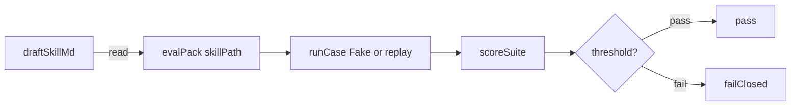
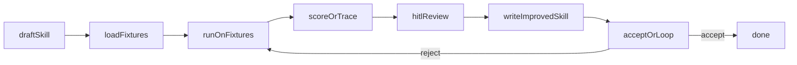

# Skill refining

**Status:** Partial — eval pack + `skillPath` via harness `read` + CLI Fake
`runCase` (no required `--replay`) landed for the fixture/score loop; no
dedicated draft → pack → HITL → write-skill demo workflow.

## Value

Produce a better skill / instruction `.md` by running it against a **fixed
fixture suite**, scoring outcomes, and folding human feedback into the next
revision of that file — **not** a one-off chat tweak whose only artifact is
scrollback, and **not** an application-code coding loop.

## UX scenarios

### S1 — Point a pack at a draft skill and run the suite

**Who:** Author with a draft skill `.md` and a golden / fixture pack.

**Want:** Repeatable suite runs against that skill — not “try a few chats.”

**Do:** Use the documented pack
`tests/fixtures/eval/golden-sample/` (`skillPath`: `skills/triage.md`).
From repo root (after `build-all`):

```bash
node packages/cli/bin/langflower.js eval tests/fixtures/eval/golden-sample \
  --project tests/fixtures/eval/golden-sample
```

Optional offline / CI maps still work with `--replay`
`replay-pass.json` / `replay-fail.json` (see pack README).

**Expect:**

- Pack MUST load the skill via harness **`read`** on `skillPath` — MUST NOT
  treat panel `skillId` / `.langflower/skills/<id>/SKILL.md` as required for
  this path.
- Suite MUST score cases via per-case `runCase` (CLI Fake skill-token agent
  when `--replay` is omitted) and pass when score ≥ threshold.
- Regression (`replay-fail.json` or a failing agent) MUST fail-closed (CLI
  exit `1`).

### S2 — Edit the skill and re-run the same pack

**Who:** Same author after changing skill wording.

**Want:** Comparable scores on the **same** pack — proof the revision helped
or hurt.

**Do:** Edit `skills/triage.md` (or the pack’s `skillPath` file) by hand.
Re-run the same `langflower eval` invocation (no `--replay` for Fake; or swap
in `replay-fail.json` to see fail-closed).

**Expect:**

- Re-run MUST use the same pack id / cases / threshold.
- Fail-closed behavior MUST still apply when suite score &lt; threshold.
- Live per-case Fake `runCase` is the default CLI path; real LLM remains a
  composed `runCase` (see [eval-regression-gate](eval-regression-gate.md) S4
  honesty).

### S3 — Review skill text and fixture outcomes at a HITL gate

**Who:** Reviewer / author deciding whether a candidate skill revision is
good enough.

**Want:** A graph gate over skill text + suite outcomes — not an informal
“looks fine?” in chat scrollback.

**Do:** _(Target)_ After a pack run, open a Review / HITL step that surfaces
the skill `.md` and fixture scores; Approve, reject, or annotate.

**Expect:**

- Gate MUST use [hitl-chat](../features/hitl-chat.md) Review / reply routing.
- Accept MUST NOT fire from suite pass alone when a human gate is in the
  refine loop.
- **Honesty:** no dedicated skill-refining demo wires this gate today.
  Related HITL→file pilots:
  [prompt-refining](prompt-refining.md),
  [article-writing](article-writing.md) (different deliverables).

### S4 — Write an improved skill `.md` after accept

**Who:** Author after HITL accept (or after a clear suite-pass policy).

**Want:** Durable skill file on disk as the run artifact — not a copied chat
message.

**Do:** _(Target)_ An improve step writes / overwrites the skill `.md` via
harness `write` / `edit` / `create` as policy allows.

**Expect:**

- Deliverable MUST be the skill / instruction `.md` on disk.
- Write tools + `permission.ask` MUST apply when an agent writes
  ([workflow execution](../features/workflow-execution.md) /
  [hitl-chat](../features/hitl-chat.md)).
- **Honesty:** not shipped as one sample graph; authorable today from
  existing nodes / tools. Demo deferred (see Missing parts).

### S5 — Orient: suite gate demo is not the refine loop

**Who:** Developer exploring demos in `demo-project`.

**Want:** Not confuse the canvas Assert gate with skill refining.

**Do:** Load workflow **Eval regression gate** (`eval-regression-gate`):
Suite score / Threshold → Compare(`gte`) → Assert → Finish.

**Expect:**

- That demo MUST prove canvas stop-on-regression for numeric suite score vs
  threshold only.
- MUST NOT claim it loads `skillPath`, runs fixtures, opens HITL on skill
  text, or writes a skill `.md`.

## UI specs

| Spec                                                    | Scenarios covered                                                                                                                                                                                                            |
| ------------------------------------------------------- | ---------------------------------------------------------------------------------------------------------------------------------------------------------------------------------------------------------------------------- |
| [Workflow execution](../features/workflow-execution.md) | [S1](#s1--point-a-pack-at-a-draft-skill-and-run-the-suite), [S2](#s2--edit-the-skill-and-re-run-the-same-pack), [S4](#s4--write-an-improved-skill-md-after-accept), [S5](#s5--orient-suite-gate-demo-is-not-the-refine-loop) |
| [Feed panel](../features/feed-panel.md)                 | [S3](#s3--review-skill-text-and-fixture-outcomes-at-a-hitl-gate), [S4](#s4--write-an-improved-skill-md-after-accept), [S5](#s5--orient-suite-gate-demo-is-not-the-refine-loop)                                               |
| [HITL chat](../features/hitl-chat.md)                   | [S3](#s3--review-skill-text-and-fixture-outcomes-at-a-hitl-gate), [S4](#s4--write-an-improved-skill-md-after-accept)                                                                                                         |
| [Node library](../features/node-library.md)             | [S4](#s4--write-an-improved-skill-md-after-accept), [S5](#s5--orient-suite-gate-demo-is-not-the-refine-loop)                                                                                                                 |

## Runtime requirements

| Need                                                      | Why (scenario)                                                                                                                                   | Today                                                     |
| --------------------------------------------------------- | ------------------------------------------------------------------------------------------------------------------------------------------------ | --------------------------------------------------------- |
| `@langflower/eval` pack (`skillPath`, scorers, threshold) | Suite over a skill file ([S1](#s1--point-a-pack-at-a-draft-skill-and-run-the-suite), [S2](#s2--edit-the-skill-and-re-run-the-same-pack))         | Landed (epic 09); skill via harness `read`                |
| CLI `langflower eval` + optional `--replay`               | Offline / CI gate ([S1](#s1--point-a-pack-at-a-draft-skill-and-run-the-suite), [S2](#s2--edit-the-skill-and-re-run-the-same-pack))               | Landed; golden-sample pass/fail maps                      |
| Live per-case `runCase` (Fake default; real via compose)  | Fixture loop without replay map ([S1](#s1--point-a-pack-at-a-draft-skill-and-run-the-suite), [S2](#s2--edit-the-skill-and-re-run-the-same-pack)) | Fake CLI path landed (epic 23); real LLM not default      |
| Review / HITL after pack outcomes                         | Human gate on skill revision ([S3](#s3--review-skill-text-and-fixture-outcomes-at-a-hitl-gate))                                                  | Nodes exist; **no** skill-refining demo wiring            |
| Harness `write` / `edit` / `create` + `permission.ask`    | Persist improved skill `.md` ([S4](#s4--write-an-improved-skill-md-after-accept))                                                                | Landed; used in other pilots, not this UC demo            |
| Compare(`gte`) + Assert canvas gate                       | Numeric stop-on-regression demo ([S5](#s5--orient-suite-gate-demo-is-not-the-refine-loop))                                                       | Landed (`eval-regression-gate.json`) — score numbers only |

No new “refineSkill” primitive — pack + `read` + authorable Review / write
nodes are the surface. Agent `runCase` is composed outside `@langflower/eval`.

## Workflow shape

**Shipped fixture path** (CLI / `@langflower/eval` — no
`skill-refining.json` in demo-project):



**Target product loop** (authorable; **not** a shipped demo file — deferred):



Related (not this Value):
`demo-project/.langflower/workflows/eval-regression-gate.json` (Suite score →
Compare → Assert → Finish). Related HITL→file pilots:
`prompt-refining.json`, `article-writing.json`.

## Status

**Partial** — pack + `skillPath` via `read` + CLI Fake `runCase` (and optional
`--replay`) prove the fixture/score/stop loop for S1–S2. Agent runtime
(epics 01–05) can author HITL + write elsewhere; this use case still lacks one
demo graph for S3–S4 and a proven real-LLM refine loop.

**Implementable when** S1–S4 Expects pass end-to-end with a **real** provider
(pack run → HITL on skill + outcomes → write improved skill `.md` → re-run
clears threshold) without a hand-maintained `--replay` map as the only agent.

### Missing parts

| Layer          | Gap                                                                        | Scenarios | Done when                                                                   |
| -------------- | -------------------------------------------------------------------------- | --------- | --------------------------------------------------------------------------- |
| Demo / wiring  | Dedicated skill-refining workflow JSON (draft → pack → HITL → write skill) | S3, S4    | Sample graph in demo-project; not only prompt/article pilots — **deferred** |
| End-user proof | Real-LLM refine loop without replay map                                    | S1–S4     | Live provider meets Expects; Fake / replay stay CI topology/score           |

### Workarounds

- **Fixture / score / stop today** — `langflower eval` + pack `skillPath` +
  golden-sample (Fake primary; `--replay` optional for CI maps).
- Edit the skill `.md` by hand between pack runs.
- Canvas Assert demo (`eval-regression-gate`) for numeric threshold stop only.
- HITL → durable file pattern — run [prompt-refining](prompt-refining.md) or
  [article-writing](article-writing.md); deliverable is not a skill `.md`.
- Panel `skillId` under `.langflower/skills/<id>/SKILL.md` remains an agent
  panel load path — distinct from pack `skillPath` via `read`.

### Demo / CI

- Pack: `tests/fixtures/eval/golden-sample/` (`pack.json` `skillPath`:
  `skills/triage.md`; optional `replay-pass.json` / `replay-fail.json`)
- CLI: `langflower eval …` (Fake primary; see pack README) + optional
  `--replay`
- Related canvas: `demo-project/.langflower/workflows/eval-regression-gate.json`
- **No** `demo-project/.langflower/workflows/skill-refining.json` (deferred)
- Epic: [09-eval-regression-gate](../DONE/EPICS/09-eval-regression-gate.md);
  live `runCase`: [23-eval-live-runcase](../TODO/EPICS/23-eval-live-runcase.md)
- Related: [eval-regression-gate](eval-regression-gate.md),
  [prompt-refining](prompt-refining.md), [article-writing](article-writing.md)

### Run path (Partial — pack loop S1–S2)

1. From repo root (after `build-all`), run the golden-sample Fake command in
   [S1](#s1--point-a-pack-at-a-draft-skill-and-run-the-suite).
2. Edit `skills/triage.md` (or your pack’s `skillPath` file).
3. Re-run with the same pack (no `--replay`); use `replay-fail.json` to see
   fail-closed exit `1` without editing the skill.
4. For HITL → write-file practice on a different artifact, use the
   prompt-refining or article-writing demo — not claimed as skill refining.
