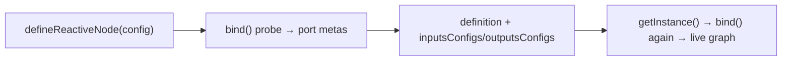

# @langflower/node-sdk

Public SDK for Langflower node authors (`defineNode` + `defineReactiveNode`).

**No `index.ts`** — published paths only via `package.json` `exports`
([PRINCIPLES.md](../../docs/PRINCIPLES.md) § Module exports).

## Factory layout (important)

Each **node factory function** lives in its **own folder** under
`src/node-factory/<factory-name>/`, with co-located types/utils/tests — same
idea as one folder per node in [NODES.md](../../docs/NODES.md).

```text
src/node-factory/
  define-reactive-node/          ← defineReactiveNode + IO helpers, base ctx
    define-reactive-node.ts      ← package main entry (re-exports sibling factories)
    io-helpers.ts
    …
  define-node/                   ← defineNode (sync/Promise execute adapter)
  define-tool-registrations/     ← defineToolRegistrations + ToolHandle wire
  define-embed/                  ← EmbedHandle + embed-handle wire (no factory yet)
  define-llm-node/               ← defineLlmNode (import via /llm)
```

| Folder                       | Factory                   | Public import              |
| ---------------------------- | ------------------------- | -------------------------- |
| `define-node/`               | `defineNode`              | `@langflower/node-sdk`     |
| `define-reactive-node/`      | `defineReactiveNode`      | `@langflower/node-sdk`     |
| `define-tool-registrations/` | `defineToolRegistrations` | `@langflower/node-sdk`     |
| `define-embed/`              | types / wire / guard only | `@langflower/node-sdk`     |
| `define-llm-node/`           | `defineLlmNode`           | `@langflower/node-sdk/llm` |

Do **not** drop a second factory into `define-reactive-node/` as a loose `.ts`
file — add a sibling folder. The main entry may re-export sibling factories for
the public `@langflower/node-sdk` import path.

## Scope (current slice)

| Symbol                                        | Role                                                                     |
| --------------------------------------------- | ------------------------------------------------------------------------ |
| `defineNode`                                  | Simple sync/Promise `execute` — default custom-node path (no RxJS)       |
| `defineReactiveNode`                          | Author factory — probe `bind` for metas + `getInstance()` per live graph |
| `defineToolRegistrations`                     | Purpose utility — emit `ToolHandle` packs for LLM `tools` ports          |
| `makeInput`, `configureOutput`, `withLoading` | Exported pure IO helpers (`io-helpers.ts`)                               |
| `ExecutionContext<UI, Caps>`                  | Identity + panel; Caps default `{}`                                      |
| `ToolHandle`                                  | Wire payload for agent tools                                             |
| `EmbedHandle`                                 | Canvas wire payload for batch embeddings (not agent inventory)           |
| `ToolHandlerContext`                          | Identity only (`projectDir` / `runId`) — see boundary below              |

| Subpath    | Symbols                                                                   |
| ---------- | ------------------------------------------------------------------------- |
| `/llm`     | `defineLlmNode`, `LlmExecutionCaps` (`toolHandles` only), inventory ports |
| `/testing` | `createNodeHarness` — unit-test IO for a `ReactiveNodeDefinition`         |

Host I/O (`files` / `crawl` / chat stream / skills) is **not**
on public `ExecutionContext`. Specialized common-nodes create it via
`@langflower/tools` (and optional private run-host services from the server).

Out of scope: `defineAgentNode`, second batch execution engine.

**Peer deps for custom packs:** `defineNode`-only authors peer on
`@langflower/node-sdk`. Reactive authors also need `rxjs` and
`@rx-evo/stateful-observable`. Pack layout / default seed `my-nodes`:
[ADR-030](../../docs/ADR.md#adr-030--custom-node-pack-layout--npm-model),
[skeleton README](../server/skeleton/nodes/my-nodes/README.md).
Pack `tsc --noEmit` uses the pack `tsconfig.json`. `.ts` suffix imports need
`allowImportingTsExtensions` + `noEmit` (hello-embed seed).

## Author SDK boundary (do not widen)

This package is the **author contract**. Keep it identity + ports + caps —
not a host service bag. Prefer extending `@langflower/tools` or private
common-nodes/server bags over growing these facades.

| Type                 | Allowed                                                        | Forbidden (put elsewhere)                                             |
| -------------------- | -------------------------------------------------------------- | --------------------------------------------------------------------- |
| `ExecutionContext`   | `projectDir`, `runId`, `params` / panel, optional typed `Caps` | `files`, `crawl`, chat stream, skills, harness, authorize, `webFetch` |
| `LlmExecutionCaps`   | `toolHandles` only                                             | Any host hook or I/O facade                                           |
| `ToolHandlerContext` | `projectDir`, `runId` only                                     | `authorize`, `webFetch`, `denyPaths`, `allowedHosts`, harness         |

**Rules for agents / PRs**

1. **Do not add fields** to SDK `ToolHandlerContext`, base `ExecutionContext`, or
   `LlmExecutionCaps` “for convenience” so shell/common-nodes can pass one object.
2. Host hooks for domain tools live on **tools**
   `@langflower/tools/domain-tool-configs` `ToolHandlerContext` (wider bag).
   Shells that need them import **tools**, not the SDK type.
3. Specialized node I/O: `@langflower/tools` `create*` + optional private
   `RunHostServices` — never public EC.
4. New author-facing context must be a **new named Caps type** (or a new
   subpath) with a real second consumer — not another optional field on the
   base types.
5. Parity locks stay intentional twins, not an excuse to grow the SDK:
    - ports: `runtime-parity.types.test.ts`
    - tool ctx: tools `tool-handler-context.parity.types.test.ts`
      (SDK identity ↔ tools widened bag; **SDK side stays identity-only**)

If a change seems to require widening any row above, stop and ask — that is
almost always a misplaced host concern.

## Dependencies

Production: `rxjs`, `@rx-evo/stateful-observable` — **no** `@langflower/runtime`,
no `@langflower/shared`. Port / instance contracts are owned here
([ADR-027](../../docs/ADR.md#adr-027--author-sdk-owns-port-types-no-production-runtime-dep));
structural parity with runtime is locked by `runtime-parity.types.test.ts`.

`@langflower/runtime` is a **devDependency** only (sample/parity tests).

## Public imports

```typescript
import {
	defineNode,
	defineReactiveNode,
	defineToolRegistrations,
	makeInput,
	configureOutput,
	type ReactiveNodeDefinition,
	type ExecutionContext,
	type ToolHandle,
	TOOL_HANDLE_WIRE_TYPE,
	type EmbedHandle,
	EMBED_HANDLE_WIRE_TYPE,
	isEmbedHandle,
} from '@langflower/node-sdk';

import { defineLlmNode } from '@langflower/node-sdk/llm';

import { createTypedUISchema } from '@langflower/node-sdk/create-typed-ui-schema';

import { createNodeHarness } from '@langflower/node-sdk/testing';
```

Do **not** deep-import internal files.

Domain tool packs (no `bind` boilerplate) — each tool needs a raw `handler`:

```typescript
import { MEMORY_TOOL_CONFIGS } from '@langflower/tools/domain-tool-configs';

export const memoryToolsNode = defineToolRegistrations({
	type: 'common-memory-tools',
	displayName: 'Memory Tools',
	category: 'Tools',
	tools: MEMORY_TOOL_CONFIGS,
});
```

## Bind lifecycle (probe + instance)



1. **Define time** — `config.bind(probeCtx, helpers)` runs once to collect port
   **metas** for the palette/registry. The probe connections are discarded.
2. **Per canvas node** — `definition.getInstance()` calls `bind` again with a
   fresh context connection and returns the live `inputs` / `outputs` graph.
3. **Author rule** — keep `bind` free of module-level I/O and shared mutable
   state. Side effects in bind would run on the discarded probe and again per
   instance. Instance-local closures may **intentionally** keep state across
   runs until workflow rematerialize or process exit — see
   [REACTIVE_NODES](../../docs/REACTIVE_NODES.md) § Instance lifetime.

`defineNode` is an adapter: it builds that `bind` for you from `execute` and
stamps pending via `withLoading` before the Promise/`execute` work.

## Reactive `bind()` rules

**Full how-to (preferred):** [docs/HOW_TO_WRITE_REACTIVE_NODES.md](../../docs/HOW_TO_WRITE_REACTIVE_NODES.md).

**Unit of work is `@rx-evo/stateful-observable`** — not raw RxJS `Observable`.

| Use                                                                       | Do not use                                                                                  |
| ------------------------------------------------------------------------- | ------------------------------------------------------------------------------------------- |
| `connection.pipeValue(map(...))`                                          | `statefulObservable({ input: connection.value$, loader: (v) => of(...) })` for simple maps  |
| `configureOutput(..., stream, { inferTypeFrom })`                         | identity `statefulObservable` passthrough                                                   |
| `statefulObservable({ input, loader })` when loader is async / multi-step | `new Observable(...)`, bare `of(...)` on outputs                                            |
| Stream **error** for visible refusals (`throwError` / failing loader)     | Fake `of('')` / `of(null)` to clear loading; bare `EMPTY` on policy stops                   |
| `makeInput<T>(portId, config)` from io-helpers                            | vanilla `Subject` / manual relays (except test harness)                                     |
| `combineInputs([…], map).pipe(withLoading()).pipeValue(...)` for waits    | raw `combineLatest` + `startWith` in bind; `pipeValue` + delay/`from` without `withLoading` |
| `ec.params` via `ctx` in `combineInputs`                                  | sync `params` at define time; host I/O via tools/`create*` inside specialized nodes         |
| `uiSchema.byField(...).default` (static fallback)                         | `uiSchema.value$`                                                                           |

`StatefulObservable` status (inactive / loading / value / **error**) is part of
the dataflow — see [LLM_NODES.md](../../docs/LLM_NODES.md) § Port events.

Panel `params` are **empty** until `runtime.start()` (or server push). `uiSchema` on bind
options is a **static** `TypedUISchema` for UI defaults / `byField` — not a reactive port.

## Author examples

| Sample              | Path                                    | Pattern                 |
| ------------------- | --------------------------------------- | ----------------------- |
| Gate (`defineNode`) | `define-node/test/samples/gate-node.ts` | sync `execute`, no rxjs |
| Reactive samples    | `define-reactive-node/test/samples/`    | RxJS `bind` patterns    |

Tests: `define-node/test/samples/samples.test.ts`,
`define-reactive-node/test/samples/samples.test.ts`,
`src/testing/create-node-harness.test.ts`. Drive a definition with
`createNodeHarness` from `@langflower/node-sdk/testing` (`send` / `next` /
`collect`). Keep `RuntimeFacade` only for tests that need runner telemetry.

## Anti dead-code gates

Follow [PRINCIPLES.md](../../docs/PRINCIPLES.md) § Feature-sliced structure and § Module exports.

1. **No export without a consumer** — every `package.json` `exports` entry must have at
   least one importer in the same PR: sample node, unit test, server, or `common-nodes`.
2. **No re-export “for later”** — colocate helpers next to the single caller; extract only
   on second real use case (YAGNI).
3. **No shim aggregators** — do not add files whose only job is `export * from './foo'`.
4. **Dead-code finish gate** — before finishing:
   `node build/tools/agent-run.mjs dead-code` → **delete** all findings (files,
   types, exports) → `check-exports` → `verify`. Orphan exports fail `verify`.
5. **Samples exercise author-facing API** — if authors need a helper, a sample must use it;
   otherwise keep it private (no `exports` entry).

## Runtime binding

Authors ship `ReactiveNodeDefinition` (`getInstance()`). Server/runtime materialize
instances — there is no `withNodeId` / `bindRuntimeNode` API in this package.

## Tests

Co-located next to factories under `test/`, plus `src/testing/` for the
author harness. Prefer exercising real `getInstance()` graphs over mocking
the factory; use `createNodeHarness` instead of raw `connect` / `firstValueFrom`.
