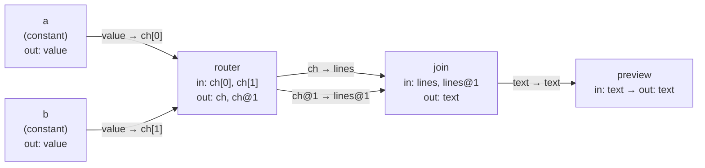

# Join workflow

Two constant sources merge through router channels, join multi-lines, then preview.

```mermaid
flowchart LR
	a["a<br/>(constant)<br/>out: value"]
	b["b<br/>(constant)<br/>out: value"]
	router["router<br/>in: ch[0], ch[1]<br/>out: ch, ch@1"]
	join["join<br/>in: lines, lines@1<br/>out: text"]
	preview["preview<br/>in: text → out: text"]

	a -->|"value → ch[0]"| router
	b -->|"value → ch[1]"| router
	router -->|"ch → lines"| join
	router -->|"ch@1 → lines@1"| join
	join -->|"text → text"| preview
```

Scenario: [`join.workflow.test.ts`](./join.workflow.test.ts)
