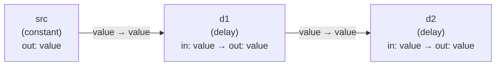

# Linear workflow

Three-node chain: constant source passes through two delay nodes in series.

```mermaid
flowchart LR
	src["src<br/>(constant)<br/>out: value"]
	d1["d1<br/>(delay)<br/>in: value → out: value"]
	d2["d2<br/>(delay)<br/>in: value → out: value"]

	src -->|"value → value"| d1
	d1 -->|"value → value"| d2
```

Scenario: [`linear.workflow.test.ts`](./linear.workflow.test.ts)
